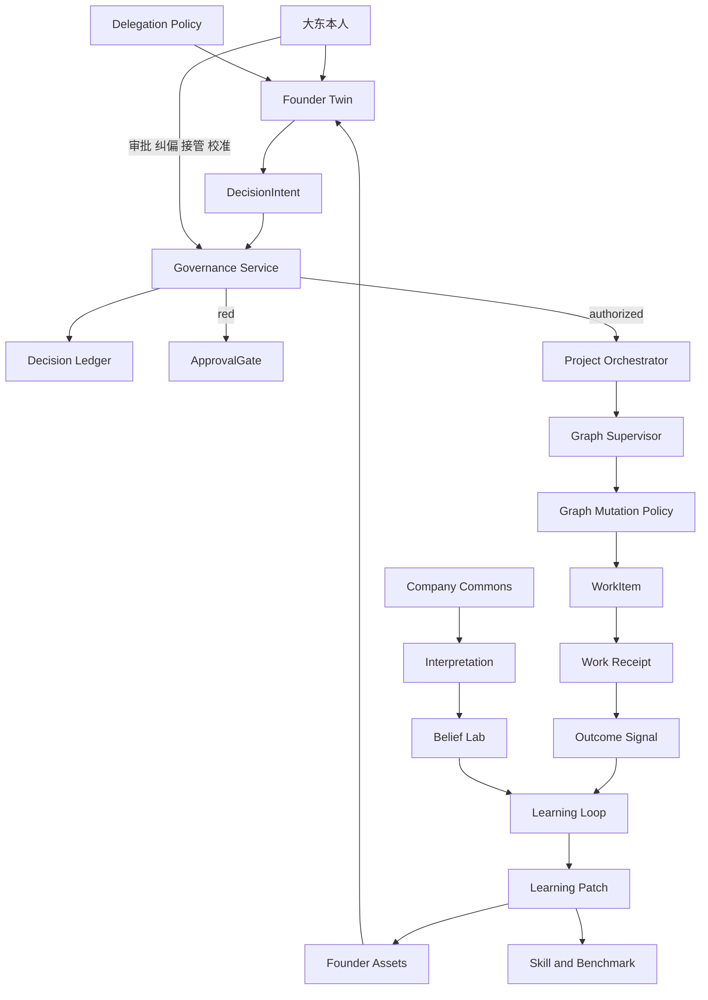
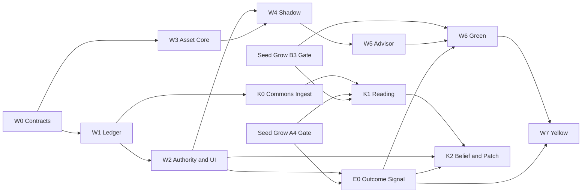

# Agent Company Founder OS v1 开发计划

## 0. 文档用途与执行状态

本文档把 Founder OS v1 转为可领取、可阻断、可验收的工程任务。它定义任务编号、依赖、授权条件、机器证据、人工确认和回滚要求。

当前状态为 `Proposed`。仓库已有 W0 基础产物，但本次归档不授权进入下一波次或提高 Founder Twin 模式，也不改变体验重构计划的当前排期。

计划基线是 `953346b22d509f6b9e76a23d4049832a96b4c6c8`。编写本文档期间，Seed-and-Grow、Founder OS W0、独立 Outcome Signal 和 Founder Assets 基础由其他提交继续推进；本文最终核对的源码快照位于 `main`，提交为 `8657010e3b53fbe19738c6980914405db29ab518`，计划基线是该提交的祖先。开始任一实现批次前，必须重新核对代码、迁移、Feature Flag、阶段证据和当前精确提交，不能把本文档快照当作持续有效的实现证明。

本文档服从以下事实源：

1. `docs/product-design/PRODUCT-CONSTITUTION.md`
2. `docs/Agent Company 产品 PRD.md`
3. `docs/product-design/00-overview.md` 与专题设计
4. `docs/product-design/Agent-Company-Experience-Refactor-Plan-v1.0.md`
5. `docs/product-design/implementation-plan.md`
6. `docs/AgentCompany-Seed-and-Grow-Development-Plan-v1.0.md`

Founder OS v1 不接管体验重构的发布顺序，也不提前宣布 Seed-and-Grow 的未完成能力可用。发生冲突时，以上位事实源、当前代码和精确提交证据为准。

## 1. 阶段目标

Founder OS v1 建立三项能力：

- `Founder Twin`：AI 大东以创始人代理身份参与治理，只输出可审计的 `DecisionIntent`。
- `Founder Assets`：把大东明确表达或确认过的原则、判断、案例和审美标准保存为可检索、可版本化、可回滚的治理资产。
- `Company Commons`：吸收外部材料，由 Agent 形成带来源的不同观点，再通过实验和结果沉淀为公司认知、Skill 或 Benchmark 修改提案。

它与现有路线的分工如下：

| 能力 | 负责的问题 |
|---|---|
| Seed-and-Grow | 组织如何根据任务和证据生长 |
| Founder OS | 谁代表创始人做判断，权限到哪里 |
| Company Commons | 公司如何吸收外部思想 |
| Learning Loop | 经验如何改变下一次行动 |

本阶段不以 Agent 数量、部门数量、群聊消息量或人格拟真度作为完成标准。

## 2. 当前代码事实

以下事实只绑定 `snapshot_commit`：

| 事实 | 当前证据 | 对本计划的影响 |
|---|---|---|
| Project、Plan、WorkItem、Artifact、ApprovalGate、ProjectEvent、WorkAttempt、WorkReceipt、GraphMutation 和 ValidationGate 已存在 | `packages/control-plane/src/company-project/company-project.sql.ts` | Founder OS 复用现有 Company Project 与执行事实，不建立第二套事实层 |
| `execution.ts` 仍是 2710 行执行入口，但 Receipt、Mutation、Supervisor、Dispatch、Quiescence、Attention 和 Recovery 已拆出生产服务 | `packages/control-plane/src/company-project/execution.ts`、`packages/control-plane/src/project-orchestrator/` 与 `packages/control-plane/src/company-project/` | Founder OS 复用已拆分的单一写入链，不把新治理逻辑重新堆回 `execution.ts` |
| 已有风险驱动的验证强度规则 | `packages/control-plane/src/company-project/orchestration.ts` | `DecisionAuthorityService` 可以复用风险事实，但不能把该规则当成完整治理服务 |
| Seed-and-Grow Feature Flag 已有 `off / shadow / active`，Founder OS 两个模式也已有全局上限、Company 持久化和读取接口 | `packages/control-plane/src/flag/flag.ts`、`packages/control-plane/src/founder-os/mode.ts` 与 `packages/control-plane/src/company/company.ts` | 两套 Flag 保持独立；Founder OS 模式默认 `off`，模块存在不代表已获授权 |
| Seed-and-Grow 契约已登记 A0-A4、B0-B5 为 implemented，但仓库没有已跟踪、绑定当前精确提交的 `stage-decision` | `docs/product-design/experience-refactor/seed-grow-stage-contract.v1.json` | 实现登记不能替代阶段 Gate；F4 Green 仍须等 B3 精确提交 Gate |
| `WorkReceipt`、`GraphMutation`、`GraphSupervisor`、Attention 和 Action 已有表、迁移或生产服务 | `packages/control-plane/src/company-project/work-facts.ts`、`packages/control-plane/src/company-project/graph-mutation.ts`、`packages/control-plane/src/company-project/attention-router.ts` 与 `packages/control-plane/src/project-orchestrator/graph-supervisor.ts` | Founder OS 必须复用这些事实与写入边界；自动执行仍受对应阶段 Gate 和 Founder OS 权限 Gate 约束 |
| `DecisionIntent`、`FounderCorrection`、typed action、evidence 和 asset reference 已有 Shared、Control Plane 与 JavaScript SDK 契约，但 Correction 的 append-only 约束和执行入口强制边界尚未落地 | `packages/shared/src/founder-os.ts`、`packages/control-plane/src/founder-os/schema.ts` 与 `packages/sdk/js/src/v2/founder-os.ts` | `FOS-CONTRACT-001` 已有实现；`FOS-CONTRACT-002/003` 仍是部分实现 |
| 独立 `OutcomeSignal` 的 SQL、Schema、Service、API、SDK、幂等提交、来源与独立 Validator 校验和启动恢复已落地，但没有 Founder OS E0 精确提交 Gate 证据 | `packages/control-plane/src/company-project/outcome-signal.ts`、迁移、Server Route 与 SDK | E0 有生产实现基础，不能因模块存在宣布通过；W7 和 K2 依赖继续失败关闭 |
| GovernanceAsset、版本追加、authority 约束、FounderTwinSnapshot 编译与选择、Founder Studio API、SDK 和 Settings 页面已落地，但没有 W3 精确提交 Gate 证据 | `packages/control-plane/src/founder-os/asset.ts`、`asset.sql.ts`、迁移、SDK 与 `packages/app/modules/agent-company/runtime/app/pages/settings/company.vue` | W3 有生产实现基础，不能整体标记完成；W4 仍须等待 W3 Gate |
| Artifact 和 ApprovalGate 当前都要求 `project_id` | `packages/control-plane/src/company-project/company-project.sql.ts` | 公司级材料、项目创建前决定和公司级红灯需要作用域迁移 |
| ApprovalGate 当前只有风险和合并两类 | `packages/control-plane/src/company-project/schema.ts` | Founder OS 不能把新权限语义塞进现有字符串而不扩展契约 |
| 董事会当前固定为 CEO、CTO、Product Lead 三人 | `packages/control-plane/src/company/company.ts` 与相关 Schema | AI 大东的 principal、现有 CEO 关系和迁移必须先由 ADR 决定 |
| Board 页面当前重定向到 Work | `packages/app/app/pages/company/board.vue` | W5 包含真实 Board 承载面和导航归属，不把重定向页当现成功能 |
| 董事会决定当前写入 ChannelMessage 和 SignalProjection，并更新 thread/root need | `packages/control-plane/src/conversation/conversation.ts` 与 `packages/control-plane/src/server/routes/company-conversation.ts` | W1 需要建立这些现有事实到 Ledger 的来源映射和安全回填 |
| W0 的六项 ADR、IA、边界检查和双次精确提交 Gate 骨架已落库，但 ADR 尚未人工确认，也没有当前候选的已跟踪通过证据 | `docs/product-design/ADR-Founder-OS-Governance-v1.0.md`、`docs/product-design/Founder-OS-IA-v1.0.md` 与 `docs/product-design/founder-os/` | W0 是部分落地，不得据此开启 Advisor 或 delegated；基线审计和 Gate 证据必须随已提交计划重新生成 |
| 当前 W0 Gate 合同漏列 `FOS-FLAG-001/002` 和 `FOS-CONTRACT-001/002/003`，runner 只登记边界检查命令 | `docs/product-design/founder-os/w0-gate-contract.v1.json` | 即使现有双次边界检查通过，也不能证明 Flag、契约一致性、Correction 追加约束和既有路径无回退；`FOS-QA-001` 必须先补齐覆盖 |
| 当前边界检查在 `workerFileCount: 0` 时仍可通过，并把未逐项验证的 task ID 记为 passed | `script/founder-os-boundary.ts` 与 `script/founder-os-gate.ts` | `FOS-BOUNDARY-002` 仍是空集合假绿风险；Gate 必须要求生产路径覆盖和可证明的负例自测 |

现有 `WorkReceipt` 是执行事实源之一，但其中的 `outcome` 字段、`attempt_failure` Artifact、验证结果或 Reputation 回写都不能替代独立 `OutcomeSignal`。

## 3. 架构与权限边界



### 3.1 四层职责

| 层级 | 职责 | 禁止事项 |
|---|---|---|
| Governance Plane | Founder Twin、董事会、权限分类、Decision Ledger、ApprovalGate | 直接修改任务图或执行外部动作 |
| Execution Plane | Project Orchestrator、Graph Supervisor、动态 Agent 组织 | 把 AI 推测写成创始人事实 |
| Knowledge Plane | Founder Assets、Company Commons、Belief Registry | 原始来源直接成为有效政策 |
| Evaluation Plane | Validator、Benchmark、Outcome、Learning Patch | 用系统自评替代真实结果 |

### 3.2 Founder Twin 的强制边界

Founder Twin 只能输出 `DecisionIntent`。它不得：

- 导入 Runtime、Tool、Graph Mutation 或 Recruitment 写入模块；
- 直接创建、修改或完成 WorkItem；
- 直接招聘、释放或提权 Agent；
- 直接发送外部消息、付款、发布、删除数据或操作生产环境；
- 修改自己的 Profile、Constitution、Delegation Policy 或有效 Founder Assets；
- 把自己的历史推测作为创始人事实或 Benchmark 正确答案。

允许的执行链只有：

```text
Founder Twin
→ DecisionIntent
→ DecisionAuthorityService
→ GovernanceService
→ ProjectOrchestrator
→ GraphSupervisor
→ GraphMutationPolicy
→ WorkItem
```

`DecisionIntent.authorityClass` 是 Founder Twin 的建议。最终权限由确定性的 `DecisionAuthorityService` 重新计算。服务可以提高风险等级，不能因为模型置信度高而降低风险等级。

`FOS-ADR-006` 已提出 AI 大东复用现有 `board-ceo`，作为 Founder Governance Projection，不创建独立 `founder-twin` principal。该 ADR 仍待人工确认；确认前 W5 保持阻断。若未来保留独立 CEO Agent，必须先替换 ADR，并重新定义决策优先级、消息来源和迁移。

### 3.3 授权模式

```text
off
→ shadow
→ advisor
→ green-delegated
→ yellow-delegated
```

模式只能由大东本人或具有等价产品权限的人显式提高。AI 不得自行改变模式。紧急关闭可以自动降级到更低权限。

| 模式 | 发言 | 执行 | 用户可见性 |
|---|---|---|---|
| off | 否 | 否 | 不展示 Founder Twin 功能 |
| shadow | 否 | 否 | 仅在校准和审计界面展示 |
| advisor | 是 | 否 | 显示建议、依据和权限分类 |
| green-delegated | 是 | 仅低风险、可逆、内部事项 | 决策时记录，执行后可追溯 |
| yellow-delegated | 是 | 仅满足成本和回滚约束的黄灯事项 | 执行后进入事后摘要 |

Shadow 只记录权限分类、Ledger 和 Comparison，不创建执行 Gate。Advisor、Green 或 Yellow 中，任何提交到审批或执行流的红灯 Intent 都必须进入 `ApprovalGate`。

## 4. 知识来源与权威等级

系统必须保存来源和权威，不允许把不同知识压成一类。

| 来源 | `authority` | 可以自动生效 | 升级条件 |
|---|---|---:|---|
| 大东明确表达 | `human_explicit` | 可以进入指定作用域的有效资产 | 保留原始来源和版本 |
| 大东确认过的内容 | `human_confirmed` | 可以进入指定作用域的有效资产 | 必须有真实确认事件 |
| AI 根据历史提出 | `ai_proposed` | 否 | 大东确认后生成新版本 |
| 外部文章或材料 | `external_source` | 否 | 先进入 Interpretation、Belief 和验证流程 |
| Agent 自己形成的观点 | `agent_interpretation` | 否 | 进入 Belief Lab 后再判断 |

禁止通过批量导入、默认勾选、AI 代点确认或测试 Fixture 生成 `human_explicit` 和 `human_confirmed` 生产数据。

## 5. 核心契约

### 5.1 `DecisionIntent`

```ts
type EvidenceRef =
  | { kind: "artifact"; artifactId: string }
  | { kind: "source_span"; sourceId: string; start: number; end: number }
  | { kind: "decision"; decisionId: string }
  | { kind: "outcome"; outcomeId: string }

type GovernanceAssetRef = {
  assetId: string
  version: number
}

type RegisteredFounderAction =
  | RequestGraphChangeAction
  | RequestProjectControlAction
  | RequestAgentLifecycleAction
  | RequestExternalAction

interface DecisionIntent {
  decisionId: string
  recommendation: string
  alternatives: string[]
  authorityClass: "green" | "yellow" | "red"
  confidence: number
  principlesApplied: GovernanceAssetRef[]
  evidenceRefs: EvidenceRef[]
  dissent?: string[]
  missingInformation?: string[]
  requestedAction?: RegisteredFounderAction
}
```

`RegisteredFounderAction` 的每个成员都必须包含固定 `type`、Schema 版本、幂等键和已验证 payload。注册表不能包含 string catch-all。`requestedAction` 是请求，不是可执行命令，仍需 Authority 和 Governance 验证，不能透传给 Tool 或 Runtime。

### 5.2 `FounderCorrection`

```ts
type AssetPatchProposal = {
  target:
    | { kind: "new"; assetType: string; scope: string }
    | { kind: "existing"; assetId: string; baseRevision: number }
  operations: JsonPatchOperation[]
}

interface FounderCorrection {
  decisionId: string
  originalRecommendation: string
  humanDecision: string
  correctionReason: string
  proposedAssetUpdates: AssetPatchProposal[]
}
```

纠偏只能追加新记录。`proposedAssetUpdates` 默认创建 `ai_proposed` 草稿，不得直接修改有效资产。typed action、typed refs 和 typed asset patch 是 W0 退出条件，W2-W5 不得消费未校验的旧 Shape。

### 5.3 Feature Flags

```ts
type FounderTwinMode =
  | "off"
  | "shadow"
  | "advisor"
  | "green-delegated"
  | "yellow-delegated"

type CompanyCommonsMode =
  | "off"
  | "ingest-only"
  | "reading"
  | "belief-loop"
```

实现必须同时提供默认关闭的全局上限和持久化的 Company 级模式，实际权限取两者中更严格的一项。关闭 Flag 后，现有执行路径和数据读取必须继续工作。

## 6. 阶段与实施波次

F0-F6 是产品能力阶段，W0-W7、E0 与 K0-K2 是实际实施波次。实施按依赖推进，不按阶段编号猜测先后。

| 产品阶段 | 实施波次 | 内容 |
|---|---|---|
| F0 | W0 | 架构、契约、Feature Flag 和验证边界 |
| F1 | W1-W2 | Decision Ledger、权限服务、Override 和 Decision Center |
| 评估基础 | E0 | 独立 Outcome Signal、来源验证、恢复和投影 |
| F2 | W4 | Shadow Founder Twin、Context Builder 和 Benchmark |
| F3 | W3-W4 | GovernanceAsset 底座、品味资产和校准 |
| F4 | W5-W7 | Advisor、Green Delegation、Yellow Delegation |
| F5 | K0-K1 | Ingest-only、Interpretation 和 Reading Scheduler |
| F6 | K2 | Belief、Experiment 和 Learning Patch |

### 6.1 依赖总览



### 6.2 模式开放 Gate

| 模式 | 进入条件 | 未满足时 |
|---|---|---|
| Shadow | W4 实现完成并由用户显式开启；仅允许 Ledger、Comparison 和校准审计写入 | 保持 off |
| Advisor | W4 Gate 通过并获得人工授权；锁定 Benchmark 的红灯召回率 100%，依据可追溯率 100%，历史选择一致率不低于 70% | 保持 shadow |
| Green Delegation | W5 观察 Gate、Seed-and-Grow B3 Gate 和 E0 Gate 通过，接管 fence 已验证，偏好留出集一致率约 80%，用户显式授权 | 保持 advisor |
| Yellow Delegation | Green 真实观察门禁通过，Outcome Signal、成本上限、回滚点、Work Receipt 和事后摘要全部存在 | 保持 green-delegated |

Green 不只依赖 Graph Supervisor 名称或模块存在。用户接管要求 Attention Router、真实停止动作和恢复链同时可用，因此以 Seed-and-Grow B3 Gate 为最小依赖。

真实观察窗口和最小样本量由 `FOS-METRIC-001` 在开放 Green 前冻结。未冻结、样本不足或观察数据不可追溯时，Gate 必须失败关闭。

## 7. 任务状态约定

任务默认初始化为 `[未开始]`；`snapshot_commit` 已落地的 W0 基础按实际状态标记。

| 状态 | 含义 |
|---|---|
| `[未开始]` | 尚未进入实现 |
| `[部分实现]` | 部分产物已落地，但契约、负例或写入约束仍不完整 |
| `[已实现]` | 代码和迁移已落地，开发者自测通过 |
| `[待测试]` | 机器验证或真实人工授权尚未完成 |
| `[已完成]` | 精确提交 Gate、恢复和所需授权全部通过 |
| `[阻断]` | 前置能力、权限或外部事实缺失 |

任务完成证据必须绑定精确提交。页面存在、接口返回、AI 自述、Fixture、旧截图或历史测试结果不能单独把任务标记为完成。

## 8. W0：治理契约与关闭能力

**Release window**：W0 运行时契约、ADR、IA 和 Gate 骨架已由其他提交落地；当前仍缺已提交计划上的双次精确提交证据和 ADR 人工确认，Founder Twin 模式没有因此获得提高授权。

| ID | 状态 | 任务 | 依赖 | 主要产物 | 机器验收 |
|---|---|---|---|---|---|
| FOS-FND-001 | [部分实现] | 重核计划基线到实现提交的代码和计划漂移 | 无 | 基线审计记录 | 每项当前事实绑定精确提交 |
| FOS-ADR-001 | [待测试] | 记录 Founder Twin 属于 Governance Plane | 无 | ADR | 依赖方向检查通过 |
| FOS-ADR-002 | [待测试] | 记录 Founder Twin 不得直接修改任务图 | FOS-ADR-001 | ADR | 禁止导入规则可执行 |
| FOS-ADR-003 | [部分实现] | 记录 AI 推测不是创始人事实 | FOS-ADR-001 | ADR | authority 状态机有负例 |
| FOS-ADR-004 | [部分实现] | 记录原始来源不能直接成为有效公司政策 | FOS-ADR-003 | ADR | 来源升级路径有负例 |
| FOS-ADR-005 | [部分实现] | 记录所有自治决定必须进入 Decision Ledger | FOS-ADR-001 | ADR | 无 Ledger 的执行请求被拒绝 |
| FOS-ADR-006 | [待测试] | 记录 AI 大东与现有 `board-ceo` 的身份和迁移 | FOS-FND-001 | ADR | 不产生双重 Founder 权威 |
| FOS-FLAG-001 | [待测试] | 实现 `founderTwinMode` 全局上限和 Company 级模式 | ADR 完成 | Flag、持久化设置、读取契约 | 默认 off，非法值失败 |
| FOS-FLAG-002 | [待测试] | 实现 `companyCommonsMode` 全局上限和 Company 级模式 | ADR 完成 | Flag、持久化设置、读取契约 | 默认 off，非法值失败 |
| FOS-CONTRACT-001 | [待测试] | 定义并版本化 `DecisionIntent` | FOS-ADR-002 | Schema、Shared、SDK 契约 | 未知 action 拒绝 |
| FOS-CONTRACT-002 | [部分实现] | 定义并版本化 `FounderCorrection` | FOS-ADR-003 | Schema、Shared、SDK 契约 | 纠偏只能追加 |
| FOS-CONTRACT-003 | [部分实现] | 定义 typed action、evidence 和 asset reference | FOS-CONTRACT-001/002 | 版本化引用和 action union | payload 不再以 unknown 进入执行链 |
| FOS-BOUNDARY-001 | [待测试] | 建立 Founder Twin 依赖边界检查 | FOS-ADR-001/002 | 包边界规则 | Runtime、Tool、Graph Mutation 导入为失败 |
| FOS-BOUNDARY-002 | [部分实现] | 保留 Worker 不可直接调用 Graph Supervisor 的规则，并消除 `workerFileCount: 0` 空集合通过 | FOS-ADR-002 | 生产路径清单、权限负例 | 受治理 Worker 路径数量大于零，注入禁止依赖的负例必定失败 |
| FOS-IA-001 | [待测试] | 冻结 Founder OS 页面在现有五项一级导航中的归属 | FOS-FND-001 | IA 决策 | 不新增六个平行一级入口 |
| FOS-QA-001 | [部分实现] | 补全 Founder OS 精确提交验证入口，覆盖全部 W0 任务、Flag、契约、边界、回归和 SDK 一致性 | FOS-FLAG-001/002、FOS-CONTRACT-001/002/003 | Contract、Gate、evidence schema、command registry | 缺任一 W0 任务、命令、生产路径覆盖或负例自测时失败；两次隔离运行结果一致 |

### W0 退出条件

- [ ] 六项 ADR 都记录状态、背景、决策、不采用方案和推进影响。
- [ ] 两个 Feature Flag 默认关闭，关闭后现有路径无行为回退。
- [ ] Founder Twin 不能导入 Runtime、Tool、Recruitment 或 Graph Mutation 写模块。
- [ ] Worker 不能调用 Graph Supervisor。
- [ ] AI 大东与现有 `board-ceo` 不形成双重 Founder 权威。
- [ ] typed action envelope 在进入执行链前完成校验。
- [ ] 现有执行路径的相关测试和恢复行为无回退。
- [ ] Shared、SDK 和 Control Plane 的契约一致。
- [ ] 精确提交证据包含命令、退出码、摘要和防篡改校验。

**人工授权**：ADR 内容由产品负责人确认。该确认不自动开启 Founder Twin。

**回滚**：关闭 Flag，保留已写入的 Ledger 和资产数据，不删除审计记录。

## 9. W1：Decision Ledger 事实层

**Release window**：W0 Gate 通过后，可 behind flag 实现。

| ID | 状态 | 任务 | 依赖 | 主要产物 | 机器验收 |
|---|---|---|---|---|---|
| FOS-DEC-001 | [未开始] | 新增 `DecisionRecord` 表和迁移 | W0 | Schema、SQL、迁移 | 新库和升级库通过 |
| FOS-DEC-002 | [未开始] | 新增 `DelegationPolicy` 表和初始规则 | W0 | Schema、默认政策 | 红灯规则不可降级 |
| FOS-DEC-003 | [未开始] | 实现 `DecisionLedgerService` | FOS-DEC-001 | append-only CRUD、查询 | 已决定记录不能覆盖 |
| FOS-DEC-004 | [未开始] | 实现决策状态转换规则 | FOS-DEC-003 | 状态机 | 非法转换失败 |
| FOS-DEC-005 | [未开始] | 将现有董事会最终决定改由 Ledger 事务入口创建 | FOS-DEC-003 | Board 集成 | 每个最终决定恰有一条主记录 |
| FOS-DEC-006 | [未开始] | 记录 `FounderTwinSnapshot` 引用 | FOS-DEC-003 | Snapshot 引用字段或强引用 | 可回答本次判断使用的版本 |
| FOS-DEC-007 | [未开始] | 实现重启恢复和幂等写入 | FOS-DEC-003/004 | Recovery | 重启不丢失、不重复 |
| FOS-DEC-008 | [未开始] | 拆分不可变 Decision 核心、append-only transition 和当前投影 | FOS-DEC-001/004 | Event、read model | 状态变化不覆盖历史事实 |
| FOS-DEC-009 | [未开始] | 映射现有 ChannelMessage、thread 和 run 来源 | FOS-DEC-005/008 | Source mapping、回填策略 | 缺失字段保持 unknown，不由 AI 推测 |
| FOS-DEC-010 | [未开始] | 把 Ledger 核心、授权 transition 和待派发 outbox 写入同一事务 | FOS-DEC-003/004 | Transaction boundary、Outbox | 不存在已授权执行但无 Ledger 的提交状态 |
| FOS-DEC-011 | [未开始] | 将 ChannelMessage、SignalProjection、thread/root need 改为可重放投影并实现对账 | FOS-DEC-005/008/010 | Projection worker、Reconciler | 任一崩溃点恢复后与 Ledger 收敛 |
| FOS-SCOPE-001 | [未开始] | 设计 company、project 和 pre-project 决策作用域 | FOS-DEC-001 | Target scope 契约、迁移方案 | 不创建虚假 Project 承载公司决定 |

### W1 退出条件

- [ ] 所有董事会最终决定进入 Decision Ledger。
- [ ] DecisionRecord 在应用重启后可恢复。
- [ ] 已执行决定只能追加纠正、回滚或后续结果记录。
- [ ] `status` 是 append-only transition 的投影，不是原地覆盖 Decision 核心。
- [ ] 同一业务决定重试不会生成重复主记录。
- [ ] 历史 ChannelMessage 回填不推测不存在的 authority、confidence 或 finalDecision。
- [ ] 记录保留决定人、模式、权限、证据、原则、风险、状态和时间。
- [ ] Ledger 是新决策的治理事实源；外部派发只消费已提交 outbox。
- [ ] 在 Ledger、授权、outbox、消息和投影之间的每个注入崩溃点重启后，记录都能对账且不会重复执行。

**回滚**：保留迁移和历史记录，关闭写入集成；不得通过删除 Ledger 回滚。

## 10. W2：权限服务、纠偏和 Decision Center

**Release window**：W1 Gate 通过后，仍保持 Founder Twin off 或 shadow。

| ID | 状态 | 任务 | 依赖 | 主要产物 | 机器验收 |
|---|---|---|---|---|---|
| FOS-AUTH-001 | [未开始] | 实现 `DecisionAuthorityService` | W1 | 确定性权限分类 | 只可提高风险，不可静默降低 |
| FOS-AUTH-002 | [未开始] | 实现 `DelegationPolicyService` | FOS-DEC-002 | Policy 解析、版本和作用域 | 未知 action 默认 red |
| FOS-AUTH-003 | [未开始] | 实现 Governance Service 入口 | FOS-AUTH-001/002 | 单一治理入口 | 无 DecisionRecord 的请求拒绝 |
| FOS-AUTH-005 | [未开始] | 定义与现有 `autonomous / balanced / strict` preset 的优先级 | FOS-AUTH-001/002 | 权限合并规则 | preset 不能降低 Founder OS 风险 |
| FOS-AUTH-006 | [未开始] | 扩展 ApprovalGate 作用域、种类和 actor 来源 | FOS-SCOPE-001/FOS-AUTH-001 | Schema、迁移、事件 | 支持 company 和 pre-project 红灯 |
| FOS-AUTH-004 | [未开始] | 红灯决定接入扩展后的 `ApprovalGate` | FOS-AUTH-003/006 | Gate 适配 | 无 approved Gate 不派发 |
| FOS-CORR-001 | [未开始] | 实现 Override 和 `FounderCorrectionService` | W1 | 纠正记录、引用关系 | 原记录保持不变 |
| FOS-OUTCOME-001 | [部分实现] | 将现有 Outcome 的可选 `decision_id` 接入未来 Decision Ledger 强引用 | W1 | 结果引用契约 | 不把 Artifact 自动当 Outcome，悬空或伪造 Decision 引用被拒绝 |
| FOS-UI-001 | [未开始] | 新增 Decision Center 数据投影和 API | FOS-AUTH-003 | Read model、API、SDK | Human 和 AI 来源不可混淆 |
| FOS-UI-002 | [未开始] | 新增 Decision Center 页面 | FOS-UI-001 | 待决定、已代理、已执行、推翻、结果视图 | 关键动作可访问且有状态反馈 |
| FOS-METRIC-001 | [未开始] | 冻结 Founder OS 指标、观察窗口和样本合同 | W1 | Metric contract | 分母、窗口、来源和失败条件完整 |

### 初始 Delegation Policy

| 事项 | 最低权限 |
|---|---|
| 低风险、可逆的内部方案选择 | green |
| 可逆但消耗明显开发资源 | yellow |
| 普通 Agent 招募与释放 | yellow |
| 对外发送、付款、生产环境操作 | red |
| 删除数据、隐私、安全、儿童风险 | red |
| 产品战略或品牌定位根本变化 | red |
| 修改 Company Constitution | red |
| 未知 action、未知影响或证据不足 | red |

### W2 退出条件

- [ ] 红灯事项没有 `ApprovalGate` 就无法进入 Orchestrator。
- [ ] 权限优先级固定为 Constitution、action authority、Founder mode、approval preset，后层不能覆盖前层硬边界。
- [ ] Gate actor 可以区分 human、ai_founder、board 和 policy_engine。
- [ ] AI 建议、大东本人决定、董事会决定和 Policy 决定在数据与视觉上明确区分。
- [ ] 每张决策卡显示建议、备选方案、原则、案例、置信度、权限、可逆性、接管、批准、否决和纠偏。
- [ ] 接受、否决、Override、Correction、Rollback 都写入 Ledger。
- [ ] Decision Center 刷新和重启后状态一致。
- [ ] 指标合同不使用 AI 自评作为正确答案。

**人工授权**：提高 Founder Twin 模式、修改红灯边界、修改预算上限和 Constitution 规则都需要真实授权。

## 11. W3：Founder Assets 与溯源底座

**Release window**：W0 后可与 W1-W2 并行，必须先于 W4。

| ID | 状态 | 任务 | 依赖 | 主要产物 | 机器验收 |
|---|---|---|---|---|---|
| FOS-ASSET-001 | [待测试] | 新增 `GovernanceAsset` 表和迁移 | W0 | Schema、SQL、迁移 | 新库和升级库通过 |
| FOS-ASSET-002 | [待测试] | 实现版本、作用域、来源和 supersedes 链 | FOS-ASSET-001 | Asset Service | 有效版本唯一且可追溯 |
| FOS-ASSET-003 | [待测试] | 实现 authority 升级状态机 | FOS-ASSET-001 | 权限规则 | AI 和外部来源不能自动转 human |
| FOS-ASSET-004 | [待测试] | 实现资产检索和作用域过滤 | FOS-ASSET-002 | Query Service | 项目私有资产不泄露到公司范围 |
| FOS-ASSET-005 | [待测试] | 实现 `FounderTwinSnapshot` 编译和校验和 | FOS-ASSET-002/004 | Snapshot Service | 同输入生成同 checksum |
| FOS-ASSET-006 | [待测试] | 实现旧 Snapshot 选择和回滚 | FOS-ASSET-005 | 回滚入口 | 不修改历史 Snapshot |
| FOS-ASSET-007 | [待测试] | 实现 Snapshot 无明文 Prompt 存储和完整校验 | FOS-ASSET-005 | Storage Policy、hash contract | checksum 覆盖模板、资产版本、模型和检索配置 |
| FOS-STUDIO-001 | [待测试] | 新增 Founder Studio 读写投影 | FOS-ASSET-002/003 | API、SDK、页面底座 | authority 和 status 始终可见 |

### W3 退出条件

- [ ] 资产有类型、作用域、authority、状态、来源、版本和批准人。
- [ ] AI 提议和外部来源只能创建 draft。
- [ ] Founder Twin 每次只使用一个持久化 Snapshot。
- [ ] Snapshot 可按版本重放，校验和一致。
- [ ] Snapshot 不因保存完整敏感上下文而扩大隐私暴露。
- [ ] Founder Studio 不把 `ai_proposed` 显示成创始人原则。

**人工授权**：只有真实的人类确认事件可以生成 `human_confirmed`。

## 12. W4：Shadow Founder Twin 与品味校准

**Release window**：W2、W3 Gate 通过后。

| ID | 状态 | 任务 | 依赖 | 主要产物 | 机器验收 |
|---|---|---|---|---|---|
| FOS-TWIN-001 | [未开始] | 实现 `FounderContextBuilder` | W2/W3 | 有界上下文构建器 | 不加载全库，作用域无泄漏 |
| FOS-TWIN-002 | [未开始] | 实现 Shadow `FounderTwinService` | FOS-TWIN-001 | 建议生成、Snapshot 引用 | 不发言、不执行、不建 Gate |
| FOS-TWIN-003 | [未开始] | 记录影子决定并与真实决定对比 | FOS-TWIN-002 | Comparison Record | 比对不修改真实决定 |
| FOS-TWIN-004 | [未开始] | 整理 30-50 条真实决策案例 | W3 | `decision_case` 资产 | 每条有原始来源和 authority |
| FOS-TWIN-005 | [未开始] | 实现模型不可用、上下文不足和引用失效时的降级 | FOS-TWIN-001/002 | fail-closed 状态 | 不生成可执行建议 |
| FOS-TASTE-001 | [未开始] | 导入约 20 条接受案例 | W3 | `taste_reference` 资产 | 原图、理由、范围可追溯 |
| FOS-TASTE-002 | [未开始] | 导入约 20 条拒绝案例 | W3 | `taste_anti_reference` 资产 | 拒绝原因拆分为可评估维度 |
| FOS-TASTE-003 | [未开始] | 实现 A/B、接受和拒绝采集 | W3 | Calibration Queue | AI 不代替用户确认 |
| FOS-TASTE-004 | [未开始] | 实现 Rubric 与 Validator 适配 | W3 | Rubric、评分引用 | Validator 输出引用资产版本 |
| FOS-CORR-002 | [未开始] | 实现 Correction 到结构化 Asset Proposal | FOS-CORR-001/W3 | target、base revision、typed diff | 默认 `ai_proposed`，字符串 ID 只作引用 |
| FOS-BENCH-001 | [未开始] | 建立 Founder Decision Benchmark | FOS-TWIN-003/004 | 留出集、runner、报告 | 红灯、追溯和一致率可重算 |
| FOS-BENCH-002 | [未开始] | 建立 Taste Benchmark | FOS-TASTE-001/002/003 | 留出集、runner、报告 | 训练集与留出集隔离 |
| FOS-BOARD-001 | [未开始] | 在 Board 审计抽屉展示影子建议 | FOS-TWIN-003 | 只读 UI | 不混入真实聊天记录 |

### 首批校准来源

首批真实案例优先覆盖：

- Agent Company 从部门制转向 Seed-and-Grow。
- 是否先上市获取反馈，而不是继续完善 Lumi。
- 销售团队是否只关注售前转化。
- Lumi 官网方案选择及其理由。
- 为什么拒绝模板化 SaaS 风格。
- 为什么重视长期价值，同时反对沉没成本。
- 哪些产品功能应该推迟。
- 哪些品牌表达被接受或否决。

当用户推翻 Shadow 或 Advisor 建议时，校准交互只追加一个问题：这是个别案例，还是应该形成长期规则。系统据此生成结构化 Asset Proposal，仍需用户确认。

### Context Builder 最小输入

1. 当前目标。
2. 本次讨论内容。
3. 相关公司原则。
4. 同领域历史决策。
5. 相关审美案例。
6. 授权边界。
7. 当前事实和资源状态。

禁止把整个知识库、全部历史聊天或无权限材料塞入上下文。

### W4 退出条件

- [ ] 红灯识别召回率为 100%。
- [ ] 判断依据可追溯率为 100%。
- [ ] 历史选择一致率不低于 70%。
- [ ] A/B 偏好留出集产生可重算报告；低于约 80% 只阻断 Green，不阻断 Advisor。
- [ ] Benchmark 不把 AI 以前的推测当作人类事实。
- [ ] 每条 Shadow Decision 记录 Snapshot、原则、案例、证据和缺失信息。

**人工授权**：真实决策和品味资产需要大东本人确认。机器 Gate 可以验证机制，不能伪造这批数据已经确认。

## 13. W5：Board Advisor

**Release window**：W4 Gate 通过后，不依赖 Graph Supervisor。

| ID | 状态 | 任务 | 依赖 | 主要产物 | 机器验收 |
|---|---|---|---|---|---|
| FOS-BOARD-002 | [未开始] | 按身份 ADR 以 `AI 大东 · 创始人代理` 身份进入 Board | W4/FOS-ADR-006 | 代理 principal 和消息来源 | 不显示为大东本人，不形成双重权威 |
| FOS-BOARD-003 | [未开始] | 实现依据、置信度、原则和案例抽屉 | W4 | Board UI | 引用可跳转到 Ledger 和 Asset |
| FOS-BOARD-008 | [未开始] | 实现或适配 Board Decision Service | W2/W4 | 收敛、DRI、超时、异议、幂等合同 | 同一讨论只产生一个当前决策请求 |
| FOS-BOARD-004 | [未开始] | 在 Board Decision Service 收敛后生成 `DecisionIntent` | FOS-BOARD-008 | Intent 生成 | 不直接创建 WorkItem |
| FOS-BOARD-005 | [未开始] | 实现立即接管、暂停、纠正、否决和重定义目标 | W2 | Takeover API、UI | 接管后不再代表创始人发言 |
| FOS-BOARD-006 | [未开始] | 接管事件写入 Decision Ledger | FOS-BOARD-005 | Ledger 集成 | 原讨论和纠偏保留 |
| FOS-BOARD-007 | [未开始] | 把当前 Board 重定向入口改为真实治理承载面 | FOS-IA-001/FOS-BOARD-002 | Route、投影、状态页 | 不把 `/work` 重定向当 Board |
| FOS-CTRL-001 | [未开始] | 新增 Founder Control Center 的 Advisor 视图 | W2/W4 | 模式、待办、校准趋势 | 未授权模式不可从 UI 提高 |

### W5 退出条件

- [ ] AI 大东只以创始人代理身份出现。
- [ ] Advisor 可以发言和生成 Intent，但不能执行。
- [ ] Intent 触发点、DRI、超时、异议保留和幂等规则可验证。
- [ ] 用户接管后，后续代理发言停止。
- [ ] 接管、暂停、否决和目标重定义都有持久化审计记录。
- [ ] Board、Decision Center 和 Founder Control Center 读取同一 Ledger 事实。

**回滚**：模式降为 shadow，保留历史代理消息和 Ledger。

## 14. E0：独立 Outcome Signal

**Release window**：W2 和 Seed-and-Grow A4 Gate 通过后。E0 是所有 delegated 模式和 Learning Loop 的前置 Gate。

| ID | 状态 | 任务 | 依赖 | 主要产物 | 机器验收 |
|---|---|---|---|---|---|
| FOS-OUTCOME-002 | [部分实现] | 补全 `OutcomeSignal` 的 transition、`currentStatus`、metric contract 和观察窗口 | W2/A4 | Schema、SQL、迁移 | Outcome 独立于 Artifact 和 Decision 核心 |
| FOS-OUTCOME-003 | [部分实现] | 补全来源验证和观察窗口合同 | FOS-OUTCOME-002/FOS-METRIC-001 | Validator、metric window | Agent 自述和 run completed 不能单独通过 |
| FOS-OUTCOME-004 | [待测试] | 实现幂等写入、重复投递和重启恢复 | FOS-OUTCOME-002/003 | Outcome Service、Recovery | 不丢失、不重复、不覆盖 |
| FOS-OUTCOME-005 | [部分实现] | 实现 Decision、Work Receipt、Validator 与 Outcome 的关联 | FOS-OUTCOME-001/002/003 | Typed links | 每个来源可追溯 |
| FOS-OUTCOME-006 | [部分实现] | 补齐 Outcome 投影和 Founder OS E0 精确提交 Gate | FOS-OUTCOME-004/005 | API、SDK、read model、stage decision | 两次隔离运行一致 |

### E0 退出条件

- [ ] Outcome Signal 有独立模型、来源、观察窗口、状态和审计事件。
- [ ] `run completed`、Artifact 存在、AI 自述和 Decision accepted 都不能单独证明 Outcome。
- [ ] 同一来源重复投递不生成重复 Outcome。
- [ ] 重启和 kill-point 后可恢复，历史 transition 不被覆盖。
- [ ] Decision Center、Green/Yellow 摘要和 Learning Patch 读取同一 Outcome 投影。
- [ ] E0 精确提交 Gate 为 pass。

**回滚**：关闭 Outcome 消费者，保留 append-only Outcome 历史；所有 delegated 模式降为 advisor。

## 15. W6：Green Delegation

**Release window**：W5、E0 完成，Seed-and-Grow B3 精确提交 Gate 通过，真实授权开启 Green。

| ID | 状态 | 任务 | 依赖 | 主要产物 | 机器验收 |
|---|---|---|---|---|---|
| FOS-DELEGATE-001 | [未开始] | Governance Service 将已授权 Green Intent 提交给 Orchestrator | W5/B3 | 治理到执行适配 | Twin 无 Runtime 引用 |
| FOS-DELEGATE-002 | [未开始] | Orchestrator 将请求解释为 Graph Supervisor 输入 | B3 | 结构化请求 | 未通过 Policy 不产生 Mutation |
| FOS-DELEGATE-003 | [未开始] | 建立 Green action allowlist | W2/B3 | 确定性 allowlist | 未知 action 变为 red |
| FOS-DELEGATE-004 | [未开始] | 实现接管后的持久化 fence、停止和取消级联 | W5/B3 | fence、stop handler、恢复对账 | fence 后无新授权或派发，在途动作完整列出 |
| FOS-DELEGATE-005 | [未开始] | 回写 Work Receipt、Decision Outcome 和 Ledger 状态 | B3/E0 | 结果关联 | 不使用自述替代结果 |
| FOS-DELEGATE-006 | [未开始] | 建立 Green Shadow 对照和推翻率趋势 | W4 | Metric projection | 不用 AI 结果训练同一评测集 |

### W6 退出条件

- [ ] 每个 Green 决定都经过 Authority、Ledger、Orchestrator、Supervisor 和 Policy。
- [ ] 未授权红灯操作数量为 0。
- [ ] 接管 fence 持久化后，不再产生新授权或新派发。
- [ ] 已经在途的动作有取消结果、明确不可取消状态和最终对账；不承诺撤销已经发生的副作用。
- [ ] 决定、Mutation、WorkItem、Receipt 和 Outcome 可以串成一条审计链。
- [ ] Green 模式由真实授权开启，不由 Benchmark 自动开启。

**回滚**：模式降为 advisor，停止新 Green 派发；已经执行的决定追加回滚记录。

## 16. W7：Yellow Delegation

**Release window**：W6 真实观察 Gate 通过，Outcome Signal 和回滚链稳定。

| ID | 状态 | 任务 | 依赖 | 主要产物 | 机器验收 |
|---|---|---|---|---|---|
| FOS-YELLOW-001 | [未开始] | 为每种 Yellow action 定义成本上限和可逆性合同 | W6/E0 | Policy 扩展 | 无上限或无回滚点则拒绝 |
| FOS-YELLOW-002 | [未开始] | 实现执行前 rollback checkpoint | FOS-YELLOW-001 | Checkpoint | kill-point 恢复一致 |
| FOS-YELLOW-003 | [未开始] | 实现黄灯事后摘要 | W2/W6 | Decision Center 摘要 | 成本、结果、回滚入口完整 |
| FOS-YELLOW-004 | [未开始] | 实现失败和超预算自动降级 | FOS-YELLOW-001 | Circuit breaker | 后续请求进入 Gate 或 advisor |
| FOS-YELLOW-005 | [未开始] | 记录 Outcome、Override 和 Rollback | W6 | Ledger 集成 | 状态只追加 |
| FOS-YELLOW-006 | [未开始] | 验证隐私、安全、儿童、生产和外部承诺始终为 red | W2 | 负例 Benchmark | 召回率 100% |

### W7 退出条件

- [ ] 每个 Yellow action 都可逆、有成本上限、有 Work Receipt、有 Outcome。
- [ ] 超预算、不可逆或影响不明时，执行前停止。
- [ ] 事后摘要可追溯到决定、执行、结果和回滚点。
- [ ] 红灯事项永不因 Yellow 模式自动执行。
- [ ] Yellow 失败不会自动扩大权限或降低验证标准。

**回滚**：降为 green-delegated 并停止新 Yellow 派发。只有明确失败条件或人工决定指定的 action 才执行对应 rollback handler，并追加回滚结果。

## 17. K0：Company Commons Ingest-only

**Release window**：W1 的作用域合同完成后可与 W2-W5 并行，模式最多为 `ingest-only`。公司级导入必须等待 Artifact 作用域迁移。

| ID | 状态 | 任务 | 依赖 | 主要产物 | 机器验收 |
|---|---|---|---|---|---|
| FOS-COMMONS-001 | [未开始] | 新增 `CommonsSource` 表和迁移 | W1 | Schema、SQL、迁移 | 新库和升级库通过 |
| FOS-COMMONS-011 | [未开始] | 扩展 Artifact 的 company、project 和 private 归属 | FOS-SCOPE-001/FOS-COMMONS-001 | Scope Schema、迁移 | 不创建虚假 Project 保存公司材料 |
| FOS-COMMONS-002 | [未开始] | 复用扩展后的 Artifact 保存原始材料 | FOS-COMMONS-001/011 | Artifact 关联 | 不建立第二套文件存储 |
| FOS-COMMONS-003 | [未开始] | 实现文本和 Markdown 导入 | FOS-COMMONS-002 | Adapter | 来源和 hash 完整 |
| FOS-COMMONS-004 | [未开始] | 实现 URL、对话导出和 PDF 导入 | FOS-COMMONS-002 | Adapter | 抽取失败可恢复 |
| FOS-COMMONS-005 | [未开始] | 实现图片、播客和视频真实 Adapter，不以接口占位宣称支持 | FOS-COMMONS-002 | OCR、音频转录、视频转录 Adapter | 每种模态的处理状态和来源跨度独立记录 |
| FOS-COMMONS-006 | [未开始] | 实现元数据、去重、分块和来源索引 | FOS-COMMONS-001 | Ingestion Pipeline | 重复内容识别和合并 |
| FOS-COMMONS-007 | [未开始] | 建立 SQLite FTS 与可插拔 Embedding 接口 | FOS-COMMONS-006 | Search Service | 无 Embedding 时仍可用 |
| FOS-COMMONS-008 | [未开始] | 实现隐私作用域和访问过滤 | FOS-COMMONS-001 | Privacy Policy | 私密对话不进入全公司上下文 |
| FOS-COMMONS-009 | [未开始] | 新增 Commons Inbox 和解析状态页面 | FOS-COMMONS-003/004/006 | API、SDK、UI | 原文、状态、来源可查看 |
| FOS-COMMONS-010 | [未开始] | 建立不可信输入隔离 | FOS-COMMONS-003/004/005 | Prompt injection policy | 来源中的指令不可执行 |
| FOS-COMMONS-012 | [未开始] | 建立 URL fetch、MIME、大小、超时和本地地址安全边界 | FOS-COMMONS-004 | Ingestion Security Policy | SSRF 和超限输入失败关闭 |
| FOS-COMMONS-013 | [未开始] | 建立导入能力矩阵和真实多模态 E2E | FOS-COMMONS-003/004/005 | Capability registry、真实样本证据 | 每个宣称支持的 sourceType 至少一个真实样本完成导入、恢复和来源引用 |

### K0 退出条件

- [ ] 原始文件只由 Artifact 保存，CommonsSource 保存来源和处理状态。
- [ ] Artifact 作用域迁移先于首个 company 或 private Commons 写入。
- [ ] 内容 hash、来源、隐私范围和解析状态可恢复。
- [ ] 重复材料可以建立重复或近重复关系，原始来源不丢失、不被合并删除。
- [ ] 外部内容中的指令不会进入 Tool、Runtime、Graph 或 Skill 写入链。
- [ ] URL 导入不访问本地、私网或未授权地址。
- [ ] 文本、Markdown、URL、对话导出、PDF、截图或图片、播客和视频各有至少一个真实样本通过端到端导入、重启恢复和来源引用。
- [ ] 没有真实 Adapter 的模态明确返回 `unsupported` 或 `blocked`，不能显示为已支持，也不能计入 K0 Gate。
- [ ] 未引入独立向量数据库作为前置条件。

**回滚**：模式降为 off，保留用户已导入的 Artifact；索引可以重建。

## 18. K1：Interpretation 与 Reading Scheduler

**Release window**：K0 完成，Seed-and-Grow A4 Receipt/Recovery Gate 通过。自动创建项目 Reading WorkItem 还需要 B3 Gate。

| ID | 状态 | 任务 | 依赖 | 主要产物 | 机器验收 |
|---|---|---|---|---|---|
| FOS-READ-001 | [未开始] | 新增 `Interpretation` 表和迁移 | K0 | Schema、SQL、迁移 | 同源多观点可并存 |
| FOS-READ-002 | [未开始] | 新增 Agent Interest Profile | K0 | topics、lenses、排除项、预算 | 预算和隐私作用域有效 |
| FOS-READ-003 | [未开始] | 实现 Reading Scheduler 评分 | FOS-READ-002 | relevance、novelty、gap、budget 规则 | 每份材料最多分配 1-3 个 Agent |
| FOS-READ-004 | [未开始] | 定义 `KNOWLEDGE_READING` WorkItem | A4/K0 | Work Type、Receipt 契约 | 不直接修改任务图 |
| FOS-READ-005 | [未开始] | 经 Orchestrator 创建阅读任务 | B3/FOS-READ-004 | 调度适配 | Scheduler 无 Graph 写权限 |
| FOS-READ-006 | [未开始] | 实现结构化阅读产出 | FOS-READ-001/004 | Interpretation Service | 每项观点引用来源段落 |
| FOS-READ-007 | [未开始] | 实现阅读预算、并发、停止和恢复 | A4/FOS-READ-003 | Scheduler Recovery | 重启无重复任务 |
| FOS-READ-008 | [未开始] | 新增 Interpretations 和项目关联页面 | FOS-READ-001/006 | API、SDK、UI | 多 Agent 分歧可并列查看 |

Reading Scheduler 至少根据兴趣领域、当前项目的上下文缺口、公司目标相关性、新颖度、阅读预算和相似观点覆盖情况评分。

### 阅读产出合同

每个 Interpretation 必须回答：

1. 核心判断是什么。
2. 哪些部分有可靠证据。
3. 与公司现有认知一致还是冲突。
4. 对哪个当前项目有影响。
5. 可以做什么低成本实验。
6. 应归档、进入候选观点，还是拒绝。

### K1 退出条件

- [ ] 每个 Interpretation 可以追溯到具体来源段落。
- [ ] 同一来源允许多个 Agent 保留不同观点。
- [ ] 阅读 Agent 没有外部工具写权限、Graph 写权限或政策写权限。
- [ ] 阅读任务有预算、并发和停止条件。
- [ ] 未完成任务重启后恢复，不重复消费预算。
- [ ] 摘要和 Interpretation 都不能自动成为 Founder Asset、Belief 或 Skill。

**回滚**：模式降为 ingest-only，停止新阅读任务；在途任务按停止合同收敛。

## 19. K2：Belief Lab 与 Learning Patch

**Release window**：K1、W2 和 E0 Gate 完成。

| ID | 状态 | 任务 | 依赖 | 主要产物 | 机器验收 |
|---|---|---|---|---|---|
| FOS-BELIEF-001 | [未开始] | 新增 `Belief` 表和迁移 | K1 | Schema、SQL、迁移 | 支持与反对证据并存 |
| FOS-BELIEF-002 | [未开始] | 实现多 Interpretation 对比 | FOS-BELIEF-001 | Comparison Service | 不以多数票自动采纳 |
| FOS-BELIEF-003 | [未开始] | 实现 Candidate Belief 生成 | FOS-BELIEF-002 | proposal-only 服务 | 默认 candidate |
| FOS-BELIEF-004 | [未开始] | 实现反方、反证和适用范围记录 | FOS-BELIEF-001 | Evidence Service | 不能删除反证 |
| FOS-EXP-001 | [未开始] | 实现 Experiment Proposal | FOS-BELIEF-003/W2 | DecisionIntent、项目连接 | 实验先过 Authority |
| FOS-EXP-002 | [未开始] | 连接真实 Outcome Signal | FOS-EXP-001/E0 | Outcome 关联 | 运行完成不等于实验成功 |
| FOS-PATCH-001 | [未开始] | 新增 `LearningPatch` 表和迁移 | FOS-EXP-002 | Schema、SQL、迁移 | 默认 proposed |
| FOS-PATCH-002 | [未开始] | 实现目标资产适配器 | FOS-PATCH-001 | governance、policy、skill、benchmark、interest、workflow adapter | 未知 target 拒绝 |
| FOS-PATCH-003 | [未开始] | 实现 Benchmark、Canary 和 Rollback | FOS-PATCH-002 | Patch lifecycle | 无 Benchmark 不进入 canary |
| FOS-PATCH-004 | [未开始] | 对接 SkillSnapshot | FOS-PATCH-002/003 | Skill patch adapter | 不直接覆盖有效 Skill |
| FOS-PATCH-007 | [未开始] | 按 targetType 强制升级权限矩阵 | FOS-PATCH-001/002、W2 | Policy、ApprovalGate 适配 | `delegation_policy` 不能自动扩大权限 |
| FOS-PATCH-008 | [未开始] | 建立 Benchmark 修改的独立审查和防自评闭环 | FOS-PATCH-003 | 冻结留出集、版本、独立 reviewer | Patch 作者或被评对象不能批准自己的评判标准 |
| FOS-PATCH-005 | [未开始] | 新增 Belief Lab 页面 | FOS-BELIEF-001/002 | 状态流 UI | 证据和争议可见 |
| FOS-PATCH-006 | [未开始] | 新增 Learning Patches 页面 | FOS-PATCH-001/003 | 影响、Benchmark、Canary、回滚 UI | 状态与真实执行一致 |
| FOS-E2E-001 | [未开始] | 跑通 AI 硬件冷启动文章的完整组织学习案例 | FOS-BELIEF-001/002/003/004、FOS-EXP-001/002、FOS-PATCH-001/002/003/004/005/006/007/008 | 精确提交 E2E 证据包 | 全链无 Fixture 假成功 |

### 目标资产升级权限

| 目标 | 生效条件 |
|---|---|
| Founder Profile | 大东本人确认 |
| Founder Taste | 大东本人确认 |
| Company Constitution | 红灯 ApprovalGate |
| Company Belief | 董事会决定和证据 |
| Delegation Policy | 大东本人红灯审批；只追加新版本，AI 不得自动扩大权限 |
| Skill | Benchmark、Canary 和回滚 |
| Benchmark | 独立审查、冻结留出集、版本化和防自评闭环；影响权限或发布 Gate 时还需红灯审批 |
| Agent 兴趣标签 | 可自动建议，黄灯生效 |
| 普通工作流规则 | Validator 通过后黄灯生效 |

### K2 退出条件

- [ ] Candidate Belief 保留支持证据、反证、适用范围、不适用范围和置信度。
- [ ] 外部材料不能直接成为 Company Constitution。
- [ ] Learning Patch 默认只生成 proposal。
- [ ] Patch 生效前按 targetType 完成权限判断、Benchmark、Canary 和回滚。
- [ ] Delegation Policy Patch 未经大东本人红灯审批不能生效，也不能扩大当前模式上限。
- [ ] Benchmark Patch 不由 Patch 作者或被评对象自批，旧版本和冻结留出集始终可重放。
- [ ] 回滚不删除历史版本和结果。
- [ ] 完整案例证明下一次真实规划读取了已批准的新规则。

## 20. 数据模型最低合同

### 20.1 DecisionRecord

必须包含：

```text
id
scopeType: company | project | pre_project
companyId
projectId?
boardThreadId?
boardRunId?
recordOrigin: live | historical_import
founderTwinSnapshotId?
subject
context
options
recommendation?
finalDecision?
decisionMaker: human | ai_founder | board | policy_engine | unknown
authorityClass: green | yellow | red | unknown
operatingMode: off | shadow | advisor | green_delegated | yellow_delegated | not_applicable | unknown
confidence?
reversible?
externalImpact?
riskLevel?
evidenceRefs
principleRefs
decisionCaseRefs
currentStatus: proposed | awaiting_approval | accepted | executed | overridden | failed | rolled_back
overrideOf?
outcomeRefIds
createdAt
decidedAt?
```

`DecisionRecord` 必须按 `recordOrigin`、`decisionMaker` 和 `currentStatus` 组成可判别联合，而不是要求所有来源伪造同一组字段：

- 新建的 `ai_founder` 记录必须有 `founderTwinSnapshotId`、recommendation、confidence、可逆性、外部影响、风险和非 unknown 权限。
- human 或纯 Board 决定不要求 Founder Snapshot 或模型 confidence，`operatingMode` 可为 `not_applicable`。
- `proposed` 和 `awaiting_approval` 可以没有 `finalDecision`；进入 accepted、executed、overridden、failed 或 rolled_back 后必须有 `finalDecision` 和 `decidedAt`。
- `historical_import` 才允许 unknown；unknown 记录不得进入 delegated 执行、权限放宽或 Benchmark 金标准。
- company 和 pre-project 决定不伪造 `projectId`。

`DecisionRecord` 的核心内容创建后不可修改。`currentStatus` 和 `outcomeRefIds` 是 append-only transition 与独立 Outcome Signal 生成的投影。v1 复用现有 conversation thread 和执行 run，不为 Founder OS 平行创建第二套 Board Session。

### 20.2 DelegationPolicy

必须包含：

```text
actionType
riskLevel
reversible
externalImpact
budgetLimit
requiresApproval
allowedMode
version
scope
createdAt
```

### 20.3 GovernanceAsset

必须包含：

```text
id
type: constitution | principle | heuristic | boundary | taste_reference | taste_anti_reference | rubric | decision_case
scope: company | domain | project | brand
content
rationale
tags
authority: human_explicit | human_confirmed | ai_proposed | external_source
status: draft | active | deprecated
sourceRefs
supersedes?
version
createdBy
approvedBy?
createdAt
approvedAt?
```

draft 和 `ai_proposed` 不要求 `approvedBy` 或 `approvedAt`；active 的 `human_confirmed` 资产必须同时具备两者和可核验确认事件。Agent Interpretation 不直接写入 GovernanceAsset。需要升级时，由 Learning Patch 或 Correction 先创建 `ai_proposed` 草稿。

### 20.4 FounderTwinSnapshot

必须包含：

```text
id
version
profileSummary
activePrincipleIds
activeHeuristicIds
decisionCaseIds
tasteExampleIds
rubricIds
promptTemplateVersion
modelConfigRef
retrievalConfigRef
compiledPromptHash
checksum
createdAt
```

Snapshot 创建后不可修改。

v1 不持久化明文 `compiledPrompt`。`compiledPromptHash` 用于重放比对，`checksum` 必须覆盖模板版本、资产版本、模型配置、检索配置和权限过滤配置。需要调试原文时，由原始资产和受权限控制的上下文重新编译，不能另存无关的私密原文。

### 20.5 CommonsSource 与 Interpretation

`CommonsSource` 最低字段：

```text
id
artifactId
sourceType
adapterId?
adapterVersion?
capabilityStatus: supported | unsupported | blocked
title
author
origin
publishedAt
language
tags
privacyScope
ingestionStatus
transcriptStatus
contentHash
sourceSpanMapRef?
createdAt
```

`Interpretation` 最低字段：

```text
id
sourceId
readerAgentId
readerRole
coreThesis
importantClaims
companyRelevance
projectConnections
agreement
conflicts
counterArguments
inspiration
experimentIdeas
confidence
evidenceRefs
createdAt
```

`AgentInterestProfile` 最低字段：

```text
agentId
topics
preferredLenses
excludedTopics
noveltyThreshold
weeklyReadingBudget
updatedAt
```

### 20.6 Belief 与 LearningPatch

`Belief` 最低字段：

```text
id
statement
scope
confidence
status: candidate | contested | experiment_pending | validated | adopted | rejected | deprecated
supportingSourceRefs
counterEvidenceRefs
interpretationRefs
actionImplications
experimentIds
reviewAt?
createdBy
approvedBy?
createdAt
approvedAt?
```

candidate、contested 和 experiment_pending 不要求批准字段；adopted 必须有 `approvedBy`、`approvedAt` 和对应董事会 Decision 引用。validated 只表示证据验证完成，不自动等于 adopted。

`LearningPatch` 最低字段：

```text
id
sourceDecisionId
sourceExperimentId
sourceOutcomeId
targetType: governance_asset | delegation_policy | skill | benchmark | agent_interest | workflow
targetId
proposedDiff
evidence
expectedImpact
benchmarkPlan
status: proposed | approved | canary | active | rejected | rolled_back
createdAt
```

### 20.7 OutcomeSignal

必须包含：

```text
id
companyId
projectId?
decisionId?
workReceiptId?
validatorResultRef?
metricContractRef
observationWindow
sourceRefs
currentStatus: observed | validated | invalidated
result
createdAt
validatedAt
```

Outcome 核心和来源创建后不可修改。验证、失效和回滚使用 append-only transition；`currentStatus` 是投影。

## 21. 页面交付范围

Founder OS v1 保留现有 Inbox、Work、Team、Library、Settings 五项一级导航，不直接新增六个平行入口。

| 页面 | 最早波次 | v1 承载位置 | 核心内容 | 权限要求 |
|---|---|---|---|---|
| Founder Control Center | W5 | Settings 内治理区 | 当前模式、今日代理决定、黄灯摘要、红灯待办、推翻记录、校准趋势 | 模式提高需要真实授权 |
| Board Room | W5 | Work 内真实 Board 工作区 | 代理身份、依据抽屉、置信度、权限、接管、Ledger 链接 | Advisor 不可执行 |
| Founder Studio | W3-W4 | Settings 内 Founder 区 | Profile、Constitution、Heuristic、Taste、Rubric、Decision Case、Calibration Queue | human authority 明确可见 |
| Decision Center | W2 | Inbox 的 Decision 视图 | 待决定、AI 代理决定、已执行黄灯、Override、Outcome | 红灯审批走 ApprovalGate |
| Company Commons | K0-K1 | Library 的 Commons 工作区 | Inbox、解析、待读、阅读中、Interpretation、项目关联、候选观点 | 隐私作用域过滤 |
| Belief Lab | K2 | Library 的 Belief 标签页 | Candidate、Contested、Experiment、Validated、Adopted、Rejected | 采纳需要治理决定 |
| Learning Patches | K2 | Library 的 Patches 标签页 | 修改目标、证据、影响、Benchmark、Canary、回滚 | 按目标类型授权 |

最终路径和导航标签由 `FOS-IA-001` 冻结。所有页面必须读取 Control Plane 的持久化事实或投影，不能建立只存在于前端的第二套状态。

## 22. Benchmark 与产品指标

| 指标 | 目标 | 证据要求 |
|---|---:|---|
| 红灯识别召回率 | 100% | 留出风险集，误判明细 |
| 判断依据可追溯率 | 100% | Snapshot、Asset、Evidence 引用完整 |
| 历史选择一致率 | 不低于 70% | 真实确认的留出决策集 |
| A/B 偏好一致率 | 约 80% | 未参与 Snapshot 编译的留出集 |
| AI 代理决定可追溯率 | 100% | Ledger 到 Outcome 全链 |
| 未授权红灯操作 | 0 | Tool、Runtime、Gate 审计 |
| 用户接管有效性 | 100% | fence 后无新授权或派发，在途动作有取消与最终对账 |
| 需要大东亲自回复的董事会节点 | 比基线下降至少 60% | 冻结前后观察窗口和分母 |
| Commons Interpretation 段落追溯率 | 100% | source span 引用 |
| Gate bypass | 0 | 所有权限和 Patch 状态转换审计 |

准确率、推翻率和一致率必须区分 Shadow 预测、真实人类决定和执行结果。不能用 AI 自己生成的决定反过来证明 AI 正确。

红灯召回率 100% 指锁定 Benchmark 中零漏判，不代表对真实世界未知风险作无限保证。真实运行中遇到未知 action、未知影响或证据不足时，一律按 red 处理。

## 23. 验证、证据与恢复

每个波次必须生成绑定精确候选提交的证据包：

```text
run-manifest
candidate-sha
base-sha
feature-flags
migration-report
contract-report
unit-and-integration-report
browser-and-desktop-report
restart-and-kill-point-report
authorization-report
metric-report
stage-decision
```

最低要求：

- 从相关 package 目录运行 `bun typecheck`，不直接运行 `tsc`。
- 不从仓库根目录运行测试。
- 同一候选提交运行两次，归一化结果一致。
- 新库、升级库、重启、重复投递和并发竞争都有确定性检查。
- Flag off 路径保持可用。
- 人工授权和机器 Gate 分开记录，机器不能伪造授权。
- 页面截图只证明视觉状态，不证明权限、持久化或真实执行。
- Provider、浏览器或桌面验证使用隔离数据，不读取生产数据库。

### 23.1 失败关闭

以下情况必须保持当前较低模式：

- 缺少前置 Seed-and-Grow Gate。
- 红灯 Benchmark 有任何漏判。
- Snapshot、Asset 或 Evidence 引用不完整。
- 接管 fence 后仍有新授权或新派发。
- Yellow action 没有成本上限或回滚点。
- Outcome 只来自 AI 自述或运行完成状态。
- 私密来源越权进入公司上下文。
- Learning Patch 没有 Benchmark、Canary 或回滚。

### 23.2 数据与回滚

- Ledger、Correction、Outcome 和 Rollback 采用追加记录。
- Snapshot 和 GovernanceAsset 使用新版本替代旧版本，不原地覆盖。
- Commons 原始 Artifact 不因索引回滚而删除。
- Belief 和 LearningPatch 保留 rejected、deprecated 和 rolled_back 历史。
- Feature Flag 降级不删除数据。
- Yellow action 在进入 allowlist 前必须有真实 rollback handler。

## 24. 开发与提交批次

每个批次独立验证、精确暂存、提交和推送。本文档只定义边界，不授权现在提交。

| 批次 | 波次 | 内容 |
|---|---|---|
| BATCH-FOS-00 | W0 | ADR、契约、Feature Flag、边界检查 |
| BATCH-FOS-01 | W1 | DecisionRecord、DelegationPolicy、迁移 |
| BATCH-FOS-02 | W1 | Ledger Service、状态机、原子 outbox、Board 投影和恢复对账 |
| BATCH-FOS-03 | W2 | Authority、Governance、ApprovalGate、Correction |
| BATCH-FOS-04 | W2 | Decision Center、指标合同 |
| BATCH-FOS-05 | W3 | GovernanceAsset、Snapshot、Founder Studio |
| BATCH-FOS-06 | W4 | Context Builder、Shadow Twin、Comparison |
| BATCH-FOS-07 | W4 | 决策案例、Taste、Rubric、Benchmark |
| BATCH-FOS-08 | W5 | Board Advisor、Takeover、Founder Control Center |
| BATCH-FOS-09 | E0 | Outcome Signal、来源验证、恢复和投影 |
| BATCH-FOS-10 | W6 | Green Governance 到 Graph Supervisor 纵向链 |
| BATCH-FOS-11 | W7 | Yellow Policy、Checkpoint、摘要和回滚 |
| BATCH-FOS-12 | K0 | Commons Schema、Artifact、导入、真实多模态能力矩阵和索引 |
| BATCH-FOS-13 | K1 | Interpretation、Interest、Reading Scheduler |
| BATCH-FOS-14 | K2 | Belief、Experiment 和 Outcome 消费 |
| BATCH-FOS-15 | K2 | Learning Patch、目标权限矩阵、Benchmark 防自评、Canary、SkillSnapshot、完整 E2E |

不得把迁移、服务、页面、真实授权数据和无关修改混成一个提交。

## 25. 明确不做

Founder OS v1 不做：

- 创建固定的 100 个 Agent。
- 训练或微调 AI 大东模型。
- 允许 AI 自动修改核心人格、Founder Profile 或 Constitution。
- 把全部历史聊天无差别加入上下文。
- 让所有 Agent 阅读所有材料。
- 让原始文章、摘要或 Agent 观点直接成为公司价值观。
- 让 Founder Twin 直接调用执行工具。
- 让 AI 决定为自己的 Benchmark 提供正确答案。
- 建设复杂知识图谱。
- 把独立向量数据库设为前置条件。
- 以 Agent 对话拟真度作为核心验收。
- 在 Graph Supervisor、Work Receipt、恢复和 Outcome Signal 未通过对应精确提交 Gate 前开放 delegated 模式。

## 26. 全局 Definition of Done

Founder OS v1 完成必须同时满足：

- [ ] W0-W7、E0、K0-K2 的精确提交 Gate 全部通过。
- [ ] Founder Twin 只能输出 `DecisionIntent`，没有 Runtime、Tool、Recruitment 或 Graph 写权限。
- [ ] 所有董事会决定进入 append-only Decision Ledger。
- [ ] Ledger、授权 transition 和待派发 outbox 原子提交，消息与 UI 投影可重放并通过崩溃点对账。
- [ ] 红灯事项没有 approved `ApprovalGate` 时无法执行。
- [ ] Human、AI、外部来源和 Agent Interpretation 在数据与视觉上可区分。
- [ ] Founder Assets 有来源、版本、作用域、authority 和回滚。
- [ ] Shadow、Advisor、Green、Yellow 按门禁逐级开放。
- [ ] 接管 fence 后无新授权或新派发，在途动作全部完成取消或最终对账。
- [ ] 每个 delegated 决定能追溯到 Snapshot、Asset、Intent、Policy、Mutation、WorkItem、Receipt 和 Outcome。
- [ ] Commons 来源可去重、恢复、按隐私范围检索。
- [ ] 每种宣称支持的 Commons 模态都有真实 Adapter 和真实样本 E2E；未支持模态明确失败关闭。
- [ ] Interpretation 引用具体来源段落，多个观点可以并存。
- [ ] Belief 保留支持证据、反证、适用范围和实验状态。
- [ ] Learning Patch 经权限、Benchmark、Canary 和回滚后才生效。
- [ ] Delegation Policy Patch 由大东本人红灯审批；Benchmark Patch 经过独立审查、冻结留出集和防自评闭环。
- [ ] 完整纵向案例在真实 Control Plane、SQLite、WebUI 和重启恢复中通过。
- [ ] 所有实现状态只陈述当前精确提交已经证明的能力。

### 26.1 完整纵向演示

最终演示必须跑通：

```text
大东给出公司目标
→ 董事会讨论
→ AI 大东以创始人代理身份参与
→ 日常 Green 或已授权 Yellow 事项由治理链处理
→ Red 事项进入 Decision Center 和 ApprovalGate
→ Orchestrator 与 Graph Supervisor 组织执行
→ Worker 提交 Work Receipt
→ Validator 独立验收
→ Outcome 回写 Decision Ledger
→ 用户纠偏形成 Asset Proposal
→ 外部材料进入 Company Commons
→ 多个 Agent 形成不同 Interpretation
→ Candidate Belief 进入真实实验
→ Outcome 生成 Learning Patch
→ Patch 通过 Benchmark 和 Canary
→ 下一次真实任务使用已批准的新规则
```

演示中的每一步都必须有持久化事实和精确提交证据。缺少其中任一依赖时，状态保持 `[阻断]`，不能用模拟链路宣布 Founder OS v1 完成。
