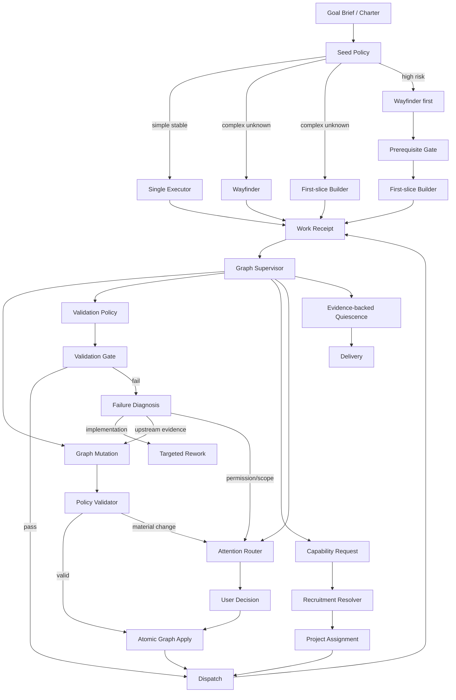

# Agent Company Seed-and-Grow 动态组织与 Graph Engineering 重构计划

## 0. 执行结论

本次改造不重写 Agent Company，也不引入 Orca 作为第二套控制平面。

保留：

- Local Control Plane 作为唯一权威写入者；
- SQLite、Project、Plan、WorkItem、Artifact、ProjectEvent、ApprovalGate；
- AgentRun、Runtime Home、SkillSnapshot、恢复机制；
- CompanyRecruitment、Candidate、Performance、Employment Review、Department；
- Experience WorkProjection、Nuxt WebUI、Electron；
- 软件领域的 Worktree、宿主验证、Review、Merge Gate、主分支复验。

替换：

- 项目启动时创建一个中心化 Project Planner；
- 开工前一次性生成完整 1–6 节点任务树；
- 每个 Worker 预建一个 Reviewer；
- 失败后默认原节点重试；
- 以 `reports_to` 层级链决定项目问题向谁升级；
- “当前没有 ready 节点”即项目完成；
- 临时项目角色写入 Agent 永久 `role_key`；
- 无匹配者时直接创建 `employee`。

目标模型：

> 复杂未知项目只用 Wayfinder 与 First-slice Builder 启动；Agent 通过结构化 Work Receipt 报告事实、未知项、阻塞和能力缺口；Graph Supervisor 根据可验证证据增量修改任务图；Recruitment 只在真实能力缺口出现后加入 Agent；Reviewer 与用户 Gate 按风险动态创建。

系统仍然是：

> 中心化事实、权限和恢复；分布式探索、执行和验证；证据驱动的组织生长。

开发与验收采用：

> AI 自动执行、机器证据裁决、失败自动诊断修复、精确提交可复现；Pre-Public 开发阶段不以人工签字、截图审批、用户研究或 Release Owner 签名阻断阶段推进。

这里取消的是**开发阶段人工强 Gate**，不是产品运行时的权限边界。权限升级、范围重大变化、外部写入、发布、删除及其他不可逆动作仍按产品宪法进入 ApprovalGate；自动化验收只需证明系统正确创建并阻塞在该 Gate，不需要真的执行风险动作。

---

## 1. 与现有 R0–R4 路线的关系

这不是新的平行路线，而是对现有 R3/R4 的纵向补强。

### R3 增补：Verified Repair

以下能力必须前移到 R3，作为“Verified Delivery”成立的前提：

- 独立 Attempt 事实；
- Work Receipt；
- 机器前提 Gate；
- Graph Mutation 基础；
- 失败诊断；
- Diagnose → Fix → Reverify 三轮修复；
- Pending Receipt / Mutation 感知的完成判定；
- 重启后恢复 Receipt、Mutation 和阻塞范围。

原因：没有这些能力，R3 只能证明“初始计划正确时可以交付”，不能证明遇到未知前提后仍能交付。

### R4 主体：Seed-and-Grow Dynamic Organization

以下能力仍属于 R4：

- Seed Policy；
- Wayfinder + First-slice Builder；
- 临时 Project Assignment；
- Receipt 驱动的能力需求；
- Agent 动态加入与释放；
- 风险驱动 Reviewer；
- 组织生长投影；
- Assignment 绩效、候选复用、转正与部门沉淀；
- `seed_and_grow` 成为默认项目策略。

### 实施原则

后端能力可以在 R3 期间通过 Feature Flag 和 Shadow Mode 提前合并，但在 R4 自动发布门禁前不替换默认项目路径。

R0–R4 是产品发布阶段，O0–O9 是本计划的工程能力包，两者不得混用：

- 当前执行顺序仍由体验重构计划决定；R0 未完成时，本计划只能做文档、契约和不改变默认路径的 behind-flag 基础工作；
- O 阶段按第 6.0 节的实际实施波次串行推进，不按能力包编号猜测先后；
- 每个实施波次由 AI 在精确候选 SHA 上执行自动测试、真实本地部署、E2E、恢复演练和证据校验；只有机器结果为 `pass` 才自动进入下一波次；
- 人工研究、主观视觉意见和具名签署可作为建议证据记录，但不进入 Pre-Public O 阶段的阻断集合，也不需要逐阶段生成 waiver；
- 面向公众的 tag、npm 发布及其他外部副作用不由本计划自动触发，仍遵守产品宪法和正式发布策略。

---

## 2. 当前代码事实与最小切口

基线：`953346b22d509f6b9e76a23d4049832a96b4c6c8`

### 2.1 已有可复用能力

| 现有能力 | 复用方式 |
|---|---|
| `Plan.phase = replan` | 承担实质性范围/验收变化的计划版本 |
| `WorkItem.depends_on` | 继续作为任务图边 |
| `ProjectEvent` | 记录 Receipt、Mutation、Assignment、Gate 的用户投影来源 |
| `AgentRun.companyProjectID/workItemID` | Receipt 直接引用真实运行，不重复运行事实 |
| `Artifact.evidence` | 保存领域验证结果与可消费证据 |
| `CompanyRecruitment` | 继续负责候选池、选择、释放、绩效与转正 |
| `WorkProjection` | 继续作为用户状态事实，不让 UI 直接消费 Runtime raw status |
| `Database.transaction({ behavior: "immediate" })` | 原子应用 Graph Mutation 与 revision CAS |
| AgentRun/Conversation 恢复 | 作为 Orchestrator 恢复的前置基础 |
| Worktree/宿主复验 | 软件任务的现实锚点 |

### 2.2 必须替换的中心化主链

当前 `packages/control-plane/src/company-project/execution.ts` 的关键行为：

1. `createPlanner()` 创建一个 `lifecycle: employee` 的项目规划者；
2. Planner 调用 `delegation.decompose()` 一次性生成完整任务集合；
3. 每个任务提前创建 Worker；
4. 每个 Worker 提前创建 Reviewer；
5. Worker 被明确禁止重规划；
6. 失败被记录为 `attempt_failure` Artifact，然后重试同一 WorkItem；
7. 无 ready 节点且所有节点终态时直接标记 Project completed；
8. Company 路径走 Recruitment，但 standalone fallback 直接创建 `employee`。

新的执行路径应绕开而非原地继续膨胀该文件。

---

## 3. 目标运行架构



### 3.1 权限边界

| 主体 | 可以做 | 不可以做 |
|---|---|---|
| Worker / Wayfinder | 执行节点、提交 Receipt、声明 blocker、提出任务/依赖/能力建议 | 直接改图、招聘、提权、降低验收标准 |
| Reviewer / Validator | 给出通过、失败与 findings | 自行修改图或批准高风险动作 |
| Graph Supervisor | 基于 Receipt 生成结构化 Mutation 提案 | 直接写 DB、暴露私有推理、绕过 Policy |
| Graph Mutation Policy | 确定性校验并原子应用允许操作 | 解释业务目标、生成开放式方案 |
| Recruitment Resolver | 根据硬约束与证据选择 Agent | 决定项目范围和验收标准 |
| Attention Router | 按材料性把问题路由给正确权限主体 | 把所有错误都升级给用户 |
| 用户 | 决定范围、验收、权限、预算和外部副作用 | 不需要编排每个 Agent |

Graph Supervisor 是 Control Plane 服务，不是员工 Agent，不出现在 Team 页面，不拥有 SOUL、Memory、Relationship 或私域。

---

## 4. 领域模型调整

## 4.1 `company_project`

新增字段：

```ts
execution_strategy:
  | "legacy_full_plan"
  | "seed_and_grow"

seed_mode:
  | "direct_single"
  | "seed_pair"
  | "discovery_first"

orchestration_state:
  | "seeding"
  | "running"
  | "processing_receipts"
  | "expanding"
  | "awaiting_attention"
  | "quiescent"
  | "stopped"

graph_revision: number
orchestrator_version: number
```

约束：

- `execution_strategy` 在首个 WorkItem 创建后不可修改；
- 旧项目迁移时固定为 `legacy_full_plan`；
- 新策略项目的所有图修改必须递增 `graph_revision`；
- `completed` 不能仅由 WorkItem 队列为空触发。

## 4.2 `company_work_item`

保留 `kind: planner | worker | reviewer` 作为执行语义；新增 `purpose` 表达业务用途：

```ts
purpose:
  | "discovery"
  | "first_slice"
  | "delivery"
  | "verification"
  | "recovery"
  | "closeout"

origin_kind:
  | "legacy"
  | "seed"
  | "receipt"
  | "graph_mutation"
  | "user"

origin_ref_id?: string
graph_revision_created: number

validation_mode:
  | "self_check"
  | "machine"
  | "independent_review"
  | "review_and_user_gate"

superseded_by_id?: string
```

`WorkItemStatus` 增加：

```ts
"superseded"
```

约束：

- completed WorkItem 和已有 Artifact 不可被 Graph Mutation 改写；
- superseded 只表示该节点不再属于当前执行图，历史事实永久保留；
- `purpose=discovery` 默认 `read_only`；
- Reviewer 不再由 Planner 无条件预建。

## 4.3 `company_work_attempt`

新增独立实体，逐步替代仅靠 `WorkItem.attempt` 计数：

```ts
{
  id
  project_id
  work_item_id
  agent_run_id?
  ordinal
  status: "running" | "completed" | "failed" | "stopped"
  failure_kind?:
    | "implementation"
    | "environment"
    | "missing_prerequisite"
    | "dependency"
    | "permission"
    | "validator"
    | "scope"
    | "unknown"
  safe_summary?
  started_at
  finished_at?
}
```

唯一约束：

- `(work_item_id, ordinal)`
- 一个 AgentRun 最多绑定一个 Attempt。

`WorkItem.attempt` 在迁移期保留为兼容/缓存字段。

## 4.4 `company_work_receipt`

每个终态 Attempt 必须恰好一个 Receipt：

```ts
{
  id
  project_id
  work_item_id
  attempt_id
  outcome: "completed" | "blocked" | "failed" | "ask"
  summary

  artifact_ids_json
  evidence_refs_json
  confirmed_facts_json
  invalidated_assumptions_json
  unknowns_json
  blockers_json
  capability_gaps_json
  task_proposals_json
  dependency_proposals_json
  questions_json

  processing_status: "pending" | "processing" | "processed" | "rejected"
  processed_mutation_id?
  created_at
  processed_at?
}
```

约束：

- `attempt_id` 唯一；
- Receipt 只引用已经持久化的 AgentRun、Artifact 和 Evidence；
- Agent 的建议是提案，不是命令；
- Receipt 必须先持久化，再广播事件；
- 重复回执通过 idempotency key 返回同一 Receipt。

## 4.5 `company_graph_mutation`

```ts
{
  id
  project_id
  trigger_receipt_id
  expected_revision
  applied_revision?
  orchestrator_version
  idempotency_key

  decision:
    | "accept"
    | "retry"
    | "expand"
    | "rewire"
    | "supersede"
    | "request_capability"
    | "request_attention"
    | "quiesce"

  rationale
  evidence_refs_json
  operations_json
  status: "proposed" | "validated" | "applied" | "rejected" | "superseded"

  created_at
  applied_at?
}
```

首版允许的 `GraphOperation`：

```ts
type GraphOperation =
  | { type: "add_work_item"; item: NewWorkItem }
  | { type: "add_dependency"; work_item_id: string; depends_on_id: string }
  | { type: "remove_dependency"; work_item_id: string; depends_on_id: string }
  | { type: "supersede_work_item"; work_item_id: string; replacement_id?: string; reason: string }
  | { type: "add_validation_gate"; gate: NewValidationGate }
  | { type: "request_capability"; need: CapabilityNeedProposal }
  | { type: "request_user_decision"; request: AttentionProposal }
```

首版不支持：

- 任意 SQL；
- 删除 WorkItem/Artifact/Event；
- 改写完成节点；
- 修改 Project goal；
- 静默删除验收条件；
- 自动扩大权限或外部副作用；
- 任意脚本式图变换。

## 4.6 `company_project_assignment`

把永久身份与项目临时责任分开：

```ts
{
  id
  company_id
  project_id
  work_item_id
  capability_need_id
  selection_id
  agent_id

  temporary_role
  responsibility
  decision_scope_json
  resource_scope_json
  permission_mode
  source_receipt_id?

  status: "assigned" | "active" | "released"
  assigned_at
  started_at?
  released_at?
}
```

约束：

- 一个 WorkItem 同一时间只允许一个 active Assignment；
- Reassign 必须关闭旧 Assignment 并保留历史；
- 临时角色不得写入 Agent 永久 `role_key`；
- `candidate/assigned/employee` 继续表示职业生命周期，Assignment 表示项目责任；
- Candidate 可以在多个项目中被选择，但并发能力由 active runs 与策略控制。

## 4.7 `company_validation_gate`

不要复用 `ApprovalGate`。两者语义不同：

- `ApprovalGate`：人的权限/批准；
- `ValidationGate`：机器事实是否满足。

本计划第 6、8 节的 `Stage Gate` 是仓库外层的构建与证据裁决，不写入产品业务表，也不复用上述两类运行时对象。

```ts
{
  id
  project_id
  work_item_id?
  kind:
    | "prerequisite"
    | "unit_test"
    | "integration_test"
    | "device"
    | "runtime"
    | "artifact"
    | "source"
    | "policy"

  status: "pending" | "running" | "passed" | "failed" | "superseded"
  criteria_json
  blocking_work_item_ids_json
  evidence_refs_json
  evaluator
  repair_round
  max_repair_rounds
  failure_summary?
  created_at
  evaluated_at?
}
```

约束：

- Gate 未通过时，所有被阻塞 WorkItem 不进入 ready；
- 判据变化通过创建新版本 Gate，旧 Gate 标记 superseded；
- 不允许把失败只写成 warning 后继续派发；
- 三轮 Diagnose → Fix → Reverify 后仍失败，停止自动执行并生成 Attention Item。

## 4.8 `CapabilityNeed`

新增硬约束：

```ts
work_item_id
source_receipt_id?
required_runtime_capabilities_json
required_tools_json
allowed_permission_modes_json
workspace_scopes_json
independent_from_agent_ids_json
```

选人顺序：

1. Runtime 兼容；
2. 工具可用；
3. 权限可满足；
4. Workspace/隐私边界允许；
5. Reviewer 独立性；
6. 再比较能力证据、历史质量、可靠性、负载、成本、速度和复用价值。

---

## 5. 新增 Control Plane 模块

建议新建：

```text
packages/control-plane/src/project-orchestrator/
├── index.ts
├── schema.ts
├── project-orchestrator.sql.ts
├── receipt-service.ts
├── seed-policy.ts
├── seed-team.ts
├── graph-supervisor.ts
├── graph-mutation-service.ts
├── graph-patch-validator.ts
├── validation-policy.ts
├── validation-gate-service.ts
├── failure-diagnosis.ts
├── attention-router.ts
├── quiescence-service.ts
├── recovery.ts
└── projection.ts
```

核心接口：

```ts
interface ProjectOrchestrator {
  startSeedProject(input): Effect<SeedResult>
  submitReceipt(input): Effect<WorkReceipt>
  processReceipt(receiptID): Effect<GraphDecision>
  proposeMutation(input): Effect<GraphMutation>
  validateMutation(mutationID): Effect<ValidationResult>
  applyMutation(mutationID): Effect<AppliedMutation>
  dispatchReady(projectID): Effect<DispatchResult>
  checkQuiescence(projectID): Effect<QuiescenceResult>
  recover(): Effect<RecoveryReport>
}
```

依赖方向：

```text
Experience / Company Routes
        ↓
CompanyProjectExecution facade
        ↓
ProjectOrchestrator
        ↓
CompanyProject / Recruitment / Governance / AgentRun / Artifact
        ↓
Runtime / Worktree / SQLite
```

禁止反向依赖：

- Runtime 不依赖 ProjectOrchestrator；
- Recruitment 不依赖 UI；
- Graph Supervisor 不依赖 GroupSession；
- WorkProjection 不直接执行业务变更；
- Worker Skill 不直接依赖 GraphMutationService。

---

# 6. 分阶段开发计划

## 6.0 实际实施波次与自动 Gate

O0–O9 是稳定的能力包编号，不等于实际开发顺序。为消除 R3 能力反向依赖 R4 的问题，按以下波次串行实施：

| 波次 | 能力包 | 目标 | 进入条件 | 自动退出条件 |
|---|---|---|---|---|
| A0 | O0 | 冻结契约并建立自动验收基础设施 | 当前 R0 允许 behind-flag 基础工作 | O0 机器 Gate `pass` |
| A1 | O1 | 建立 Attempt / Receipt 事实层 | A0 `pass` 且进入 R3 开发窗口 | O1 机器 Gate `pass` |
| A2 | O4 | 建立 Graph Mutation、revision 与原子 Policy | A1 `pass` | O4 机器 Gate `pass` |
| A3 | O6 | 建立 ValidationGate、FailureDiagnosis 与 Repair | A2 `pass` | O6 机器 Gate `pass` |
| A4 | O7-R3 | 完成 Receipt / Mutation / Gate 恢复与对账 | A3 `pass` | O7-R3 机器 Gate `pass` |
| B0 | O2 | 建立 Project Assignment 与招聘硬约束 | A4 `pass` 且进入 R4 开发窗口 | O2 机器 Gate `pass` |
| B1 | O3 | 建立 Seed Policy 与两 Agent 启动 | B0 `pass` | O3 机器 Gate `pass` |
| B2 | O5 | 建立 Graph Supervisor 与 Grow Loop | B1 `pass` 且 O4 `pass` | O5 机器 Gate `pass` |
| B3 | O7-R4 | 完成 Attention Router 与 R4 恢复链 | B2 `pass` | O7-R4 机器 Gate `pass` |
| B4 | O8 | 建立 Experience Projection 与 WebUI | B3 `pass` | O8 机器 Gate `pass` |
| B5 | O9 | Shadow、Dogfood、默认切换与回滚 | B4 `pass` | O9 机器 Gate `pass` |

每个波次遵循同一契约：

1. AI 先把本波次实现收敛为一个精确候选提交，记录完整 SHA；
2. 自动 runner 从该 SHA 创建隔离工作树、临时 Runtime Home、临时数据目录和动态端口，不用开发者当前脏工作区作为通过证据；
3. 依次执行静态检查、包级测试、迁移、真实本地 Control Plane、Browser/Desktop E2E、重启恢复、候选部署和两轮本地同 SHA 复现；
4. 确定性 Gate 校验退出码、JUnit/JSON、运行态断言、候选 SHA、文件摘要和证据覆盖；AI 可以执行与修复，但不能用自然语言把失败改成通过；
5. `pass` 自动进入下一波次；`failed` 或 `blocked` 保留现场并停止，AI 最多进行三轮 Diagnose → Fix → Reverify；
6. 人工研究、人工截图审批、SUS 与主观设计意见只写入 `advisory`，缺失时不改变 O 阶段结果；
7. 产品运行时 ApprovalGate 的正确阻塞本身可以成为自动验收的 `pass`，无需真人点击批准。

## O0 — 冻结基线与架构契约

**目标发布：R3 前置**
**优先级：P0**
**复杂度：M**

### 任务

- `ORCH-00`：新增本计划文档和 ADR；
- `ORCH-01`：定义 `legacy_full_plan | seed_and_grow` 双路径契约；
- `ORCH-02`：新增机器可读 `orchestration-contract.v1.json`；
- `QA-08`：新增 `seed-grow-benchmark-scenarios.v1.json`，在不修改 R0 S01–S12 基线契约的前提下登记 S13–S27；
- `METRIC-01`：定义动态图与组织指标；
- `QA-AUTO-01`：新增机器可读 `seed-grow-stage-contract.v1.json`，绑定波次、Task、验收标准和命令；
- `QA-AUTO-02`：新增精确 SHA 自动 evidence runner 与确定性 stage gate；
- `QA-AUTO-03`：为 evidence runner 建立防伪、路径限制、超时、脱敏和自检；
- `QA-AUTO-04`：建立两轮本地同 SHA 复现 Gate；保留 CI adapter 契约，GitHub Actions 恢复前不作为阻断项；
- `QA-AUTO-05`：建立真实本地 Control Plane / WebUI 临时部署与健康、版本、关闭清理检查；
- 增加 Feature Flag：
  - `off`：只有 legacy；
  - `shadow`：新 Supervisor 只计算不应用；
  - `active`：新项目可选择 seed_and_grow。

### 改动范围

- `docs/product-design/ADR-Seed-and-Grow-Orchestration-v1.0.md`
- `docs/product-design/experience-refactor/manifest.v1.json`
- `docs/product-design/experience-refactor/seed-grow-benchmark-scenarios.v1.json`
- `docs/product-design/experience-refactor/metric-contract.v1.json`
- `docs/product-design/experience-refactor/orchestration-contract.v1.json`
- `docs/product-design/experience-refactor/seed-grow-stage-contract.v1.json`
- `docs/product-design/experience-refactor/seed-grow-stage-evidence.v1.json`
- `packages/sdk/js/src/v2/gen/sdk.gen.ts`
- `packages/sdk/js/src/v2/gen/types.gen.ts`
- `packages/sdk/openapi.json`
- `script/seed-grow-stage-evidence.ts`
- `script/seed-grow-stage-gate.ts`
- Flag/config
- 不改生产执行行为。

### 自动验收

- 当前所有测试与 R0 证据不回退；
- 每个新 Task 能映射到 R3/R4 Gate；
- Project execution strategy 在 `orchestration-contract.v1.json` 中只有一个 Schema 事实源；数据库字段到 B1 实现前不得伪报为已落地；
- 明确不做 Orca 兼容层、第二数据库、第二 Runtime。
- stage contract 对 A0–B5 的 Task、验收标准和证据引用覆盖率为 100%；
- runner 自检能拒绝错误 SHA、脏候选、缺失命令、重复命令、路径逃逸、篡改日志、过期证据和伪造 `pass`；
- 同一候选连续运行两次得到一致的归一化判定；
- O0 Gate 不读取人工证据字段，也不接受跳过机器检查的 waiver。

---

## O1 — Attempt 与 Work Receipt 事实层

**目标发布：R3**
**优先级：P0**
**复杂度：XL**
**依赖：O0**

### 任务

- `FACT-01`：新增 `company_work_attempt`；
- `FACT-02`：新增 `company_work_receipt`；
- `FACT-03`：建立 Receipt Zod Schema 和 Effect Service；
- `FACT-04`：让 legacy Worker/Reviewer 路径也产生 Receipt；
- `FACT-05`：新增事件：
  - `work_attempt.started`
  - `work_attempt.finished`
  - `work_receipt.submitted`
  - `work_receipt.processed`
- `FACT-06`：增加幂等与恢复扫描；
- `FACT-07`：SDK/诊断只读接口。

### 关键实现

- 不复制 AgentRun events、usage、SkillSnapshot；
- Receipt 只保存语义化结论和事实引用；
- 当前结构化 submission 继续作为 Artifact 内容；
- 当前 `attempt_failure` Artifact 暂时保留，Receipt 成为统一入口；
- Worker/Reviewer 完成后先写 Attempt、Artifact、Receipt，再推进 WorkItem 状态。

### 自动验收

- 每个终态 Attempt 恰好一个 Receipt；
- 相同 AgentRun 重放不产生重复 Receipt；
- Receipt 引用的 Artifact/Run 不存在时拒绝提交；
- Control Plane 在 Receipt 写入后、处理前崩溃，重启后可继续；
- legacy 项目行为与结果不变；
- WorkProjection 尚不显示新事实也不报 unknown event。
- A1 runner 必须在全新数据库与从基线迁移的数据库各执行两轮，归一化 Receipt/Attempt 结果一致；
- 阶段证据包含迁移报告、JUnit、崩溃点、重启后数据库断言和未重复副作用证明。

---

## O2 — Project Assignment 与招聘收敛

**目标发布：R4 前置，可在 R3 behind flag 合并**
**优先级：P0**
**复杂度：XL**
**依赖：O1**

### 任务

- `TEAM-06`：新增 `ProjectAssignment`；
- `TEAM-07`：CapabilityNeed 绑定 WorkItem/Receipt；
- `TEAM-08`：增加 Runtime/Tool/Permission/Workspace/Independence 硬约束；
- `TEAM-09`：移除项目选择对永久 `role_key` 的副作用；
- `TEAM-10`：禁止 `CompanyProjectExecution` 直接创建 `employee`；
- `TEAM-11`：统一 standalone 与 company 项目选人路径；
- `TEAM-12`：Reassign 改为版本化 Assignment；
- `TEAM-13`：项目结束释放 Assignment。

### 迁移策略

- 保留 `TeamSelection` 作为“为什么选中/拒绝”记录；
- `ProjectAssignment` 表示“当前正在承担什么责任”；
- `CompanyAgent.lifecycle` 继续表示职业状态；
- 首版保留 `assigned` lifecycle 兼容，但不再承载临时角色；
- 现有 `ensureRoleKey()` 不再由项目选人调用。

### 自动验收

- 所有项目 Agent 都能追溯到 Need → Selection → Assignment；
- 临时角色不修改 Agent 永久身份；
- 无匹配者只创建 candidate，不直接创建 employee；
- Reviewer 选择可声明 `independent_from_agent_ids`；
- 重启和 Reassign 不丢失历史 Assignment；
- 同一 WorkItem 不存在两个 active Assignment。
- B0 runner 必须覆盖 standalone/company、无匹配者、Reassign、重启和并发争用，直接查询真实 SQLite 断言生命周期；
- `role_key` 或正式 employment 被项目临时选择意外改写时，阶段立即失败。

---

## O3 — Seed Policy 与两 Agent 启动

**目标发布：R4**
**优先级：P1**
**复杂度：XL**
**依赖：O2**

### Seed Policy

```text
direct_single
  低风险、明确、可逆、稳定 SOP

seed_pair
  新功能、陌生代码库、复杂研究、跨模块工作

discovery_first
  高风险、外部副作用、关键前提未知
```

确定性规则优先，模型只处理规则无法分类的边界。

### 任务

- `SEED-01`：实现 SeedPolicy；
- `SEED-02`：新增 `project-wayfinding@1` Capability Pack；
- `SEED-03`：定义 WayfinderReceipt；
- `SEED-04`：实现 First-slice Selection；
- `SEED-05`：新增 `startSeedProject()`；
- `SEED-06`：为 `start()` 与 `startFromCharter()` 接双路径；
- `SEED-07`：新项目 pin execution strategy；
- `SEED-08`：不提前创建 Reviewer；
- `SEED-09`：Wayfinder 和 Builder 分配不同 Agent。

### Wayfinder 约束

允许：

- workspace/repository read；
- search；
- test discovery；
- runtime/config inspection；
- 已授权网络只读。

禁止：

- workspace write；
- Git commit/merge；
- 外部写入；
- 修改图；
- 创建 Agent；
- 声称项目完成。

### First Slice 选择原则

按以下维度选第一块：

1. 最快接触真实环境；
2. 信息增益高；
3. 用户价值可感知；
4. 可逆；
5. 依赖少；
6. 有明确现实锚点；
7. 不跨越未批准权限。

### 自动验收

- 复杂项目初始只有两个 active Assignment；
- Wayfinder 和 Builder 为不同 Agent；
- Wayfinder 的 AgentRun 为 read_only；
- 初始没有 Reviewer；
- 不生成完整 1–6 节点任务树；
- simple benchmark 仍允许单 Agent；
- high-risk benchmark 在前提 Gate 通过前不启动 Builder；
- Feature Flag 关闭后完全回到 legacy。
- B1 runner 对 S13、S14、S15 各重复两轮；S15 正确创建 ApprovalGate 并保持 Builder 未派发即视为通过，不需要真人批准；
- Wayfinder 发生写入、两个角色落到同一 Agent 或初始生成完整任务树时，阶段立即失败。

---

## O4 — Graph Mutation 与确定性 Policy

**目标发布：R3 基础 / R4 启用**
**优先级：P0**
**复杂度：XL**
**依赖：O1**

### 任务

- `GRAPH-01`：Project `graph_revision`；
- `GRAPH-02`：GraphMutation Schema/SQL/Service；
- `GRAPH-03`：限定 GraphOperation；
- `GRAPH-04`：GraphPatchValidator；
- `GRAPH-05`：原子 apply + expected_revision；
- `GRAPH-06`：WorkItem superseded；
- `GRAPH-07`：并发 Receipt 冲突重算；
- `GRAPH-08`：Mutation 事件与审计；
- `GRAPH-09`：Shadow Mode。

### 确定性规则

必须拒绝：

- 环；
- 自依赖；
- 不存在的节点；
- 修改 completed/superseded 事实；
- 删除 Artifact/Event；
- 静默删除验收条件；
- 自动扩大 scope/permission；
- 降低高风险 Gate；
- Reviewer 复核自己；
- 运行中节点被静默换依赖；
- 无 Receipt/Evidence 的自动扩图；
- expected_revision 不匹配。

### 原子顺序

```text
BEGIN IMMEDIATE
→ 检查 graph_revision
→ 验证全部操作
→ 写 Mutation
→ 应用节点/依赖/状态变化
→ graph_revision + 1
→ 写 ProjectEvent
→ COMMIT
→ 发布 SSE invalidation
```

### 自动验收

- 同一 Mutation 重放无副作用；
- 两个并发 Receipt 只有一个 mutation 在旧 revision 上成功；
- 冲突方读取新快照后重新决策；
- 崩溃前后数据库不会处于半张图状态；
- superseded 节点和原因可追溯；
- Shadow Mode 不修改业务状态。
- A2 runner 在事务提交前后、事件广播前后和并发 revision 冲突点注入故障并重启复核；
- 阶段证据必须包含 mutation 输入、policy verdict、提交前后 graph snapshot 与数据库不变量报告。

---

## O5 — Graph Supervisor 与 Grow Loop

**目标发布：R4**
**优先级：P0**
**复杂度：XL**
**依赖：O3、O4**

### 任务

- `ORCH-03`：实现 GraphSupervisor；
- `ORCH-04`：Receipt Processor；
- `ORCH-05`：结构化 GraphDecision；
- `ORCH-06`：CapabilityGap → Need；
- `ORCH-07`：Mutation 应用后 dispatch；
- `ORCH-08`：Pending Receipt 串行化；
- `ORCH-09`：QuiescenceService；
- `ORCH-10`：Orchestrator versioning；
- `ORCH-11`：系统级决策审计，不保存私有推理。

### Graph Decision

每个 Receipt 只产生以下之一：

```text
accept
retry current node
add 1–3 next nodes
rewire dependencies
supersede affected branch
request capability
request user attention
declare quiescence
```

“1–3”是首版控制组织膨胀的预算，不是永久产品限制。

### Quiescence 条件

Project 只有同时满足以下条件才能进入交付：

- 没有 active/running WorkItem；
- 所有终态 Attempt 都有 Receipt；
- 所有 Receipt 均 processed；
- 没有 proposed/validated Mutation；
- 没有失败 ValidationGate；
- 没有 unresolved blocker；
- 没有 pending ApprovalGate；
- 每条验收标准都有证据覆盖或明确限制；
- Supervisor 明确输出 `quiesce`；
- Delivery Package 可生成。

### 自动验收

- 新 WorkItem 100% 引用 seed、Receipt、Mutation 或用户决定；
- 无证据不能自动扩图；
- Receipt 未处理时项目不能完成；
- Mutation 应用后只派发真正 ready 的节点；
- Graph Supervisor 不出现在员工列表；
- 同一个 Receipt 不会被重复处理；
- 无新任务时也必须经过 Quiescence 判断。
- B2 runner 对 S13、S17、S21、S24 各重复两轮，并校验每次扩图最多新增 1–3 节点；
- safe benchmark 采用无需人工介入的批准策略；需要授权的 benchmark 只验证正确停在 ApprovalGate。

---

## O6 — Eval、Prerequisite Gate 与 Graph Repair

**目标发布：R3**
**优先级：P0**
**复杂度：XL**
**依赖：O1、O4；Receipt Processor 最小接口在本阶段实现，不依赖 O3/O5 的 R4 启用链**

### 任务

- `EVAL-01`：ValidationGate 实体；
- `EVAL-02`：前提事实化；
- `EVAL-03`：软件 Evidence Anchor；
- `EVAL-04`：研究/文档/本地应用 Anchor；
- `EVAL-05`：FailureDiagnosis；
- `EVAL-06`：Diagnose → Fix → Reverify；
- `EVAL-07`：三轮熔断；
- `EVAL-08`：风险驱动 ValidationPolicy；
- `EVAL-09`：禁止 warning-only 放行；
- `EVAL-10`：验收标准证据覆盖矩阵。

### 软件领域 Anchor

- repository binding 真实存在；
- runtime capability 真实支持；
- host test/build/lint 命令；
- Worktree diff；
- 独立 Reviewer（需要时）；
- merge 后主分支复验；
- UI 使用真实 Control Plane 的 Playwright；
- 设备任务接真实 device state。

### 非软件 Anchor

| 领域 | Anchor |
|---|---|
| 研究 | 来源可访问、抓取时间、正文片段、跨来源一致性 |
| 文档 | 文件存在、可回读、可解析、可导出 |
| 本地应用 | 实际启动、关键交互、状态断言 |
| UI | Playwright、截图回归、真实后端、交互断言 |
| 外部动作 | 平台返回的真实 ID、状态、时间和可回查记录 |

### Failure Diagnosis

```text
implementation
  原 Worker 定向返工

environment
  新增环境修复节点或等待恢复

missing_prerequisite
  增加 Prerequisite Gate / recovery 节点并重连

dependency
  修改图边

permission
  Approval Gate / 用户

validator
  修正 Validator 后使用同一标准重验

scope
  用户决定或 supersede 受影响分支

unknown
  先创建诊断节点，不盲目重跑
```

### 自动验收

- Gate 失败时下游零派发；
- 假前提能生成 recovery 节点并重连依赖；
- 只有上游证据才触发 Graph Mutation；
- 实现错误不会无意义改图；
- 三轮失败后停止自动执行；
- 三轮诊断、修复和复验证据一起进入 Attention；
- Validator 变化不能降低原验收标准；
- Reviewer 不再是所有任务的默认配置。
- A3 runner 必须覆盖 S16 与 S22，并保存每轮原判据、诊断、修复 diff、复验结果和最终 Attention；
- AI 语义判断只能生成 finding 或修复建议，ValidationGate 的 `passed` 必须来自已登记的确定性 evaluator 与现实 Anchor。

---

## O7 — Attention Router、真实动作与恢复

**目标发布：R2/R3 补齐 + R4**
**优先级：P0**
**复杂度：XL**
**依赖：O7-R3 依赖 O1、O4、O6；O7-R4 依赖 O5、O6**

### Attention Router

不再用 `reports_to` 决定项目问题的裁决者：

| 问题 | 路由 |
|---|---|
| 实现错误 | Worker 返工 |
| 缺少前提 | Graph Supervisor |
| 新能力缺口 | Recruitment Resolver |
| Reviewer findings | Worker 定向返工 |
| 图依赖错误 | Graph Mutation Policy |
| Runtime 临时故障 | 自动恢复/重试 |
| 权限不足 | Approval Gate |
| 范围/验收变化 | Project DRI / 用户 |
| 外部副作用 | 用户 |
| 永久招聘/部门 | Company Governance |

### O7-R3 任务

- `REC-01`：Orchestrator recovery；
- `REC-02`：启动扫描 pending Receipt；
- `REC-03`：恢复 proposed/applied Mutation；
- `REC-05A`：Receipt、Mutation、Gate、WorkItem、Runtime 对账。

### O7-R4 任务

- `GOV-01`：AttentionRouter；
- `GOV-02`：材料性判断；
- `GOV-03`：实现真实 pause/resume/stop/retry/resolve_blocker；
- `GOV-04`：调整方向进入新 GoalBrief/Plan 版本；
- `GOV-05`：新项目路径停止使用 `reports_to` 失败上报；
- `REC-04`：Assignment/AgentRun 对账；
- `REC-05B`：补齐 Assignment、Attention 与 action handler 对账。

### 服务启动顺序

```text
schema migration
→ ConversationRuntime recover
→ AgentRunSupervisor recover
→ ProjectOrchestrator recover
→ rebuild projections
→ accept new dispatch
```

### 自动验收

- Control Plane 在 Receipt 写入后任意边界崩溃均可恢复；
- 重启不重复 Mutation、Assignment 或副作用；
- 用户只收到材料性问题；
- `ExperienceR0ImplementedMutationActions` 只在真实 handler 存在后逐项启用；
- Legacy delegation hierarchy 继续兼容旧路径，但不进入 seed_and_grow；
- 无效打断率进入现有 `<20%` 指标。
- A4 runner 对 Receipt、Mutation、Gate 的每个持久化边界执行 kill/restart；B3 再覆盖 Assignment、Attention 与真实 action handler；
- 两个子 Gate 分别产出独立判定，O7-R3 通过后可以进入 B0，不等待 O7-R4。

---

## O8 — Experience Projection 与 WebUI

**目标发布：R4**
**优先级：P1**
**复杂度：XL**
**依赖：O5–O7**

### Shared Contract

`ExperienceSourceRef.kind` 增加：

```text
work_attempt
work_receipt
graph_mutation
project_assignment
validation_gate
```

新增只读投影：

```ts
OrganizationProjection
GraphChangeSummary
DiscoverySummary
ValidationSummary
AssignmentSummary
```

建议新增接口：

```text
GET /experience/work/:projectID/organization
GET /experience/work/:projectID/graph
GET /experience/work/:projectID/receipts/:receiptID
GET /experience/work/:projectID/validation
```

用户动作统一进入已有 Experience Action 语义，不给前端开放 Graph Mutation API。

### Work 主界面

默认展示：

- 当前目标；
- Wayfinder 在确认什么；
- First Slice 在交付什么；
- 最近发现的未知项；
- 为什么新增/暂停了任务；
- 哪些 Gate 正在阻塞；
- 是否需要用户决定；
- 最终交付。

不默认展示：

- raw dependency IDs；
- GraphOperation JSON；
- Recruitment score；
- Prompt；
- Tool 参数；
- Runtime stack；
- 完整内部消息。

### Team 页面

从“公司静态员工名册”升级为：

- 当前 active Assignment；
- Agent 为什么加入；
- 依据哪个 Receipt/Need；
- 临时角色还是正式员工；
- 当前负载；
- 何时释放；
- 选择理由的事实摘要。

### Diagnostics

提供：

- Plan/Graph revision；
- Mutation diff；
- Attempt/Receipt；
- Gate 判据与证据；
- Assignment/Selection；
- 失败与 superseded 分支；
- Runtime/Skill/Usage 引用。

### 任务

- `UX-01`：WorkProjection projector version bump；
- `UX-02`：新事件白名单和防冲突逻辑；
- `UX-03`：Organization endpoint；
- `UX-04`：Graph diagnostics endpoint；
- `UX-05`：Seed Team 卡片；
- `UX-06`：发现—调整—继续时间线；
- `UX-07`：Team Assignment 视图；
- `UX-08`：Graph Diff Diagnostics；
- `UX-09`：Attention 交互；
- `SDK-01`：重新生成 JS SDK；
- `QA-09`：Nuxt unit / Playwright / visual regression。

### 自动验收

- 主界面不暴露内部图噪音；
- 所有变化可定位到 sourceRefs；
- SSE 断线后全量快照收敛；
- 页面刷新和重启后内容一致；
- 后端缺字段时显示不可用，不虚构成功；
- 两 Agent 启动和组织增长能被用户理解；
- 键盘、读屏、Loading/Empty/Error/Offline 完整。
- B4 runner 使用真实本地 Control Plane 和 production WebUI build 执行 Browser E2E，并在桌面受影响时执行原生 Desktop E2E；
- DOM/交互、可访问性、截图差异和 sourceRef 完整性为机器阻断项；AI 视觉评审只生成 advisory finding，不能单独判定通过或失败。

---

## O9 — Shadow、Dogfood、默认切换与组织学习

**目标发布：R4 完成**
**优先级：P0**
**复杂度：L**
**依赖：O1–O8**

### 任务

- `ROLLOUT-01`：实现 off → shadow → opt_in → dogfood_default → pre_public_default 状态机；
- `ROLLOUT-02`：生成 legacy 与 seed_and_grow Shadow comparison；
- `ROLLOUT-03`：建立 Dogfood candidate 与连续两轮复现；
- `ROLLOUT-04`：实现 Pre-Public 默认切换判定；
- `ROLLOUT-05`：实现本地回滚与 legacy fallback 演练；
- `LEARN-01`：建立 Assignment 绩效、能力复用与 recurring need 指标。

### Rollout 顺序

1. `off`
   - legacy 为唯一执行路径。

2. `shadow`
   - legacy 真执行；
   - SeedPolicy/Supervisor 读取同一快照；
   - 只生成 shadow Receipt 决策和 Mutation，不应用；
   - 对比完整度、成本、Reviewer 数量、未知项发现和错误率。

3. `opt_in`
   - 新建项目可显式选择 seed_and_grow；
   - 已存在项目固定 legacy。

4. `dogfood_default`
   - 内部新项目默认 seed_and_grow；
   - 单项目可回退 legacy，但不能运行中切换。

5. `pre_public_default`
   - seed_and_grow 成为默认；
   - legacy 只作为故障回退。

6. `legacy_retirement`
   - 至少两个连续候选版本通过后，另开清理批次；
   - 删除中心化 Planner 主路径；
   - 保留历史数据读取，不强迁移执行中项目。

### 组织学习

- 绩效按 Assignment/WorkItem 归因；
- Project 完成后才写入职业 Performance；
- Candidate 跨多个项目复用；
- 重复能力需求形成 recurring need；
- 只有满足现有证据条件才转正或建立 Department；
- 部门是历史需求沉淀，不重新成为项目统一派工中心。

### Pre-Public 默认切换自动 Gate

- false completion = 0；
- graph mutation 无证据率 = 0；
- complex 项目首轮 active Assignment 中位数 = 2；
- Receipt 处理恢复成功率 = 100%；
- Graph Mutation 恢复成功率 = 100%；
- Delivery 可消费率 = 100%；
- 验收可判定率 = 100%；
- 无效打断率 < 20%；
- Reviewer 调用量相对 legacy 下降；
- 低风险任务质量不下降；
- Agent 复用率上升，候选膨胀受控；
- 基准集核心完成率 ≥ 70%。
- 同一候选 SHA 的本地 Gate、临时部署和回滚演练全部终态成功，并由两轮隔离运行证明可复现；
- 两个连续候选提交各自完成两轮全量 benchmark，结果可复现且指标均达标；
- Gate 自动产出 `pre_public_default=pass` 后即可切换默认策略，不等待人工截图审批、用户研究或签名；
- tag、npm publish、公开发布及 legacy destructive retirement 不由该 Gate 自动触发。

---

# 7. 新增基准场景

`benchmark-scenarios.v1.json` 继续作为冻结的 R0 S01–S12 基线契约。新增场景写入
`docs/product-design/experience-refactor/seed-grow-benchmark-scenarios.v1.json`，通过
`extends.path` 和 `extends.sha256` 绑定该基线，在其上增加：

| ID | 场景 | 必须证明 |
|---|---|---|
| S13 | 陌生代码库复杂功能 | 初始恰好 Wayfinder + Builder 两个 Assignment |
| S14 | 简单文案改写 | direct_single，单 Agent，无 Reviewer |
| S15 | 高风险外部动作 | discovery_first，Builder 等待前提/用户 Gate |
| S16 | 假前提暴露 | Gate 拦下游，新增 recovery 节点并重连 |
| S17 | 新能力缺口 | Receipt 后才加入第三个 Agent |
| S18 | Reviewer 动态创建 | 低风险无 Reviewer，高风险有独立 Reviewer |
| S19 | Receipt 后崩溃 | 重启后只处理一次 |
| S20 | Mutation 提交后崩溃 | 图状态原子、一致、无重复派发 |
| S21 | 并发 Receipt | revision 冲突后重算，无覆盖 |
| S22 | 三轮修复失败 | 停止自动执行并生成一条高信号 Attention |
| S23 | 前置节点错误 | 整段 superseded，历史和替代关系保留 |
| S24 | 项目完成判定 | pending Receipt/Mutation 时绝不 completed |
| S25 | 临时角色与身份 | Assignment 不修改永久 role_key |
| S26 | Agent 复用 | 相似任务优先复用，不无限新建 Candidate |
| S27 | 服务重启 | AgentRun、Receipt、Mutation、Assignment、Gate 全部对账恢复 |

---

# 8. AI 自动化测试、部署与阶段验收

本节参考 `lumi-full-stack-e2e-validation` 的方法，但按 Agent Company 的 local-first 架构实现，不复制设备、OTA、VPS 或小程序专用流程。

## 8.1 核心契约

- 本地静态检查、单元测试、集成测试、候选构建、本地部署、运行态 E2E、重启恢复、同 SHA 复现和默认切换是独立 Gate；前一个成功不能推断后一个成功；
- 每次运行只接受一个精确候选 SHA，所有命令、构建物和运行态结论必须绑定同一 SHA；
- 最终 Gate 从精确提交创建隔离工作树并使用独立 Runtime Home、SQLite、WebUI data/build/output 目录和动态端口，不读取当前开发工作区的脏状态作为通过证据；
- Browser E2E 必须连接真实本地 Control Plane；Desktop E2E 使用真实内嵌 Control Plane；不得用 fake-control-plane、生产 Fixture、静态截图或直接改库伪造业务完成；
- AI 负责 preflight、执行、观察、诊断、修复和复验；确定性 runner 负责裁决，模型自述、代码总结或“看起来正确”不能改变 Gate 状态；
- 停在预期 ApprovalGate、权限拒绝或风险边界可算场景通过；绕过 Gate 执行动作必须失败；
- 首个失败不变量立即停止后续有副作用步骤，保留已产生证据；
- 共享同一 SQLite、端口、Runtime Home 或可变项目状态的测试不得并行；无共享状态的包级检查可以并行；
- 日志和证据不得保存 token、cookie、Provider 密钥、用户真实内容、完整环境变量、个人路径外的敏感信息或未脱敏 transcript；
- Pre-Public 阶段没有人工阻断项。人工研究和主观意见只能追加为 advisory，不能伪造成机器证据；
- public tag、npm publish、外部部署、删除和其他不可逆动作不属于阶段自动部署，需按当时授权策略单独执行。

## 8.2 AI 执行者与确定性裁决者

| 角色 | 职责 | 不得做 |
|---|---|---|
| Implementer AI | 实现本波次、运行快速检查、修复失败 | 修改验收标准掩盖失败、直接写 `pass` |
| Validation AI | 启动精确 SHA runner、分析证据、定位最小失败面 | 用主观判断替代退出码、数据库断言或 E2E |
| Deterministic Gate | 校验合同、命令、报告、摘要、SHA、覆盖率与最终状态 | 调用模型自行解释失败 |
| Local Reproducer | 从同一提交创建第二个隔离环境并复现全部 Gate | 复用第一次运行目录或历史成功记录 |
| CI Adapter | GitHub Actions 恢复后复用同一判定模块 | 在当前不可用状态下阻塞阶段 |

Implementer AI 与 Validation AI 可以由同一自动化会话串行承担，但最终 `pass` 只能由确定性 Gate 生成。需要独立 Reviewer 的产品场景，必须使用不同 Agent/Run；阶段验收本身不要求真人 Reviewer。

## 8.3 单次运行证据包

每次运行写入一个目录：

```text
.agent/runs/agent-company-seed-grow/<run-id>/
├── run.json
├── source/
│   └── candidate.json
├── commands/
│   └── <step-id>.json
├── logs/
│   └── <redacted-log>
├── reports/
│   ├── junit/
│   └── assertions/
├── runtime/
│   ├── health.json
│   ├── events.json
│   └── recovery.json
├── database/
│   ├── migration.json
│   └── invariants.json
├── playwright/
│   ├── browser/
│   └── desktop/
├── deployment/
│   ├── local-preview.json
│   └── rollback.json
├── ci/
│   └── availability.json
├── advisory/
└── stage-decision.json
```

要求：

- `run.json` 记录 run ID、实施波次、能力包、候选 SHA、runner 版本、开始/结束时间和隔离目录摘要；
- 每条 command 记录稳定 step ID、cwd、argv、allowlist 环境键、超时、退出码、标准输出/错误摘要和日志 SHA-256；
- JUnit、JSON assertion、截图、视频和数据库报告逐文件记录 SHA-256；
- `stage-decision.json` 只允许 `pass | failed | blocked | invalid`，同时列出 required、passed、failed、missing 和 advisory；
- 只有全部 required step `pass`、没有 missing/failed、证据包可重算且两轮同 SHA 归一化结果一致时，阶段才是 `pass`；
- 失败证据与成功证据使用相同保留规则，不覆盖上一次 run。

## 8.4 目标自动化接口

O0 在现有 `experience-automatic-evidence.ts` 的精确提交、隔离目录、命令记录、摘要校验和防篡改能力上抽取可复用基础，不复制一套互不兼容的 runner。现有 `experience-gate.ts` 只实现 R0，不能假装支持本计划；O0 必须实现以下新接口后才能进入 A1：

```bash
bun script/seed-grow-stage-evidence.ts \
  --ref <full-sha> \
  --stage <A0|A1|A2|A3|A4|B0|B1|B2|B3|B4|B5> \
  --out <empty-run-directory>

bun script/seed-grow-stage-gate.ts \
  --ref <same-full-sha> \
  --stage <same-stage> \
  --evidence <run-directory> \
  --out <stage-decision.json> \
  --require-pass
```

stage contract 必须记录 `githubActions.status=unavailable`、`blocking=false` 和 `replacement=two_local_exact_sha_runs`。GitHub Actions 恢复后 CI 复用相同 evidence 与 gate 模块，不维护另一套判定逻辑。`--require-pass` 不接受 human evidence 或 stage waiver；缺失人工 advisory 不影响结果，缺失机器证据必须失败或 blocked。

## 8.5 自动测试与本地部署流水线

每个波次按以下顺序执行：

1. `source.candidate`
   - 候选是完整 40 位提交 SHA；
   - SHA 存在于目标 ref，提交内容与待验证实现一致；
   - 隔离工作树初始与结束均无漂移；
   - 记录本地 SHA、目标 ref；远端可用时附加 remote SHA，但当前不作为阻断项。

2. `contract.coverage`
   - stage contract、Schema、Task、验收标准、命令和报告引用一一对应；
   - 不允许未登记命令决定 Gate；
   - 不允许 criteria 没有 evidence ref。

3. `local.package-gates`
   - 按受影响包执行 typecheck、unit、migration、SDK drift、build 和 lint；
   - 测试从包目录运行，不从仓库根目录运行；
   - 生成 JUnit/JSON 报告。

4. `runtime.integration`
   - 使用全新 SQLite 启动 Control Plane；
   - 执行本阶段真实 API、事件、数据库与投影断言；
   - 再使用迁移数据库执行一次；
   - 验证 `/global/health`、运行版本和候选构建元数据。

5. `deployment.local-preview`
   - 构建 production WebUI；
   - 在 loopback 动态端口启动候选 Control Plane 与 WebUI preview；
   - 验证健康、资源加载、连接、关键路由和候选 SHA 绑定；
   - 若阶段影响 Desktop，构建并启动临时 Electron 测试实例；
   - 关闭后确认端口、进程和临时锁释放，证据目录保留。

6. `e2e.real-surfaces`
   - Browser 走真实本地 Control Plane；
   - Desktop 走真实内嵌 Control Plane；
   - 运行本阶段 benchmark、异常路径、权限路径和恢复路径；
   - 核心场景至少重复两轮并比较归一化结果。

7. `recovery.reconcile`
   - 在本阶段规定的持久化边界注入进程终止；
   - 重启后核对 AgentRun、Receipt、Mutation、Assignment、Gate、WorkItem、Projection 和受管资源；
   - 断言无重复派发、无重复副作用、无 false completion。

8. `local.exact-sha-repeat`
   - 从同一候选 SHA 创建第二个全新隔离工作树、依赖环境、Runtime Home 和数据目录；
   - 重新执行本阶段全部 required Gate，不复用第一次运行的日志、报告、数据库或浏览器状态；
   - 比较两轮 command status、报告摘要、覆盖矩阵与最终判定的归一化 digest；
   - GitHub Actions 当前记录为 `unavailable/non_blocking`；恢复后再增加同 SHA 远端复现，不改变本地 Gate 语义。

9. `stage.finalize`
   - 校验全部文件摘要与覆盖矩阵；
   - 生成 `stage-decision.json`；
   - `pass` 后 AI 自动开始下一波次；
   - `failed | blocked | invalid` 时停止推进。

## 8.6 分阶段自动验收矩阵

所有波次都执行 8.5 的通用流水线，并增加以下必选断言：

| 波次 | 能力包 | 必选自动场景 | 核心证据 |
|---|---|---|---|
| A0 | O0 | contract 全覆盖、runner 防伪自检、基线回归、重复运行一致 | contract report、tamper self-test、baseline report |
| A1 | O1 | fresh/migrated DB、Attempt/Receipt 唯一性、重放幂等、写入后崩溃恢复 | JUnit、Receipt DB invariants、restart report |
| A2 | O4 | revision CAS、并发 Receipt、原子 apply、每个事务边界崩溃、Shadow 零写入 | mutation snapshots、conflict report、DB diff |
| A3 | O6 | S16 假前提、S22 三轮熔断、标准不降级、Reviewer 非默认 | gate evidence matrix、三轮 repair trace、Attention |
| A4 | O7-R3 | Receipt/Mutation/Gate/WorkItem/Runtime 启动对账 | kill-point matrix、recovery report、duplicate check |
| B0 | O2 | Need→Selection→Assignment、candidate-only、Reassign、并发唯一性 | assignment history、lifecycle diff、DB invariants |
| B1 | O3 | S13、S14、S15，两 Agent 分离、Wayfinder read-only、off 回退 | assignment snapshot、permission trace、flag diff |
| B2 | O5 | S13、S17、S21、S24、1–3 节点预算、evidence-backed quiescence | graph decisions、sourceRefs、quiescence report |
| B3 | O7-R4 | 材料性路由、真实 action handler、Assignment/Attention 恢复 | action trace、attention precision、recovery report |
| B4 | O8 | real Control Plane Browser/Desktop、SSE 重连、刷新/重启、a11y、视觉差异 | Playwright、axe/DOM assertions、screenshots、watermark |
| B5 | O9 | Shadow comparison、Dogfood、两候选两轮、local rollback、legacy fallback | metric report、local exact-SHA repeats、rollback report、final decision |

## 8.7 测试层

### 单元与属性测试

- SeedPolicy 分类矩阵；
- Receipt Schema 与幂等键；
- FailureKind 与 ValidationPolicy；
- Graph cycle、completed facts immutable、scope/permission escalation；
- expected_revision、Mutation idempotency、Quiescence；
- Assignment 独立性与硬约束；
- sourceRefs 与 projection deterministic replay；
- Gate evaluator 对 missing、tampered、stale、duplicate 和 wrong-SHA evidence 的拒绝。

### 集成测试

```text
AgentRun terminal
→ Attempt
→ Artifact
→ Receipt
→ GraphDecision
→ Mutation
→ Assignment
→ Dispatch
```

覆盖 happy path、blocked/ask、Reviewer rejected、Provider error、write approval、false prerequisite、replan、concurrent receipts、每个持久化边界重启、dirty repository/worktree、隐私与权限拒绝。

测试可使用确定性 Runtime 和受控故障注入，但必须把“测试条件已注入”与“真实产品结果已完成”分开记录。任何 Fixture 只能建立输入条件，不能直接写入最终完成状态。

### E2E

失败时至少保存：

- 页面截图、视频、Console 和 Network；
- Project Events、Attempt/Receipt、Mutation、Gate 与 Assignment；
- 脱敏 AgentRun 摘要；
- Projection watermark；
- Control Plane 健康与候选信息；
- SQLite invariants；
- CI availability；恢复可用后再记录 run identity。

## 8.8 包级验证命令

以下是通用全集；stage contract 根据受影响面选择子集，但 A0、B4、B5 必须执行全集。最终阶段 Gate 仍会补跑所有受影响路径，不能只依赖开发期间的 targeted test。

```bash
bun run lint
bun script/experience-validate.ts

cd packages/control-plane
bun typecheck
bun run script/check-migrations.ts
bun test

cd ../shared
bun typecheck
bun test

cd ../sdk/js
bun typecheck
bun test

cd ../../..
./packages/sdk/js/script/build.ts

cd packages/app
bun run test:unit
bun typecheck
bun run build
bun run test:r1-r3
bun run test:e2e
bun run test:production
bun run qa:visual

cd ../desktop
bun typecheck
bun run test:e2e
```

runner 为 Playwright、production preview 和 `qa:visual` 注入本次动态 URL，包括 `AGENT_COMPANY_QA_BASE_URL`，不得依赖历史占用端口。仓库级 metadata、format 和 diff 检查由 runner 在根目录执行；测试和 `bun typecheck` 始终从包目录执行，不直接调用 `tsc`。

## 8.9 失败处理与退出码

AI 自动修复循环：

```text
failed
→ 定位最小失败 Gate
→ 保存原证据
→ Diagnose
→ 最小修复
→ targeted reverify
→ 全阶段 reverify
```

- 最多三轮；每轮生成新的 run ID，不覆盖旧证据；
- `failed` 表示已执行且不变量失败；
- `blocked` 只表示 required 环境、权限或外部依赖当前不可用，不等于通过；已在合同中声明为 non-blocking 的 GitHub Actions 不生成 `blocked`；
- 人工 advisory 缺失不得生成 `blocked`；
- `invalid` 表示参数、路径、SHA、Schema 或证据包不可信；
- 三轮后仍未通过，AI 生成一条高信号 Attention，包含影响范围、失败 Gate、已尝试修复和恢复入口，不启动下一波次。

退出码：

- `0`：全部 required Gate 通过；
- `1`：至少一个 required Gate 失败；
- `2`：无失败，但存在 blocked 或 missing；
- `64`：参数、路径、候选 SHA 或证据格式无效。

---

# 9. 数据迁移与回滚

## 9.1 迁移原则

- 全部 additive；
- 不删除旧列或旧表；
- `company_project.execution_strategy` 默认 `legacy_full_plan`；
- 现有 WorkItem 的 `origin_kind=legacy`；
- 现有 active 项目永不运行中转换；
- 新表空数据对 legacy 无影响；
- migration 在数据库打开时正常执行；
- 任何失败必须保持原库可打开。

## 9.2 回滚

Feature Flag 切回 `off`：

- 新项目走 legacy；
- 已经创建的 seed_and_grow 项目暂停，不静默转 legacy；
- Receipt、Mutation、Assignment 数据保留；
- 只停止新 Orchestrator dispatch；
- 不删除审计事实；
- 可由明确的恢复工具继续 seed_and_grow 项目。

## 9.3 Legacy 删除条件

- 默认策略通过两个连续候选版本；
- 所有新场景通过；
- 迁移/备份/恢复演练通过；
- 没有依赖 `createPlanner()` 的产品 API；
- 历史 legacy Project 仍可只读展示；
- 删除工作建立独立清理批次，不与默认切换同批。

---

# 10. 指标

## 10.1 交付质量

- false completion count；
- acceptance criterion evidence coverage；
- graph repair success rate；
- blind retry rate；
- validation gate false-pass rate；
- delivery consumability；
- recovery success。

## 10.2 组织效率

- complex 项目首轮 Agent 数；
- 首次 Receipt 前 Agent 数；
- Receipt 后新增 Agent 数；
- Candidate reuse rate；
- new Candidate / completed project；
- unnecessary Reviewer rate；
- Reviewer rejection precision；
- Agent load balance。

## 10.3 自治与打断

- automated graph decisions；
- user attention count；
- invalid interruption rate；
- scope/permission/external-effect attention precision；
- unresolved ask latency；
- three-round circuit-breaker count。

## 10.4 成本

- per accepted delivery token/cost；
- Wayfinder cost；
- Reviewer cost；
- legacy vs seed_and_grow total model calls；
- failed attempt cost retained as reusable knowledge；
- graph growth node count。

## 10.5 自动判定要求

- 每项 B5 阻断指标必须在 `metric-contract.v1.json` 定义事件源、公式、分母、时间窗、最小样本量和阈值；
- 指标从持久化 ProjectEvent、Attempt、Receipt、Mutation、Assignment、Gate、AgentRun 与本地 Gate 事实计算，不接受手填汇总；
- 每份 metric report 绑定候选 SHA、run IDs、查询版本与输入摘要，可从证据包重算；
- 缺事件、分母为零、样本量不足或查询版本不匹配时结果为 `blocked`，不能按零失败放行；
- SUS、人工用户研究和主观品牌认知不属于 B5 自动 Gate；它们仅作为 Pre-Public advisory，并在正式公开发布策略中另行处理。

---

# 11. 风险与控制

| 风险 | 控制 |
|---|---|
| Graph Supervisor 过度扩图 | 每轮最多新增 1–3 节点、预算、证据绑定、Mutation Policy |
| Agent 膨胀 | Assignment、候选复用、硬约束、项目结束释放 |
| 两 Agent 变成固定岗位 | Wayfinder/Builder 是临时 purpose，不是永久 Agent 类型 |
| Graph Mutation 破坏事实 | completed immutable、superseded 保留、revision CAS |
| Reviewer 过少导致质量下降 | ValidationPolicy + 机器 Anchor + 高风险独立复核 |
| Reviewer 过多导致成本高 | 低风险默认 self/machine |
| 模型自己判断自己通过 | Gate 放行权与 Worker 分离，现实 Anchor |
| 自动 Gate 复用过期或伪造证据 | 精确 SHA、当前进程执行、文件摘要、覆盖矩阵、防篡改自检 |
| AI 冒充人工研究 | 人工项只允许 advisory，禁止由模型生成参与者或签署事实 |
| 本地 preview 被误报为公开发布 | deployment step 明确标记 `local-preview`，tag/npm publish 独立授权 |
| Receipt 变成大段自述 | 严格 Schema、证据引用、字段预算 |
| 多 Receipt 并发覆盖 | project revision + immediate transaction + re-decision |
| 重启重复副作用 | Receipt/Mutation idempotency、恢复对账 |
| UI 暴露内部复杂度 | 主界面高信号，完整图仅 Diagnostics |
| Department 再次成为派工中心 | Department 只管长期能力与标准，项目由 Graph 生长 |
| 旧项目迁移风险 | in-flight legacy pin，不运行中转换 |
| execution.ts 继续膨胀 | 新建 project-orchestrator 模块，旧路径 facade 化 |

---

# 12. 开发与提交批次

默认在 `main` 分支开发，不强制创建 PR，也不以人工 Review 或合并批准作为波次 Gate。每个批次仍必须独立可提交、可回滚、可测试：

- 只暂存本批次明确路径，保留无关改动；
- 提交前运行 targeted checks 与 `git diff --check`；
- 一个波次的全部批次完成后冻结精确候选 SHA，执行第 8 节全量自动 Gate；
- 本地 Gate 通过后完成本阶段独立提交；GitHub Actions 当前不可用，不等待远端 CI；
- 自动 Gate `pass` 后开始下一波次；不需要人工签字、截图审批或 stage waiver；
- PR 可用于外部协作，但不是本计划的阶段前提。

| 批次 | 波次 | 内容 |
|---|---|---|
| BATCH-ORCH-00 | A0 | 契约、Feature Flag、benchmark/metric metadata |
| BATCH-ORCH-01 | A0 | exact-SHA evidence runner、stage gate、自检与本地双运行复现 |
| BATCH-ORCH-02 | A1 | Attempt Schema/SQL/Service |
| BATCH-ORCH-03 | A1 | Receipt Schema/SQL/Service、legacy emission 与恢复 |
| BATCH-ORCH-04 | A2 | GraphMutation store、revision、superseded |
| BATCH-ORCH-05 | A2 | GraphPatchValidator、atomic apply、Shadow 零写入 |
| BATCH-ORCH-06 | A3 | ValidationGate、Evidence Anchor、FailureDiagnosis |
| BATCH-ORCH-07 | A3 | Repair loop、三轮熔断、risk-driven Reviewer |
| BATCH-ORCH-08 | A4 | Receipt/Mutation/Gate/WorkItem/Runtime recovery |
| BATCH-ORCH-09 | B0 | ProjectAssignment 与 Recruitment hard constraints |
| BATCH-ORCH-10 | B0 | 移除 `role_key` 副作用与 direct employee creation |
| BATCH-ORCH-11 | B1 | SeedPolicy、Wayfinder、First Slice behind flag |
| BATCH-ORCH-12 | B2 | GraphSupervisor shadow mode 与 Receipt Processor |
| BATCH-ORCH-13 | B2 | Supervisor active mode、dispatch 与 Quiescence |
| BATCH-ORCH-14 | B3 | Attention Router、真实 action handlers、完整 recovery |
| BATCH-ORCH-15 | B4 | Shared/SDK/Experience projections |
| BATCH-ORCH-16 | B4 | Work/Team/Diagnostics WebUI 与真实 Control Plane E2E |
| BATCH-ORCH-17 | B5 | S13–S27、Shadow comparison、两候选重复验证 |
| BATCH-ORCH-18 | B5 | Dogfood default、Pre-Public default、rollback 演练 |
| BATCH-ORCH-19 | 后续 | Legacy retirement；满足删除条件后作为独立可逆清理目标，不与 B5 混合 |

---

# 13. 全局 Definition of Done

本计划完成必须同时满足：

- A0–B5 每个波次都有绑定精确候选 SHA 的 `stage-decision.json`，状态为 `pass`；
- 每个波次的本地测试、真实本地部署、E2E、恢复演练与两轮同 SHA 复现独立通过；
- 阶段证据包可重算、摘要匹配、无 missing/failed，且没有用历史 run、Fixture 或 AI 自述代替现实证据；
- 人工研究、人工截图审批、SUS 与具名签名没有被伪造为完成，也不阻断 Pre-Public 本计划；
- 新复杂项目默认从 Wayfinder + First-slice Builder 启动；
- 简单任务可以单 Agent；
- 高风险任务可以 discovery-first；
- Worker 不能直接改图、招聘或提权；
- 所有 Graph Mutation 都有 Receipt 与 Evidence；
- Gate 未通过时下游不派发；
- Reviewer 按风险创建；
- 临时角色不污染永久 Agent 身份；
- 项目完成采用 evidence-backed quiescence；
- Receipt、Mutation、Assignment、Gate 可重启恢复；
- 主界面只显示高信号变化；
- Diagnostics 可完整追溯；
- R3/R4 基准集通过；
- SDK、Browser、Desktop 共用同一 Control Plane 事实；
- 无生产 Fixture 假成功；
- false completion 为 0；
- legacy 路径在默认切换前始终可回滚；
- 所有实现状态文档只陈述已通过验收的能力；
- public tag、npm publish 和其他外部副作用未被阶段 runner 自动触发。

---

# 14. 首个纵向验证切片

建议首个真实 Dogfood 目标：

> 重建 Agent Company 的真实 Project 消息与 Delivery 工作区，使 Browser E2E 不再依赖 fake-control-plane。

初始 Seed：

### Wayfinder

检查：

- Nuxt Work 页面真实入口；
- Project/Conversation/Artifact API；
- fake-control-plane 使用范围；
- SSE 与快照恢复；
- Delivery/Artifact 投影；
- Browser 与 Desktop E2E 差异；
- 运行控制 handler 缺口。

### First-slice Builder

只实现：

- 使用真实 SDK 加载一个 Project；
- Loading / Empty / Error / Success；
- 不实现完整 Thread、Graph、Team 或 Delivery。

预期组织生长：

```text
Receipt 发现：
- Browser E2E 仍依赖 fake control plane
- Project message flow 无真实载体
- Delivery criterion verdict 后端缺失
- mutation action handler 未实现

Graph Supervisor 增加：
- Real browser Control Plane harness
- Project conversation projection
- Criterion evidence model
- First real intervention handler
```

### 自动验收

- production WebUI build 通过真实 SDK 连接临时 Control Plane，`/global/health` 正常；
- 创建的 Project、消息、Artifact 与 Delivery 状态真实写入 SQLite，刷新与重启后仍可读取；
- Browser E2E 的成功路径不导入或启动 fake-control-plane；
- Loading、Empty、Error、Success、SSE 断线重连和 Control Plane 重启均有确定性断言；
- Wayfinder Receipt 必须真实发现至少一个代码事实，Graph Mutation 必须引用该 Receipt/Evidence；
- First-slice Builder 只完成约定切片，不提前实现 Thread、Graph、Team 或完整 Delivery；
- 场景连续执行两轮，归一化投影、sourceRefs 和最终判定一致；
- 证据写入 B4/B5 的标准 run bundle，Gate `pass` 后自动计入 Dogfood 指标，不等待人工截图审批。

该切片的确定性 Gate 通过，才证明新架构不是概念设计，而是能够在 Agent Company 自身开发中以真实发现驱动图与团队增长。
