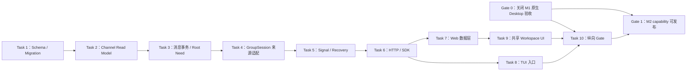

# M2 真实 IM、董事会与高信号 Thread 实施计划

> 状态：实施中；Task 1–6 已完成并提交，Task 7–10 待实施
> 制定日期：2026-07-14
> 进度更新：2026-07-14（`f87c442`、`3983625`、`b91b674`、`644d2b4`、`43d283e`、`cb2ec75`）
> 上位事实源：[产品宪法](../../product-design/PRODUCT-CONSTITUTION.md) → [产品 PRD](../../Agent%20Company%20产品%20PRD.md) → [实施计划](../../product-design/implementation-plan.md)
> 实施方式：按 Task 1 → 10 推进；每个 Task 先写失败测试，再实现、验证并独立提交

**目标：** 把当前只能显示 M1 初始化结果或显式视觉 fixture 的 Company Workspace，变成真实、持久、可恢复的公司会话入口。用户可以在董事会发送一个目标；Control Plane 先持久化 Root Need、主会话消息和产品 Thread，再复用现有 GroupSession / Session / MessageV2 运行董事会讨论，最终只把有来源的高信号结果投影回主会话。刷新、SSE 断线和进程重启后，消息、运行状态与来源证据仍可从权威数据重建。

**架构：** 新增 Conversation 应用层，SQLite 保存 Channel、成员、产品 Thread、主会话消息、运行状态和投影引用；现有 GroupSession、Session、MessageV2、AgentMessage 与 Tool Part 继续保存原始运行记录。`ChannelMessage` 不复制原始工具日志，`ConversationThread` 也不替代现有执行 `thread` 表。正式状态先提交 SQLite，再通过 `/global/event` 发送不含正文的失效通知；客户端永远通过快照和游标 API 补齐状态。

**建议工期：** 双工作流 12–15 个工程日，约 3 个日历周；单线顺序实施 16–20 个工程日，约 4 周。原实施计划的“约 2 周”没有计入 GroupSession 崩溃恢复、来源消息精确关联、TUI 旧入口收口和真实模型纵向测试，本计划据代码审计校准为约 3 周。

**技术栈：** Bun、TypeScript、Effect、Drizzle/SQLite、Hono + hono-openapi、生成式 JavaScript SDK、SolidJS、Electron 共享 WebUI、OpenTUI、Playwright、Bun test。

---

## 1. M2 交付边界

### 1.1 本里程碑必须交付

- 公司群、董事会、项目群三类可读取的真实频道；项目群只能由服务端项目事实创建，客户端没有创建频道接口。
- `department` 与 `direct` 两类 schema、保留期和成员约束，但不创建默认实例、不在 UI 开放；Direct 必须等待 M5 私域硬边界。
- 董事会目标发送、Root Need、产品 `ConversationThread`、真实 Board runtime、来源引用和高信号投影。
- 公司频道作为组织级高信号 feed；M2 不让公司群目标绕过董事会直接进入执行。
- 项目频道适配入口与自动创建测试；正式 `Goal → Charter → Project` 创建仍由 M3 负责。
- 稳定游标分页、Thread 详情、折叠工具来源、按需加载源证据和结构化 `@Agent` / `@Role`。
- 唯一 M2 结构化动作：中断当前 Thread。`delegate`、`decide`、`approve` 等治理动作留给 M3，不能只存一个字符串就宣称实现。
- Web/Desktop 共用的真实 Company Workspace；TUI 首页和 `--prompt` 也走同一 Channel API。
- 持久化先于广播、重复请求幂等、断线快照补偿、进程重启后的消息恢复与未完成运行续跑。

### 1.2 明确非目标

- 不实现完整 Charter、项目 DRI、批准策略继承、Gate、Worktree、Review、合并或 Delivery；这些属于 M3。
- 不开放部门群和 Direct，不读取或注入 Agent private、Direct、Dream、SOUL 或私人记忆。
- 不把现有 `/company-project` 固定游戏流程接到新 Company Workspace，也不为旧 API 建长期兼容层。
- 不创建第二套模型聊天记录；GroupSession、Session、MessageV2 和 Part 继续是运行事实源。
- 不显示虚假 Approval、Delivery、测试结果、项目状态、Agent 忙碌或 Bidding 分数。
- 不实现全文搜索、组织图、Kanban 工作项写入、通知中心或 Desktop 托盘；相应能力在 M3/M4。
- 不在 M2 重做 Company Workspace 已确认的视觉方向。

### 1.3 M1 前置门槛

- M2 schema、服务和 UI 可以开始开发，但 `capabilities.board_messages` 不得在 M1 原生 Desktop 手工验收关闭前对发布构建置为 `true`。
- M1 当前未完成项是 macOS 解锁后的原生目录选择、取消、重启、配对和 revoke 手工验收；它是 M2 发布 Gate，不是数据库和服务开发的阻塞项。
- 执行前保留当前工作树中的用户改动，不重置 `bun.lock` 及现有 M1 测试文件。

---

## 2. 当前代码事实与差距

| 区域 | 当前事实 | M2 处理 |
|---|---|---|
| Company | M1 已有 singleton Company、三人董事会、Provider、RepositoryBinding 和认证 API | 增加频道种子与会话 capability，不改变 M1 bootstrap 业务身份 |
| 产品 Thread | `thread` 表是单 Agent 执行线程，不是 IM Thread | 新建 `conversation_thread`，显式关联运行来源 |
| 模型消息 | Session / MessageV2 / Part 已持久化模型与工具记录 | 作为原始证据，只通过受权投影读取 |
| AgentMessage | 已有 `root_need_id` 字符串和审计关联，但没有 Root Need 实体 | 新建 `root_need` 权威对象，并允许来源引用现有 AgentMessage |
| GroupSession | 有三人会话、Bidding、GroupMessage 和 Session fan-out | 复用；补外部幂等键、运行消息 ID、工作域上下文策略和恢复入口 |
| GroupSession 恢复 | active scheduler 只在内存；崩溃后无法判断是否应续跑 | 新建持久 `conversation_run` 并实现幂等 resume |
| GroupSession 来源 | GroupMessage 只有 `session_id`，没有产生内容的 MessageV2 ID | 新增 `runtime_message_id`，精确定位消息和 Tool Part |
| Bidding | Probe 并发为 unbounded，评分事件含完整 reason | Board 固定最多三人并发；普通 Thread API/SSE 不暴露评分噪音 |
| WebUI | M1 ready 页面真实；完整 IM 工作台只存在显式 fixture 分支 | 保留视觉组件，删除运行时 fixture 适配并接生成 SDK |
| TUI | 首页输入直接 POST `/company-project`；`--prompt` 自行创建 GroupSession | 全部改走新 Board Channel API；原 GroupSession 页面仅保留诊断入口 |
| SSE | `/global/event` 是 best-effort，有心跳和有界队列 | 只发失效通知；任何遗漏都由快照/游标补齐 |
| 测试 | M1 有 bootstrap/restart/E2E；GroupSession 只有 scheduler 纯函数测试 | 增加真实 GroupSession、Conversation、恢复和端到端测试 |

最脆弱假设是：现有 GroupSession / Session 能在不重写 Runtime 的前提下，提供稳定的董事会执行和精确来源。Task 4 必须先证明这条链路；若失败，只替换 Conversation runtime adapter，不重写共享 WebUI 或整个 Session Runtime。

---

## 3. 决策规格

### [M2-S1] 数据对象与权威边界

新增 `packages/opencode/src/conversation/`，使用以下表：

| 表 | 责任 | 关键约束 |
|---|---|---|
| `channel` | 频道事实 | kind=`company|board|department|project|direct`；同一 Company 只有一个 company/board；project scope 唯一 |
| `channel_member` | 成员与角色 | principal=`user|agent`；离开用时间标记，不删除历史 |
| `root_need` | 用户原始需要的治理关联 | 每次新的董事会目标一个；状态只表示 intake 生命周期，不冒充 Project |
| `conversation_thread` | 产品协作 Thread | 与现有执行 `thread` 分离；可关联 root need 和 project scope |
| `conversation_thread_member` | Thread 参与者 | 记录运行时实际参与者，不从当前频道成员反推历史 |
| `channel_message` | 主会话正式消息 | 用户输入或高信号；Agent 普通协作消息不得写入主会话 |
| `conversation_run` | 异步运行与恢复 | `queued|running|projecting|completed|failed|interrupted`；保存 attempt、runtime id 和安全错误摘要 |
| `signal_projection` | 高信号投影版本 | 一条投影对应一条 ChannelMessage、来源 Thread、投影器版本和来源水位 |
| `signal_projection_source` | 精确来源集合 | 允许 `group_message|message|part|agent_message|decision|artifact|gate`，按 ordinal 稳定排序 |

`GroupMessageTable` 增量增加：

- `external_message_id`：董事会用户消息的 `ChannelMessage.id`，同一 GroupSession 唯一；
- `runtime_message_id`：Agent 输出对应的 `MessageV2.id`；
- `context_policy` 放在 GroupSession：M2 Board 固定为 `work_scoped`，不得调用 private memory 搜索。

ID 前缀固定为 `chn_`、`need_`、`cth_`、`cmsg_`、`crun_`。M2 不提升 `Company.data_version`；数据库版本由 migration journal 管理，避免把 API data version 与物理 schema migration 混为一谈。

### [M2-S2] 默认频道与项目频道

- Company bootstrap 新事务内创建确定性的公司群、董事会与成员；已有 M1 Company 由前向 migration 幂等回填。
- 公司群成员为本地用户和三名董事；董事会成员为本地用户、CEO、CTO、Product Lead。
- 默认不创建 department/direct channel。
- `ensureProjectChannel(projectID, title, members)` 是唯一项目频道创建入口；使用 `(company_id, kind, scope_id)` 幂等。
- M2 只实现这个服务端适配契约和自动创建测试。M3 正式 Project 创建事务调用它；M2 不把低层 `ProjectTable` 仓库记录或旧 `CompanyProjectTable` 自动解释成正式项目。
- WebUI 没有创建、改 kind、改 scope 或伪造成员的接口。

### [M2-S3] 董事会消息事务与幂等

`POST /company/channels/:channelID/messages` 输入包含：

```ts
{
  request_id: string // UUID
  body: string       // trim 后 1..20_000
  reply_to?: string
  referenced_thread_id?: string
  mentions?: Array<
    | { kind: "agent"; agent_id: string }
    | { kind: "role"; role: "ceo" | "cto" | "product_lead" }
  >
}
```

写入流程使用一个 `immediate` transaction：

1. 验证 Company ready、频道可见、用户为成员、频道未归档；
2. 验证 reply/thread 与目标频道在同一可见作用域；
3. 以 `channel_id + request_id` 检查幂等；同输入返回原结果，不同输入 409；
4. 生成 Root Need、ConversationThread、Thread members、用户 ChannelMessage 和 queued ConversationRun；
5. 提交后才发失效事件并启动异步 runtime；
6. HTTP 返回 `202 MessageAccepted`，不等待模型完成。

只有董事会新顶层消息创建 Root Need。Thread 回复复用原 Root Need；公司群消息不创建 Project；项目群发送能力在存在正式项目频道后启用。

### [M2-S4] Runtime 适配，不建设第二套聊天

- 新建 `company/repository-instance.ts`，从 `RepositoryBinding.root_path` 进入真实仓库 Instance；不要用 M1 的 `bootstrap-runtime` 运行董事会。
- Board runtime 使用现有 `GroupSession.Service`，成员固定为三名董事；role prompt 来自系统签名的 role_key 与职责，不创建 M5 Agent Home。
- GroupSession `chat` 接受外部消息 ID并返回稳定 round；重复调用不重复插入用户 GroupMessage。
- Agent 完成时保存 `runtime_message_id`，使来源链成为：

```text
ChannelMessage(user)
  → RootNeed
  → ConversationThread
  → ConversationRun
  → GroupSession / GroupMessage
  → Session / MessageV2 / Part
  → SignalProjection
  → ChannelMessage(high signal)
```

- M2 Board context 只允许 Company public、当前 Channel、当前 Thread、Repository rules/status 和该 Agent professional role；明确禁止 private/Direct/Dream/其他 Agent memory。
- Probe 并发上限为 Board 成员数三；取消从 Conversation action 传播到 GroupSession 和 Session。
- Bidding score、Probe reason 和原始 reasoning 不进入主会话，也不通过普通 Thread API返回；诊断事件仍留在受控本地日志/诊断入口。

### [M2-S5] 高信号协议

Schema 支持 `conclusion|decision|plan|status|risk|approval|delivery|intervention`，但 M2 runtime 只允许产生：

- `conclusion`：董事会本轮形成的可读结论；
- `status`：运行开始、失败、恢复、完成等真实状态；
- `risk`：董事会识别到、对用户有意义的风险；
- `intervention`：用户真实执行中断。

`decision` 必须有 DRI，`approval` 必须有关联 Approval，`delivery` 必须有关联 Artifact/Gate/验证事实；这些来源在 M3 前不存在，因此 M2 不生成这三类消息，也不渲染相应卡片。`plan` 只有在 M3 Charter/里程碑事实存在后开放。

董事会讨论结束后，由 Product Lead 的现有 Session 执行一次受 Zod 约束的 signal synthesis。投影器只接受短正文、signal type、作者/DRI 和精确 source IDs；验证失败时保留 Thread 原文并把 Run 标记为可重试失败，不能把无法验证的自然语言塞入主会话。

主会话允许显示用户自己的输入；其他 Agent 普通发言、重复同意、工具日志和中间方案只存在 Thread。

### [M2-S6] 读取、分页与来源 API

固定产品接口：

| Method | Path | operationId | 返回 |
|---|---|---|---|
| GET | `/company/channels` | `company.channels` | `ChannelSummary[]` |
| GET | `/company/channels/:channelID/messages` | `company.channelMessages` | `ChannelMessagePage` |
| POST | `/company/channels/:channelID/messages` | `company.channelSend` | `MessageAccepted`（202） |
| GET | `/company/threads/:threadID` | `company.thread` | `ConversationThreadDetail` |
| GET | `/company/threads/:threadID/entries` | `company.threadEntries` | `ThreadEntryPage` |
| GET | `/company/threads/:threadID/sources/:sourceID` | `company.threadSource` | `ThreadSourceDetail` |
| POST | `/company/threads/:threadID/actions` | `company.threadAction` | `ConversationThreadDetail` |

规则：

- Message/Entry 使用 `(time_created, id)` 不透明游标，默认 50、最大 100；不使用 offset。
- Channel list 数量小，返回完整可见集合，不分页。
- Thread entries 是受权读取投影；文字、状态、工具摘要是 tagged union。
- 工具 input/output 默认只返回名称、状态、耗时和截断摘要；完整来源通过单项 source API 按需读取。
- 每次读 source 都重新验证 Thread/Channel 成员，不能只依赖 UI 隐藏。
- 错误响应完整声明 400/401/403/404/409/500 Zod schema；产品 operation 的 success/error 不得生成 `unknown`。

### [M2-S7] SSE 是失效通知，不是权威消息总线

新增全局事件：

- `company.channel.invalidated { channel_id }`
- `company.thread.invalidated { thread_id }`
- `company.conversation_run.updated { thread_id, state }`

事件不携带正文、tool output 或 Bidding 信息。写服务必须在 SQLite commit 后发布。WebUI 收到事件后按 channel/thread 合并刷新；SSE 重连、页面重新可见和服务 `server.connected` 都触发当前快照重取。队列丢事件不会丢业务状态。

### [M2-S8] Web/Desktop 与 TUI 产品入口

- M2 ready 状态默认进入三栏 Company Workspace，不再停留在 M1 静态 ready landing。
- M1 公司/Provider/Repository/Policy 事实放进可折叠 Context Panel；不丢失配对与凭据管理入口。
- 删除运行时 `company-fixture` data source 和 `VITE_AGENTCOMPANY_COMPANY_FIXTURE`；视觉 fixture 如仍需保留，只能放在测试/Storybook，不可从生产入口到达。
- 频道侧栏只渲染 Server 返回的真实频道；没有项目时显示空分组，不写死项目/Direct。
- Thread Panel 由真实 `source_thread_id` 打开；工具详情按需加载。
- Composer 支持发送状态、失败重试、@董事角色、引用当前 Thread 和 `/interrupt`；不显示不可用的 `/approve`、`/delegate`。
- TUI `HomeBoardPrompt` 与 `--prompt` 使用生成 SDK 的 Board Channel API；删除首页对 `/company-project` 和自建 GroupSession 的依赖。
- 手工 GroupSession 页面保留为次级诊断能力，但不作为用户目标的默认入口。

---

## 4. 依赖关系与工作流



并行建议：

- Control Plane 主链：Task 1–6；这些任务会连续修改 schema/service/routes，默认串行。
- WebUI 流：Task 7–9；Task 7 可在 Task 6 的 contract commit 后与 Task 8 并行。
- Verification 流：从 Task 1 开始维护 migration/restart fixture；Task 10 汇合，不在最后一天才补恢复测试。

---

## 5. 实施任务

## Task 1：建立 Conversation schema 与前向 migration（2 天）

**Create**

- `packages/opencode/src/conversation/schema.ts`
- `packages/opencode/src/conversation/conversation.sql.ts`
- `packages/opencode/src/conversation/index.ts`
- `packages/opencode/migration/20260714000000_m2_conversation/migration.sql`
- `packages/opencode/test/conversation/schema.test.ts`
- `packages/opencode/test/conversation/migration.test.ts`

**Modify**

- `packages/opencode/src/group-session/group-session.sql.ts`
- `packages/opencode/src/group-session/group-session.ts`
- `packages/opencode/src/storage/schema.sql.ts`
- `packages/opencode/src/company/schema.ts`
- `packages/opencode/src/company/company.ts`

- [x] 先写 schema/refinement 与 migration 失败测试，覆盖五种 channel kind、decision DRI、source kind、游标、唯一索引和外键。
- [x] migration 为已有 Company 回填唯一 company/board channel 与成员；重复启动不重复数据。
- [x] 新 bootstrap 在原 immediate transaction 内写默认频道；任一失败整体回滚。
- [x] `CompanyReadyState.capabilities.board_messages` 的 schema 改为 boolean；Task 10 Gate 关闭前，Company service 仍固定返回 false。
- [x] GroupSession 增量字段允许旧行为空，不反向迁移、不删除旧数据。
- [x] 从 `packages/opencode` 运行目标测试与 `bun typecheck`。
- [x] Commit：`feat(conversation): add M2 channel and thread schema`

## Task 2：实现频道、成员、分页与项目频道服务（1.5 天）

**Create**

- `packages/opencode/src/conversation/conversation.ts`
- `packages/opencode/test/conversation/conversation.test.ts`

**Modify**

- `packages/opencode/src/company/company.ts`
- `packages/opencode/src/company/index.ts`

- [x] 写真实 SQLite 服务测试：list、membership、archive、稳定 cursor、同时间 ID tie-break、不可见频道拒绝。
- [x] 实现 `listChannels`、`pageMessages`、`getThread`、`pageEntries`、`getSource`。
- [x] 实现幂等 `ensureCompanyChannels` 与 `ensureProjectChannel`；没有客户端 create channel 方法。
- [x] 确认仓库级 `ProjectTable` 不会被误投影为正式项目群。
- [x] 所有查询显式限制 company/channel/thread scope，避免未来 Direct 越权。
- [x] Commit：`feat(conversation): add persistent channel read model`

## Task 3：实现董事会消息事务、Root Need 与结构化输入（2 天）

**Create**

- `packages/opencode/src/conversation/intake.ts`
- `packages/opencode/test/conversation/intake.test.ts`

**Modify**

- `packages/opencode/src/conversation/conversation.ts`
- `packages/opencode/src/conversation/schema.ts`

- [x] 写失败测试：原子创建、同 request 重放、同 request 不同 body 409、非法 reply/thread、非成员、归档频道、空白/超长输入。
- [x] 一个 immediate transaction 写 RootNeed、Thread、members、用户消息和 queued run。
- [x] `@Agent/@Role` 只接受当前频道成员；被提及对象结构化保存并传给 runtime，不从正文猜权限。
- [x] 公司群不创建 Root Need；项目群只有正式 project scope 才允许发送。
- [x] transaction 提交前不发事件、不启动模型；提交后丢响应可安全重试。
- [x] Commit：`feat(conversation): persist idempotent board intake`

## Task 4：适配 GroupSession、Session 与精确来源（3 天）

**Create**

- `packages/opencode/src/company/repository-instance.ts`
- `packages/opencode/src/conversation/runtime.ts`
- `packages/opencode/test/group-session/group-session.test.ts`
- `packages/opencode/test/conversation/runtime.test.ts`

**Modify**

- `packages/opencode/src/group-session/group-session.ts`
- `packages/opencode/src/group-session/schema.ts`
- `packages/opencode/src/session/message-v2.ts`

- [x] 使用真实本地 test LLM server 写 GroupSession 集成测试，不复制 scheduler 逻辑、不 mock GroupSession service。
- [x] `chat` 接受 external message ID，返回 `{roundNum, userGroupMessageID}`；重复调用不重复消息。
- [x] Agent 完成时保存 `runtime_message_id`，验证可定位 MessageV2 及其 Part。
- [x] `work_scoped` context policy 跳过 private memory；测试在 private scope 放入 canary 后模型上下文和 API 均无命中。
- [x] 从 RepositoryBinding 进入真实 repository Instance，Board sessions 绑定正确 project/runtime context。
- [x] Board 并发上限三，interrupt 能传播到所有运行 Session。
- [x] 普通产品事件不包含 Bidding bids/reason。
- [x] Commit：`feat(conversation): bridge board threads to runtime sources`

## Task 5：实现高信号投影、失败状态与进程恢复（3 天）

**Create**

- `packages/opencode/src/conversation/signal-projector.ts`
- `packages/opencode/src/conversation/recovery.ts`
- `packages/opencode/test/conversation/signal-projector.test.ts`
- `packages/opencode/test/conversation/recovery.test.ts`

**Modify**

- `packages/opencode/src/conversation/runtime.ts`
- `packages/opencode/src/conversation/conversation.ts`
- `packages/opencode/src/server/event.ts`

- [x] 先写投影拒绝测试：无 source、非法 signal、decision 无 DRI、approval/delivery 无事实来源全部失败。
- [x] 用 Product Lead Session 生成受 schema 限制的 signal draft；投影事务同时写 ChannelMessage、SignalProjection 和 source rows。
- [x] 同一 run/source watermark 重放不重复高信号消息。
- [x] 运行失败保存安全错误摘要、attempt 和 retryable；不得把 Provider secret、prompt 或 tool output 放进错误/SSE。
- [x] 启动恢复将遗留 running/projecting 归一为 queued，并根据 external message/round/source watermark 幂等续跑。
- [x] 已完成 run 不重跑；用户中断状态不自动恢复。
- [x] 故障注入覆盖：用户消息提交后崩溃、首个 Agent 后崩溃、投影前崩溃、投影提交后响应丢失。
- [x] Commit：`feat(conversation): project and recover high-signal threads`

## Task 6：发布认证 HTTP contract 并生成 SDK（2 天）

**Create**

- `packages/opencode/src/server/routes/company-conversation.ts`
- `packages/opencode/test/server/company-conversation.test.ts`
- `packages/sdk/js/src/v2/company-conversation.contract.test.ts`

**Modify**

- `packages/opencode/src/server/server.ts`
- `packages/opencode/src/server/routes/company.ts`
- `packages/sdk/js/src/v2/gen/**`（只由生成命令修改）

- [x] 写 raw HTTP 失败测试，覆盖七个 operation、Basic/Bearer、无凭据 401、作用域 403/404、409 和完整错误 body。
- [x] route 只做验证与 service 调用；不在 handler 内拼领域规则。
- [x] POST send 返回 202；所有写入已持久化后才返回。
- [x] OpenAPI 覆盖测试保证 success/error schema 完整，Event union 包含三类 invalidation。
- [x] 从仓库根运行唯一生成命令：`./packages/sdk/js/script/build.ts`。
- [x] 从 `packages/sdk/js` 运行 contract assertions 与 `bun typecheck`，确认 M2 operation response/error 没有 `unknown`。
- [x] Commit：`feat(sdk): publish typed M2 conversation contract`

## Task 7：建立 Web 会话数据层与 SSE 补偿（2 天）

**Create**

- `packages/app/src/pages/company/company-conversation-data-source.ts`
- `packages/app/src/pages/company/company-conversation-data-source.test.ts`

**Modify**

- `packages/app/src/pages/company/company-data-source.ts`
- `packages/app/src/pages/company/company-model.ts`
- `packages/app/src/pages/company/company-state.ts`
- `packages/app/src/context/global-sdk.tsx`

- [ ] 写数据层测试：bootstrap → ready workspace、channel switch、分页去重、optimistic pending、202 替换、事件合并、SSE 重连全量刷新。
- [ ] 不 optimistic 伪造 Agent 响应；只可立即显示已由 202 返回确认持久化的用户消息。
- [ ] invalidation 只触发受影响 channel/thread 刷新，连续事件合并，失败保留旧快照并显示可重试状态。
- [ ] 页面重新可见、`server.connected` 和认证变化时重新读取 channels/messages。
- [ ] Commit：`feat(app): add resilient company conversation store`

## Task 8：让 TUI 走同一 Board Channel 契约（1.5 天，可与 Task 7 并行）

**Create**

- `packages/opencode/src/cli/cmd/tui/routes/company-channel.tsx`
- `packages/opencode/test/cli/tui/company-channel-model.test.ts`

**Modify**

- `packages/opencode/src/cli/cmd/tui/component/home-board-prompt.tsx`
- `packages/opencode/src/cli/cmd/tui/routes/home.tsx`
- `packages/opencode/src/cli/cmd/tui/app.tsx`
- `packages/opencode/src/cli/cmd/tui/context/route.tsx`
- `packages/opencode/src/cli/cmd/tui/i18n/en.ts`
- `packages/opencode/src/cli/cmd/tui/i18n/zh.ts`

- [x] 首页先读取真实 board channel，再通过生成 SDK 发送 request_id/body。
- [x] `--prompt` 使用同一方法；删除 `board_group_session_id` KV 与自动创建 GroupSession 逻辑。
- [x] 删除 HomeBoardPrompt 对 `/company-project` 的默认提交；不能再绕过董事会与 Root Need。
- [x] 最小 CompanyChannel 路由支持主消息分页、打开 Thread 摘要和 interrupt；不复制 Web IA。
- [x] 手工 GroupSession 创建仍可从诊断入口使用，但首页不可到达。
- [x] 从 `packages/opencode` 运行 TUI 目标测试与 `bun typecheck`。
- [x] Commit：`feat(tui): route board intake through company channels`

## Task 9：接入真实 Company Workspace 并删除生产 fixture（3 天）

**Create**

- `packages/app/src/pages/company/channel-sidebar.tsx`
- `packages/app/src/pages/company/message-feed.tsx`
- `packages/app/src/pages/company/thread-panel.tsx`
- `packages/app/src/pages/company/company-composer.tsx`
- 对应 `*.test.tsx`

**Modify**

- `packages/app/src/pages/company/index.tsx`
- `packages/app/src/pages/company/company-ready.tsx`
- `packages/app/src/pages/company/workspace.css`
- `packages/app/src/pages/company/company-model.ts`
- `packages/app/src/i18n/en.ts`
- `packages/app/src/i18n/zh.ts`
- `packages/app/src/env.d.ts`

**Delete / relocate out of runtime**

- `packages/app/src/pages/company/company-fixture.ts`
- `VITE_AGENTCOMPANY_COMPANY_FIXTURE` 运行时分支

- [x] 组件测试先覆盖真实 empty/loading/error/pending/failed/completed、键盘导航和 reduced motion。
- [x] ready 默认渲染频道栏、主会话、Composer 和可折叠 Context Panel；公司事实与浏览器配对管理仍可访问。
- [x] 频道、成员、badge、消息和 Thread 都来自 SDK；无项目时不渲染 fixture 项目。
- [x] Agent 普通消息只在 Thread；高信号消息显示 source affordance、author/DRI、project 和时间。
- [x] 工具详情默认折叠并在点击后请求 source API；长输出不进入初始 DOM。
- [x] 只显示真实 conclusion/status/risk/intervention；移除 fixture Approval/Delivery 卡和“已批准”切换。
- [x] 发送、@角色、引用 Thread、interrupt、失败重试均有可访问状态，状态不只靠颜色。
- [x] 从 `packages/app` 运行 unit、typecheck、build；从 `packages/ui` 运行 typecheck。
- [x] Commit：`feat(app): ship live company messaging workspace`

## Task 10：真实纵向 E2E、重启 Gate 与文档收口（2.5 天）

**Create**

- `packages/app/e2e/company-conversation.spec.ts`
- `packages/opencode/test/conversation/restart.test.ts`
- `docs/compose/reports/2026-07-xx-m2-real-im-board.md`（完成时）

**Modify**

- `packages/app/e2e/m1-server.ts`（重命名为通用 server fixture 时同步引用）
- `packages/app/playwright.config.ts`
- `packages/app/e2e/company-bootstrap.spec.ts`
- `packages/opencode/src/company/schema.ts`
- `packages/opencode/src/company/company.ts`
- `docs/product-design/implementation-plan.md`
- `docs/README.md`

- [x] Playwright M2 纵向（`company-conversation.spec.ts`）：发送真实董事会目标得到 202、消息回读、打开来源 Thread、interrupt，并验证幂等重放与 401/403/404；UI 断言 ready 渲染真实频道栏且无 fixture 卡片。等待真实模型高信号结果由 `runtime.test.ts`/`signal-projector.test.ts` 用 scripted LLM 覆盖，E2E server 不带 LLM 故不在此等待。
- [x] 刷新后 channel/message/thread ID 不变（`restart.test.ts` 重启后回读同一 messageID/threadID）；浏览器 Bearer 无越权 source 读取（`company-conversation.spec.ts` 401/403/404 用例）。
- [x] child-process restart 测试（`conversation/restart.test.ts`）在 send 提交后 kill 与 request_id 冲突两个故障点验证无重复用户消息；GroupMessage/SignalProjection/高信号消息的故障注入恢复由 Task 4/5 的 `runtime.test.ts`、`recovery.test.ts`、`signal-projector.test.ts` 覆盖。
- [ ] SSE 中断期间发送/完成消息，重连后用 snapshot/cursor 补齐（Web 数据层 `company-conversation-data-source.test.ts` 已覆盖事件合并与重连全量刷新的纯逻辑；端到端 SSE 断线 Playwright 用例待真实模型环境补）。
- [x] interrupt 有可恢复 UI 与自动化测试（`company-conversation.spec.ts`、TUI `company-channel.tsx`、`thread-panel.tsx`）；Provider 失效/投影 schema 错误的恢复由 `signal-projector.test.ts`、`recovery.test.ts` 覆盖。
- [x] M1 bootstrap、Browser pairing 无回归（`company-bootstrap.spec.ts` 已更新为新 IA 断言并保留配对/重放用例）；手工 GroupSession 诊断入口保留、首页不可到达（Task 8）。
- [ ] 完成原生 Desktop 手工验收：Web 与 Desktop 消息/Thread 一致（M1 原生 Desktop Gate 受 macOS 解锁与 Windows 窗口采集限制，为手工验收项，非本会话可自动关闭）。
- [x] `capabilities.board_messages` 生产值在 M1 原生 Gate 关闭前保持 `false`；仅 `AGENTCOMPANY_BOARD_MESSAGES_TEST` 在测试中开启，失败/回滚时保持只读历史。
- [x] 更新 implementation-plan：据已验证事实更新 M2 状态，并列出真实命令与日期。
- [x] Commit：`test: close M2 real conversation vertical slice`

---

## 6. 计划节奏

| 周次 | Control Plane | Web/TUI | Verification | 周末可演示结果 |
|---|---|---|---|---|
| 第 1 周 | Task 1–3：schema、read model、intake | 提前抽取无数据依赖的视觉组件测试 | migration、幂等、权限测试 | API 内可持久化用户董事会消息和 Thread |
| 第 2 周 | Task 4–6：runtime、source、signal、recovery、SDK | Task 7/8 在 SDK commit 后并行 | GroupSession 集成、故障注入 | 一条真实模型讨论可投影为有来源 conclusion |
| 第 3 周 | 修复恢复/性能问题 | Task 9：共享 Workspace | Task 10：Playwright、restart、Desktop 手工 | Internal Alpha：真实董事会会话 |

若只有一名开发者，按 Task 顺序执行，不并行修改 generated SDK、Company UI model 和 server routes；预计增加到 4 周。

---

## 7. 验证矩阵

### 7.1 自动化命令

所有测试从 package 目录运行，禁止从仓库根运行测试；类型检查只运行 `bun typecheck`。

```powershell
# packages/opencode
bun test test/conversation test/group-session/group-session.test.ts test/server/company-conversation.test.ts test/company
bun typecheck

# 仓库根：唯一 SDK 生成命令
./packages/sdk/js/script/build.ts

# packages/sdk/js
bun typecheck

# packages/app
bun test --preload ./happydom.ts ./src/pages/company
bun typecheck
bun run build
bunx playwright test --project=company-bootstrap --project=company-conversation

# packages/ui
bun typecheck

# packages/desktop
bun test
bun typecheck
bun run build
```

实际执行时以 package 现有脚本为准；若 Desktop 没有通用 `bun test` 脚本，使用其已存在的精确测试命令，不新增根目录测试绕过 guard。

### 7.2 M2 退出标准

- [ ] 用户在董事会发送消息后立即得到已持久化 202 结果；刷新和重启后 ID、正文和 Root Need 不变。
- [ ] 至少两名真实董事 Agent 在 GroupSession 中协作，来源可定位到 GroupMessage、Session、MessageV2 和 Tool Part。
- [ ] 主会话中除用户输入外只出现允许的真实高信号消息；普通 Agent 发言、工具日志、Bidding 信息只在 Thread/诊断层。
- [ ] 任一高信号消息可定位来源 Thread、作者/DRI（适用时）、project scope（适用时）和时间。
- [ ] 项目频道没有客户端创建接口，`ensureProjectChannel` 的幂等/成员测试通过。
- [ ] Thread 与 source 分页稳定，长 tool output 初始不加载。
- [ ] SSE 丢失/断线后通过快照与游标恢复，无重复、无丢失。
- [ ] 四类进程故障注入恢复通过；interrupted run 不自动复活。
- [ ] Web、Desktop、TUI 发送董事会目标都走同一生成 SDK / Control Plane 契约。
- [ ] 生产路径无 `company-fixture`、旧 `/company-project` 首页提交、KV board GroupSession 或虚假 Approval/Delivery。
- [ ] 无凭据 401；不可见 channel/thread/source 被拒绝；work_scoped runtime 不含 private/Direct canary。
- [ ] M1 bootstrap、配对、Coding Session 次入口无回归；M1 原生 Desktop Gate 已关闭。

### 7.3 性能与可访问性 Gate

- 本地已有 10,000 条 ChannelMessage 时，首屏 50 条只走 cursor query，不全表载入；记录测试环境与耗时，不以无基线的绝对数字阻塞 M2。
- Thread source 只按当前页 hydrate MessageV2/Part；不为一条消息扫描所有 Session。
- Composer、频道切换、Thread 打开/关闭、tool 展开和 interrupt 可完整键盘操作。
- running/failed/interrupted 不只靠颜色；屏幕阅读能读出作者、类型、时间和来源动作。

---

## 8. 失败与恢复矩阵

| 失败点 | 已持久化状态 | 恢复方式 | 自动验证 |
|---|---|---|---|
| send transaction 前失败 | 无 RootNeed/Thread/Message | 原 request 重试 | intake test |
| transaction 中失败 | 全部回滚 | 原 request 重试 | transaction test |
| commit 后 202 丢失 | 完整 queued run | 同 request 返回原结果 | idempotency test |
| GroupSession 创建前崩溃 | queued run | restart recovery 创建一次 | restart test |
| 用户 GroupMessage 后崩溃 | external_message_id 已存在 | resume 原 round，不重复用户消息 | runtime/restart |
| 一个 Agent 完成后崩溃 | runtime_message_id/source 已存在 | 复用已完成 source，继续未完成阶段 | restart test |
| signal 生成无效 | Thread 原始记录完整，run failed/retryable | 用户重试或自动有限重试 | projector test |
| signal transaction 后响应丢失 | projection/source/message 已提交 | source watermark 幂等命中 | recovery test |
| SSE 队列丢事件 | SQLite 完整 | 重连/可见性刷新 snapshot | app data test/E2E |
| Provider 凭据失效 | 用户消息与 Thread 保留，run failed | Settings 修复 Provider 后 retry | route/E2E |
| 用户 interrupt | run/thread interrupted，Session 取消 | 明确再次发送/重试，不自动恢复 | action/restart |
| source 不可读取 | 正式消息仍在 | 显示来源不可用与诊断，不伪造证据 | source test |

---

## 9. 回滚与发布策略

- migration 只前向新增表、列和索引；代码回滚不删除 Channel、Thread、Message、Run 或 Projection。
- 在 M2 Gate 完成前 `board_messages=false`，Web/TUI 不显示可发送入口；这不是生产 fixture fallback。
- capability 置 true 后若 runtime 出现严重问题，只允许服务端关闭新发送并保留只读历史；不能回到 `/company-project` 或 fixture。
- SDK generated contract 与 server routes 同一个提交前滚/回滚，不能只回滚一侧。
- 旧 GroupSession/Session 数据不迁移成产品消息；只有带显式 Conversation link 的新运行进入 M2 Thread。
- 不提供 AgentCompany 旧文件系统/config/API compatibility；本计划的 migration 只服务当前 Agent Company M1 → M2 数据。

---

## 10. Review Gates

### Domain / Privacy Review（Task 3、4 后）

- 频道、Thread、Source 每层都重新验证 scope；
- Direct/department 没有意外默认行或 UI 入口；
- Board runtime 没有 private/Direct/other-agent memory；
- 用户消息 transaction 和 project channel 创建都不能由客户端伪造治理事实。

### Runtime / Recovery Review（Task 5 后）

- every external message、round、runtime message、projection 都有稳定幂等键；
- restart 不依赖内存 EventEmitter 还在；
- completed/interrupted 不错误重跑；
- 错误与 SSE 不泄漏 prompt、secret、tool output 或 Bidding reason。

### Product Fact Review（Task 9 后）

- UI 每个成员、状态、消息、来源、时间均来自 API；
- 无 Approval/Delivery/测试/项目完成的演示数据；
- TUI 不再绕过 Board/Root Need；
- 看板或旧 workstation 不定义主产品入口。

### Release Review（Task 10）

- M1 原生 Gate + M2 自动/手工 Gate 全部通过；
- implementation-plan 只陈述已验证事实；
- Internal Alpha 可表述为“可创建本地公司并进行真实董事会会话”，不可表述为“可自治交付软件项目”。

---

## 11. PRD 追踪

| 需求 | M2 完成口径 | 任务 |
|---|---|---|
| IM-01 | 五类 schema；开放公司/董事会；项目频道由服务端事实产生；部门/Direct 不开放 | 1、2、9 |
| IM-02 | `ensureProjectChannel` 唯一且幂等，客户端无 create channel | 2、6、10 |
| IM-03 | 用户输入外，Agent 普通协作只在 Thread；主会话只接收合法 SignalProjection | 3、5、9 |
| IM-04 | Thread 关联参与者、GroupMessage、Session、MessageV2、Part 与运行状态 | 1、4、6 |
| IM-05 | 每条高信号含 source Thread 和精确 source refs | 5、6、9 |
| IM-06 | Tool 摘要首屏折叠，单项 source 按需加载 | 2、6、9 |
| IM-07 | @Agent/@Role、Thread 引用和真实 interrupt 动作 | 3、6、8、9 |
| IM-08 | Bidding score/reason 仅诊断可见，不进入普通 Thread/SSE | 4、5、10 |
| IM-09 | Channel/Thread 是主入口；不从旧 Kanban/CompanyProject 创建用户目标 | 8、9、10 |
| GOV-01 | 复用 M1 固定三人董事会作为 Board runtime 成员 | 1、4 |
| LCP-01–03/09 | 复用认证 API、唯一 Control Plane 和生成 SDK | 6、7、10 |

IM-01 的 Department/Direct 完整开放仍按上位实施计划留在 M5；GOV-02–11、Project/Charter 与软件交付闭环仍由 M3 负责。

---

## 12. 计划自审

- [x] [M2-S1] 由 Task 1、2、5 覆盖。
- [x] [M2-S2] 由 Task 1、2、10 覆盖。
- [x] [M2-S3] 由 Task 3、6、7 覆盖。
- [x] [M2-S4] 由 Task 4、5 覆盖。
- [x] [M2-S5] 由 Task 5、9、10 覆盖。
- [x] [M2-S6] 由 Task 2、6、7、8 覆盖。
- [x] [M2-S7] 由 Task 5、7、10 覆盖。
- [x] [M2-S8] 由 Task 7–10 覆盖。
- [x] 与宪法 IM-first、双层信息密度、最小董事会、Local Control Plane 和私域边界一致。
- [x] 没有把 M3 Charter/Governance/Delivery 或 M5 Direct/Private 写成 M2 已实现。
- [x] 没有把现有执行 `thread`、GroupSession 或 CompanyProject 冒充产品 Channel/Thread/Project。
- [x] 所有 code-producing Task 都要求失败测试、实现、package 级验证和独立 commit。
- [x] JavaScript SDK 只使用仓库指定脚本生成；测试不从仓库根运行，类型检查不直接运行 `tsc`。

## 13. 执行交接

计划获批后从 Task 1 开始。Task 1–6 是契约主链，不并行修改同一 schema/server/generated 文件；Task 7 与 Task 8 在 Task 6 commit 后并行；Task 9 消费 Task 7 数据层；Task 10 是唯一完成口径。任何单元测试通过、静态 UI 可用或 GroupSession 能聊天，都不能单独把 M2 标记为完成。
