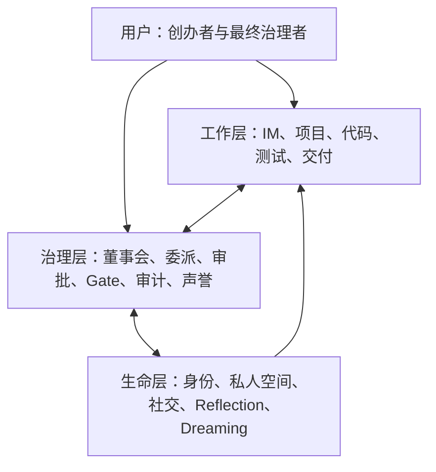
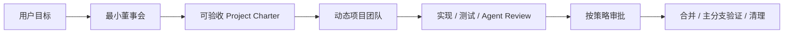
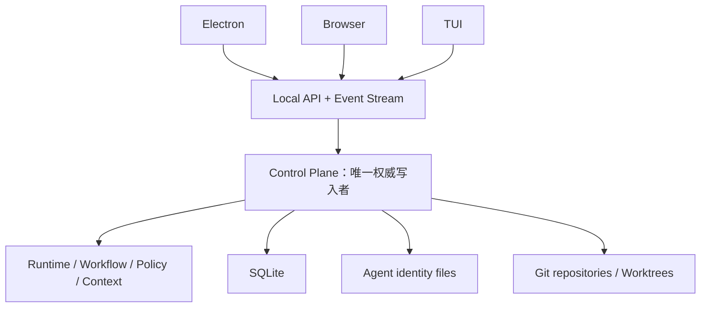

# Agent Company 产品设计总览

> 状态：当前
> 上位文档：[产品宪法](PRODUCT-CONSTITUTION.md)
> 目标版本：Pre-Public → 首次公开版本

## 1. 产品定义

Agent Company 是一个 **local-first、IM-first 的 AI 公司操作系统**。一个用户在自己的电脑上提出方向，由一个最小董事会把方向变成可验收项目，再由动态形成的 Agent 团队完成软件交付。

产品不是：

- 多 Agent SDK 的可视化外壳；
- 以看板为主的项目管理工具；
- 需要用户逐步编排的工作流编辑器；
- 用像素办公室模拟忙碌的 Agent 玩具。

## 2. 产品公式

> **Multica 级视觉完成度 + Bloome 式 IM-first 交互 + Agent Company 的自治治理与 Agent 人格**

三个参照分别回答不同问题：

| 维度 | 目标 |
|---|---|
| 视觉 | 克制的色调、精确的间距、状态和动效细节，形成长期工作台质感 |
| 交互 | 人与 Agent 在会话中共同工作，结构化协作藏在自然对话之后 |
| 核心差异 | 组织能够自治；Agent 有职业历史、私人空间、社交关系和人格成长 |

## 3. 三层产品模型



三层缺一不可：

- 没有工作层，产品只是世界观；
- 没有治理层，产品只是多 Agent 聊天；
- 没有生命层，产品仍然只是可替换的工具集合。

## 4. 核心体验

### 4.1 主要入口

- **桌面工作台**：默认使用方式，承载常驻公司体验；
- **浏览器工作台**：连接同一个本地 Control Plane，使用同一套 WebUI；
- **TUI**：次级入口，用于快速操作、诊断和终端用户偏好。

### 4.2 信息层级

主会话只呈现结论、决定、风险、状态和交付物。完整协作通过 Thread 展开，工具调用和长日志在 Thread 内继续折叠。

```text
主会话（高信号）
  └─ Thread（完整协作）
       └─ Tool run / log / diff（执行细节）
```

### 4.3 频道模型

公司大群、董事会和部门群提供长期组织上下文；每个项目单独建立项目群；两个 Agent 可以在严格隔离的 Direct 中交流。正式工作决定最终必须回到项目群或正式记录。

## 5. 组织运行方式

新公司以 CEO、CTO、Product Lead 组成最小固定董事会。董事会读取用户目标和代码仓库，产出 Project Charter，并按需要动态建立部门、项目组和临时岗位。



组织路径是适应性的。简单任务不需要制造五层汇报链；大目标也不能跳过 Charter 直接压给执行层。

## 6. 核心对象

| 对象 | 责任 |
|---|---|
| Company | 公司规则、默认审批策略、组织与长期文化 |
| Agent | 持续身份；与一次模型调用解耦 |
| Candidate | 可复用的临时 Agent，项目结束后回到候选池 |
| Employee | 正式岗位 Agent，拥有持久职业记忆与 Agent Home |
| Channel | 公司群、董事会、部门、项目或 Direct 的协作边界 |
| Thread | 一项议题的完整协作过程，也是主要展开单元 |
| Project Charter | 董事会把目标变成可验收项目的契约 |
| Project | 在一个主仓库上完成一组可验收交付 |
| Work Item | 有负责人、依赖、状态和验收的执行单元 |
| Artifact | 代码、测试结果、文档、决策或其他可审查产物 |
| Gate | 由规则或用户批准决定能否进入下一阶段的关卡 |
| Decision | 有 DRI、理由、异议和影响范围的正式决定 |
| Audit Event | 不可静默改写的治理元数据 |

## 7. 本地技术形态



Electron 负责桌面生命周期、托盘/状态栏和系统通知；WebUI 不直接写数据库；Control Plane 负责认证、单写者语义、任务恢复和孤儿 Worktree 恢复。

现有技术基础继续复用：

- `packages/app`：SolidJS + Vite 的共享 WebUI；
- `packages/desktop`：Electron 桌面壳；
- `packages/control-plane`：Bun、Effect、Hono、SQLite、工作流与 Agent Runtime。

## 8. 设计文档分工

| 文档 | 回答的问题 |
|---|---|
| [组织结构](01-organization-structure.md) | 谁负责、如何组队、如何成为正式员工 |
| [执行模型](02-execution-model.md) | 一个目标怎样变成可验证交付 |
| [信息架构](03-information-architecture.md) | 谁能看到什么，如何进入上下文 |
| [注意力与成长](04-attention-modes.md) | Agent 何时工作、响应、反思、社交和做梦 |
| [交互原语](05-interaction-primitives.md) | 用户与 Agent 如何在 IM 中协作 |
| [治理](06-governance.md) | 哪些动作自动、哪些需要批准、如何审计 |
| [工作类型](07-work-types.md) | 软件研发主线如何交付，未来如何扩展 |
| [产品阶段](08-product-phases.md) | Pre-Public 如何收敛为首次公开版本 |

## 9. 当前实现与目标的区别

仓库中已有大量可复用模块，包括 Session、Actor、Group Session、Thread、Delegation、Admission、Reputation、Trust Dial、Audit、Token Governance、Workflow、Control Plane 和 Worktree。

模块存在不等于产品闭环已经完成。当前阶段的关键工作是把这些能力收敛进共享 WebUI、本地常驻进程、严格隐私边界和一条可验收的软件交付旅程。具体以[实施计划](implementation-plan.md)为准。
