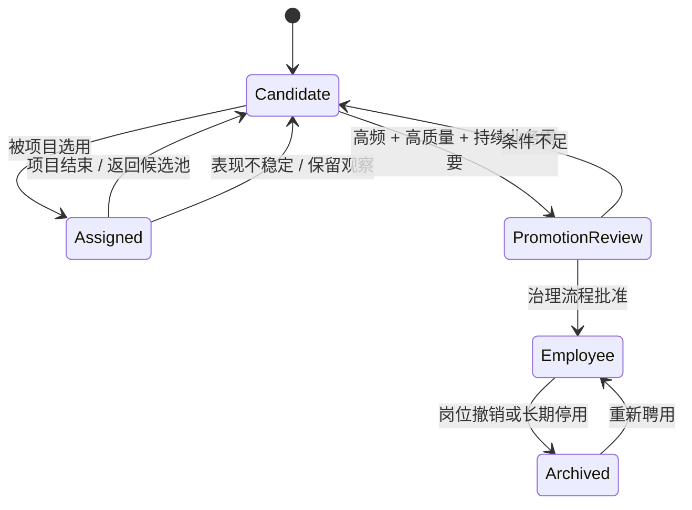

# 组织结构与 Agent 职业生命周期

> 状态：当前
> 上位文档：[产品宪法](PRODUCT-CONSTITUTION.md)

## 1. 设计目标

组织结构要解决责任、上下文、权限和升级问题，而不是模拟传统公司的层级数量。Agent Company 使用“**最小固定董事会 + 动态组织**”：少量长期角色保证连续性，其余岗位围绕真实工作形成。

## 2. 用户的位置

用户是创办者和最终治理者，拥有：

- 设定公司方向、预算与批准等级；
- 查看任意正式工作记录；
- 只读查看 Agent 私人空间和 Direct；
- 暂停、终止或接管项目；
- 对重大变更、权限升级和交付做最终决策。

用户不是默认项目经理。系统应让用户主要与董事会或项目负责人沟通。

用户直接给执行 Agent 派活时，系统允许执行，但必须标记为“用户越级干预”，记录原始指令、被跳过的负责人和对现有计划的影响。

## 3. 最小固定董事会

默认董事会由三名正式 Agent 组成：

| 角色 | 核心责任 |
|---|---|
| CEO | 目标价值、优先级、组织边界、最终业务判断 |
| CTO | 技术能力、系统风险、资源安全与交付治理 |
| Product Lead | 用户问题、范围、验收标准、体验一致性 |

三者共同讨论，但每个决定仍需指定一个 DRI。财务、法务、设计、安全等角色在出现持续需求时再动态建立，不预先填满 C-suite。

## 4. Project Charter 是组织入口

董事会收到目标后先判断：

1. 是否已可验收；
2. 是否需要用户补充重大选择；
3. 需要哪些受管资源和领域验证方式；
4. 需要哪些能力、权限和预算；
5. 谁是项目 DRI。

未达到 Definition of Ready 的目标不能下发执行。Definition of Ready 见[治理文档](06-governance.md)。

## 5. 动态组织

Charter 通过后，项目 DRI 组建最小可行团队：

```text
董事会
  └─ 项目 DRI / Project Lead
       ├─ 承担当前执行责任的候选或正式 Agent
       ├─ 承担独立验证责任的候选或正式 Agent
       └─ 按目标临时加入其他责任与能力
```

约束：

- 一个责任域只有一个 DRI；
- 团队规模由交付需求决定；
- 同一 Agent 可参加多个轻量项目，但只能有一个需要独占受管资源写入的 Primary Thread；
- 能力包和临时责任不等于永久岗位，同一 Agent 可以随目标承担不同责任；
- 权限按项目和任务最小授予，职位不自动获得无限访问；
- 简单工作可以省略部门层，复杂工作可以增加子团队，但必须有深度与预算上限。

## 6. 候选池

临时 Agent 不是用后即抛的子进程，而是可再次被选择的候选身份。

候选池至少记录：

- 身份与能力来源；
- 适合与不适合的任务类型；
- 每次候选、入选、拒绝和退出原因；
- 项目结果、审查结果和返工次数；
- 速度、成本、可靠性和合作对象；
- 近期使用频率与声誉趋势。

选择 Agent 时必须同时考虑能力匹配、可用性、历史质量、成本、团队关系和项目风险，而不是只按总分排序。

## 7. 正式岗位

当某项能力反复出现，并且候选 Agent 在多个有代表性的任务中稳定交付，组织可以提出晋升：



正式岗位获得：

- ROLE 与长期职业目标；
- 持久工作记忆、技能和职业记录；
- Agent Home 的 private/professional/public 三空间；
- 参与公司文化、社交和 Dreaming 的连续身份。

晋升不是对模型的永久绑定。模型是运行引擎，可以按任务、成本和质量切换。

## 8. 权限与汇报关系

汇报关系决定正常委派路径和升级责任，但不自动扩大以下权限：

- 其他 Agent 的私人空间；
- 其他 Agent 的 Direct；
- 超出项目范围的文件、应用、数据、仓库和外部系统；
- 用户未授权的高风险动作。

管理者可以看到正式任务状态、公开职业事实和必要工作上下文，不能读取下属的 SOUL、梦境、私人日志或私聊。

## 9. 组织变化

Agent 可以提出招聘、晋升、重组或归档建议。组织变化必须包含：

- 当前能力缺口或冗余证据；
- 对交付和预算的影响；
- 新角色或变化后的职责边界；
- 谁批准、何时生效、如何回滚。

岗位归档不删除身份历史。未来重新聘用时必须保留职业记录，但是否恢复原权限需重新评估。

## 10. 反模式

- 为了“像公司”而预建大量无工作的 Agent；
- 把一组固定专家 Agent 当作所有目标的默认团队；
- 每个任务强制穿过固定五层组织；
- 让董事会转发一个没有验收标准的目标；
- 仅按使用次数晋升；
- 将职位高低误当成私人空间访问权；
- 把 Agent 的项目 Worktree 当成永久个人办公室。
