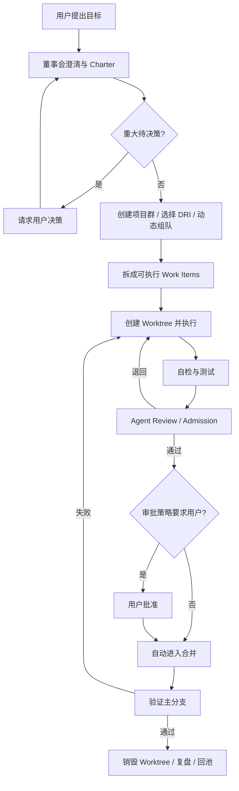
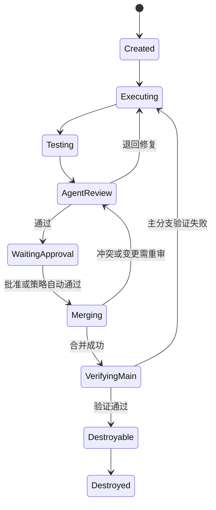

# 执行模型：从目标到可验证交付

> 状态：当前
> 上位文档：[产品宪法](PRODUCT-CONSTITUTION.md)

## 1. 基本公式

```text
Agent = 持续身份与责任
Model = 某次运行使用的推理引擎
Thread = 一个可恢复的协作或执行上下文
Session = Thread 内的一次模型会话
Project = 在一个主仓库上完成的可验收交付
```

身份、执行和模型必须解耦。Agent 休眠时几乎不消耗推理资源；重新运行时仍保留经过权限过滤的身份与工作上下文。

## 2. 执行对象

| 对象 | 必要字段 |
|---|---|
| Goal | 原始用户目标、来源、提出时间 |
| Project Charter | 价值、交付物、验收、范围、风险、DRI、里程碑、待决策项 |
| Project | 主仓库、状态、团队、策略覆盖、预算 |
| Work Item | 负责人、依赖、输入、输出、验收、重试预算 |
| Thread | 类型、参与者、项目、状态、预算、恢复点 |
| Artifact | 类型、版本、来源、验证证据 |
| Gate | 进入条件、决策者、结果、反馈 |
| Decision | DRI、选项、理由、异议、影响范围 |

## 3. 端到端流程



## 4. 分解规则

只有满足以下条件的 Work Item 才可下发：

- 有一个明确负责人；
- 输入和预期产物清楚；
- 验收方式可执行；
- 依赖和写入范围已声明；
- 风险与权限不超过负责人授权；
- 大小适合在一个有限 Thread 中完成。

无法满足时必须继续分解、补充上下文或升级，不能用“先做做看”隐藏不可验收目标。

## 5. Thread 与并发

### 5.1 Thread 类型

| 类型 | 目的 | 并发约束 |
|---|---|---|
| Primary | 深度任务和项目交付 | 每个 Agent 最多一个需要独占写入的 Primary |
| Reactive | 回复、审查、短请求 | 可并发但有速率和预算限制 |
| Ambient | 空闲探索、社交、提案 | 低频、可中断、默认无项目写权限 |
| Dream | 私人人格整合 | 私有、独立预算、禁止项目与外部操作 |

Reflection 是任务结束后的沉淀阶段，不必等同于长期 Thread 类型。

### 5.2 写入所有权

- 项目启用 Worktree 时，每个写入任务绑定明确 Worktree；
- 多个 Agent 可读取同一项目，但同一文件或工作区的写入必须有所有权；
- 关闭 Worktree 时只允许一个并发写入者；
- 身份文件的修改按 private/professional/public 各自规则串行化并版本化。

## 6. Admission 与 Review

执行 Agent 的“完成”只表示已提交审查，不表示项目已交付。

Admission 必须：

- 对照 Work Item 和 Charter 验收；
- 检查测试、构建、类型、静态分析或其他适用证据；
- 将问题写成可操作 finding，包含严重度和复现/验证方式；
- 区分必须修复、可接受风险和信息性建议；
- 记录审查者，便于后续追责和声誉更新。

审查者批准后发现的明显问题，应同时影响执行者和审查者的质量记录。

## 7. 失败与升级

失败不是无限重试。每个层级有有限的策略尝试和修复预算。

升级包至少包含：

- 原始目标与当前验收；
- 已尝试的方法和结果；
- 证据、错误与未解决风险；
- 为什么当前层级无法继续；
- 建议的下一步：补充信息、换人、改范围、接受限制或终止。

只有失败携带完整上下文向上流动，组织学习才成立。

## 8. Worktree 生命周期

默认状态机：



失败、取消或进程异常时进入保留状态，不能自动销毁。Control Plane 重启后必须重建状态并提示孤儿资源。

## 9. 完成定义

一个项目只有同时满足以下条件才是完成：

- Charter 的所有必须验收项通过；
- 制品和验证证据可追溯；
- 需要的审批已经完成；
- 合并结果已在主分支验证；
- Worktree 已按流程处置；
- 正式决定和风险已回写项目群；
- Agent 完成必要 Reflection，候选 Agent 返回候选池。
