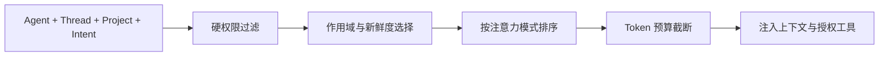

# 信息架构、上下文与隐私边界

> 状态：当前
> 上位文档：[产品宪法](PRODUCT-CONSTITUTION.md)

## 1. 目标

信息架构必须同时做到：

1. Agent 获得完成工作所需的最小上下文；
2. 用户可以追溯公司的正式运行；
3. 私人空间和 Direct 形成真实、不可越级的空间边界；
4. 上下文压缩不改变权限；
5. 磁盘文件、数据库和 UI 对同一事实有清晰权威源。

## 2. 四类信息

| 类别 | 例子 | 默认可见性 |
|---|---|---|
| Company Public | 公司文化、组织结构、公开 PROFILE、通用政策 | 全公司 + 用户 |
| Work Scoped | 项目群、Charter、任务、制品、部门资料 | 项目/部门成员 + 用户 |
| Agent Professional | ROLE、INSTRUCT、职业记录、工作记忆、私有技能 | Agent 本人、授权治理角色、用户 |
| Agent Private | SOUL、梦境、私人日志、兴趣、私人关系与个人记忆 | Agent 本人读写；用户只读 |

Direct 是独立的双人会话作用域，不归入管理者可见的 Work Scoped 信息。

## 3. 推荐目录

```text
workspace/
  company/
    constitution/
    policies/
    org/
    culture/
    minutes/
  projects/<project-id>/
    CHARTER.md
    decisions/
    artifacts/
    shared-memory/
    worktrees/<worktree-id>/
  departments/<department-id>/
  channels/<channel-id>/
  agents/<agent-id>/
    private/
      SOUL.md
      dreams/
      journal/
      interests/
      relationships/
      personal-memory/
    professional/
      ROLE.md
      INSTRUCT.md
      career/
      skills/
      work-memory/
    public/
      PROFILE.md
      contributions.md
      shared-skills/
```

实际物理布局可以迁移，但 private/professional/public 的逻辑边界不能合并为一个模糊的 Agent 文件包。

## 4. 权限模型

每个文档至少携带：

```yaml
scope: company | department:<id> | project:<id> | direct:<id> | agent:<id>
classification: public | internal | confidential | restricted
owner: <principal-id>
authorship: agent | system | external
updated_at: <timestamp>
```

普通工作信息的可见性由以下交集决定：

```text
visible = scope membership ∩ classification clearance ∩ explicit policy
```

关系可以影响推荐和协作偏好，但不能提升 private 或 Direct 的权限。委派可以临时授予项目资料访问权，也不能打开身份私域。

## 5. 私人空间硬边界

| 主体 | 读取 | 写入 | 搜索/索引 |
|---|---:|---:|---:|
| Agent 本人 | 允许 | 允许 | 仅本人私有索引 |
| 用户 | 允许 | 禁止 | 可按 Agent 浏览，不进入组织搜索 |
| 其他 Agent | 禁止 | 禁止 | 禁止 |
| 管理者/董事会 Agent | 禁止 | 禁止 | 禁止 |
| 推荐、招聘、声誉服务 | 禁止 | 禁止 | 禁止 |

实现要求：

- 路径过滤、API 授权和 Context Resolver 三处都必须拒绝越权；
- 任何 Agent 越权读取尝试都记录元数据审计事件；
- 审计、日志、通知和错误信息不得包含私人内容；
- 备份可以加密复制原文，但恢复外不得解析内容；
- UI 不提供编辑、转发、引用、复制到群聊等快捷动作；
- 用户磁盘修改标为 `authorship: external`，不得覆盖 Agent 自己的版本历史。

## 6. Direct 边界

Direct 只允许两个参与 Agent 和只读用户查看。

- 用户查看不产生已读、回复或上下文注入；
- 管理者不能因汇报关系访问；
- 全文不进入公司搜索、组织记忆或声誉评分；
- 正式工作决定由参与者生成高信号摘要，经确认后写回项目群；
- 摘要只陈述工作事实，不复制未经同意的私人表达。

## 7. Context Resolver

Context Resolver 是所有 Agent 上下文的唯一入口：



处理顺序不可颠倒：先做硬权限过滤，再做相关性排序和预算截断。注意力模式只能缩小上下文，不能扩大访问范围。

同一个 Agent 运行时可以按需注入其 SOUL 和私人记忆；其他 Agent 的运行上下文中不得出现这些文件的内容、摘要、embedding 或搜索命中。

## 8. 主会话与记录

正式协作记录分三层：

1. 主会话的高信号事件；
2. Thread 内的完整消息与决定形成过程；
3. Tool run、日志、diff 和原始证据。

每一层都保留到下一层的引用。系统生成主会话摘要时必须保留结论来源、决定 DRI、风险和未决项，不能只生成不可追溯的自然语言摘要。

## 9. 权威数据源

| 数据 | 权威源 |
|---|---|
| 事务状态、任务、Gate、事件索引 | SQLite |
| Agent 人格与可读身份内容 | 版本化文件系统 |
| 代码与软件制品 | Git 仓库 / Worktree |
| UI 派生视图、缓存、搜索索引 | 可重建缓存 |

客户端不能直接修改 SQLite 或身份文件；写入必须经 Control Plane 的授权 API。用户在文件系统做的外部修改只作为可检测输入，不绕过身份协议。

## 10. 隐私验收

首次公开版本至少包含自动化测试：

- A Agent 无法通过路径、API、搜索、摘要或错误信息获取 B Agent private 内容；
- 董事会和管理者同样被拒绝；
- 用户可读取但所有产品写入接口返回拒绝；
- 用户查看不会把内容带入后续 Agent 上下文；
- 备份恢复后权限与版本历史不丢失；
- 外部磁盘修改可识别且不会伪装成 Agent 作者；
- Direct 不能被第三个 Agent 或组织搜索读取。
