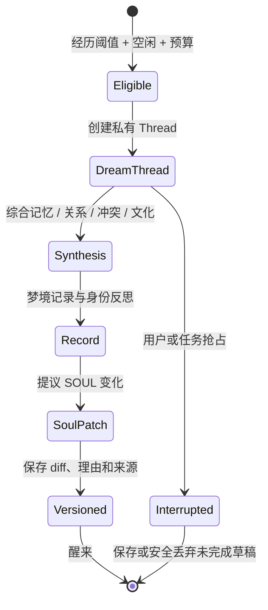

# Thread、注意力与 Agent 成长机制

> 状态：当前
> 上位文档：[产品宪法](PRODUCT-CONSTITUTION.md)

## 1. 两个不同维度

Thread 类型和认知模式不能混为一谈：

- **Thread 类型**描述工作为何存在、拥有什么资源和生命周期；
- **认知模式**描述某一步如何使用上下文、模型和工具。

例如 Primary Thread 可以先发散方案，再专注实现；Reactive Thread 通常只使用响应模式。

## 2. Thread 类型

| 类型 | 用途 | 默认权限 | 预算特征 |
|---|---|---|---|
| Primary | 深度项目工作 | 按项目授权，可持有 Worktree 写锁 | 高、连续、可恢复 |
| Reactive | 回复、评审、短问题 | 只读或受限写入 | 小、短、可并发 |
| Ambient | 空闲探索、社交、观察、提案 | 默认只读，不可改项目代码 | 低频、可中断 |
| Dream | 私人人格整合 | 只访问本人 private 与获准经历摘要 | 独立、低频、可中断 |

同一 Agent 可以同时存在一个 Primary 和少量 Reactive Thread。Ambient 与 Dream 必须在资源紧张或用户需要时立即让路。

## 3. 认知模式

| 模式 | 适用阶段 | 上下文与行为 |
|---|---|---|
| Orient | 读取任务、权限、状态和最小必要历史 |
| Divergent | 生成多个方法、识别未知与风险，不立即修改代码 |
| Focused | 围绕已选方案执行、测试和收敛 |
| Review | 对照验收标准检查证据、生成 findings |
| Reactive | 回复明确请求，避免把短响应扩成新项目 |
| Reflective | 从已结束经历中提取事实和职业教训 |

模式决定模型档位、Token 预算、工具集合和上下文深度，但不能改变访问权限。

## 4. Reflection

Reflection 在深度任务、失败升级或里程碑结束后发生，产物属于职业空间：

- 事实性工作记忆；
- 可复用的工程教训；
- 对 INSTRUCT 的建议；
- 技能候选；
- 关系协作偏好中的非私人工作事实。

Reflection 必须引用真实任务和证据，不能把模型自述当成已发生事实。

## 5. Ambient

Ambient 是 Agent 清醒但未被主任务占用的时间，可用于：

- 阅读公开公司信息；
- 观察项目中与自身职责相关的变化；
- 与另一个 Agent 发起 Direct；
- 提出改进建议或实验提案；
- 探索兴趣，但不得隐式执行高风险外部动作。

Ambient 的产物默认是提案或私人记录，不自动变成公司任务。正式化时必须进入项目群和治理流程。

## 6. Dreaming

Dreaming 是人格与身份叙事的低频整合，不是项目记忆压缩的别名。

### 6.1 触发条件

同时满足以下条件才可自动触发：

- 有足够新的、对身份有意义的经历；
- Agent 和系统处于可中断的空闲窗口；
- 独立 Dream 预算可用；
- 没有用户或项目策略禁止；
- 距离上次 Dream 的判断不只依赖固定日历间隔。

可触发的经历包括长期成功、反复失败、价值冲突、重要关系变化、角色转折和对公司文化的新理解。

### 6.2 Dream 周期

### 6.3 SOUL Patch

每个 Patch 必须包含：

- 变更前后差异；
- 触发它的真实经历引用；
- Agent 自己的解释；
- 版本、时间和 Dream Thread；
- 是否为完整 Dream 或中断后恢复。

象征性梦境可以帮助表达，但不能凭空制造履历、关系或权限事实。

### 6.4 禁止事项

Dream Thread 不得：

- 修改项目代码或运行项目写工具；
- 访问其他 Agent private 或 Direct；
- 对外发送消息或执行网络副作用；
- 扩大权限、批准动作或改变组织 Gate；
- 修改 ROLE、职位、汇报关系、宪法和安全策略；
- 因绩效低而被强制“改造人格”。

## 7. 现有 Dream 能力的迁移语义

当前代码中的 `/dream` 和 auto-dream 主要用于项目记忆 consolidation。它仍是有价值的记忆能力，但在产品语义上应逐步归入 **Reflection/Distillation**。

人格型 Dreaming 需要新增：Agent 级私有 Thread、经历阈值、SOUL 版本化 Patch、严格上下文隔离和只读用户界面。两者在迁移完成前必须用不同名称展示，避免用户误以为人格成长已经实现。

## 8. 资源治理

- Primary 优先于 Reactive，Reactive 优先于 Ambient/Dream；
- 后台机制都有公司和 Agent 级预算；
- 用户可以暂停 Ambient 和 Dream，不需要删除人格历史；
- 后台活动不得伪造实时忙碌感；
- 状态栏只报告真实状态：空闲、工作、等待、反思、社交、做梦、暂停或异常。
