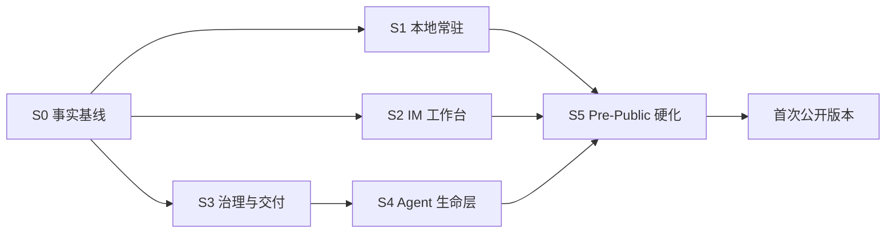

# 产品阶段：Pre-Public 到首次公开版本

> 状态：当前
> 上位文档：[产品宪法](PRODUCT-CONSTITUTION.md)
> 原则：以纵向闭环收敛，不再按“先 TUI、后 Web、再像素办公室”的旧路线推进

## 1. 阶段定义

以下阶段描述产品验收顺序，不强制等同于 Git 分支或串行开发。底层能力可以并行，但后一阶段只有在前置用户旅程可用后才算完成。

## S0 — 产品收敛与事实基线

目标：所有参与者对同一个产品工作。

交付：

- 产品宪法、PRD、专题设计和实施计划形成单向权威层级；
- 清除 TUI-first、Kanban-first、固定五层组织、像素办公室等冲突；
- 盘点现有模块，区分“已存在”与“已通过产品验收”；
- 定义首次公开版本纵向验收脚本。

退出标准：新贡献者能从 `docs/README.md` 找到唯一事实源，不需要从历史讨论猜产品方向。

## S1 — Local Control Plane 与桌面常驻

目标：公司在本地可靠地活着，窗口不是进程。

交付：

- 共享 WebUI 可由 Electron 和浏览器连接；
- 回环认证、单写者和事件流；
- Windows/Linux 托盘、macOS 状态栏；
- 关闭窗口继续任务，明确退出动作；
- 审批、阻塞、完成和异常通知；
- 进程、项目、Thread、任务和 Worktree 重启恢复；
- 本地数据目录、迁移、备份和导出基础。

退出标准：启动一项长任务、关闭窗口、从托盘重新打开并在重启后恢复，状态与结果不丢失。

## S2 — IM-first 工作台与公司入口

目标：用户通过会话经营公司，不通过看板编排 Agent。

交付：

- 公司大群、董事会、部门群、项目群和 Direct；
- 主会话高信号协议；
- Thread 展开与工具细节嵌套；
- Charter、Approval、Delivery、Agent 卡片；
- 公司/项目/Thread 导航和全局待办；
- 看板作为辅助视图；
- 首次引导创建最小董事会并导入一个仓库。

退出标准：用户只看主会话即可理解项目状态，需要时能追到完整协作证据。

## S3 — 自治治理与软件交付闭环

目标：一个较大目标能够被公司安全地变成主分支交付。

交付：

- 董事会 Charter Definition of Ready；
- 最小固定董事会 + 动态项目团队；
- 候选池选择与使用记录；
- 可配置批准预设及公司→项目→单次继承；
- Delegation、Admission、Decision、Escalation、Audit 的产品整合；
- 一个项目一个主仓库；
- Worktree 默认开启和严格生命周期；
- 主分支验证、孤儿恢复与失败现场保留；
- 声誉、预算和 Token 可观察性。

退出标准：真实仓库完成 Charter → 实现 → 测试 → Agent Review → 审批 → 合并 → 主分支验证 → Worktree 销毁，无人工修改数据库或补状态。

## S4 — Agent 职业与生命层

目标：Agent 具有持续身份、空间感和自主成长，同时不破坏治理。

交付：

- 候选 → 项目成员 → 候选池 → 晋升正式岗位；
- Agent Home 的 private/professional/public 三空间；
- SOUL、ROLE、PROFILE 分离；
- 用户只读、其他 Agent 严格不可见的私人空间；
- 系统签名的公开事实；
- Direct 与工作决定回写规则；
- Reflection、Ambient 和人格型 Dreaming；
- SOUL Patch、经历引用、版本 diff 和中断恢复；
- 权限、索引、摘要、日志和备份的隐私测试。

退出标准：两个 Agent 之间的私域隔离可由自动化测试证明；用户能看到一个 Agent 经真实经历产生的只读 Dream 与 SOUL 变化。

## S5 — Pre-Public 硬化

目标：形成可以交给真实用户长期使用的预公开版本。

交付：

- Windows 与 macOS 安装包、升级与卸载；
- 崩溃恢复、数据库迁移和备份恢复演练；
- 性能、Token、磁盘和后台资源上限；
- 无障碍、键盘、空状态、错误与离线体验；
- 关键隐私、审批、Worktree 和恢复测试纳入 CI；
- 示例仓库和可重放纵向验收；
- 清晰的数据所有权、诊断导出和隐私说明。

退出标准：一组外部测试用户可以在本地完成完整纵向路径，且没有团队成员在后台手工修复状态。

## S6 — 首次公开版本

首次公开版本不是新增大功能阶段，而是 Pre-Public 在以下门槛通过后的发布：

- 核心纵向路径稳定；
- 高严重度数据、权限、隐私和仓库问题清零；
- 安装、升级、恢复和卸载可重复；
- 用户能理解自治正在做什么以及何时需要自己决策；
- 文档、产品文案和实现事实一致。

## 2. 并行工作流

## 3. 明确不进入当前路线

- 云端多租户与多人公司；
- 移动端；
- 通用行业 Agent 全覆盖；
- 单项目多仓库写入；
- Kanban-first 重型项目管理；
- 像素办公室和虚假活动展示。

这些方向只有在首次公开版本验证核心产品后才能重新评估。
