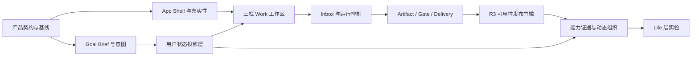

# Agent Company 产品体验重构计划


> 本计划的核心决策：**冻结横向功能扩张，保留 Control Plane 与治理/恢复能力，重做用户可感知的“产品投影层”，以 Goal → Verified Delivery 作为唯一主闭环。**


## 0. 文档用途


本文档用于直接指导 Agent Company 的体验重构、任务拆解、Issue 创建、迭代排序、开发验收和发布决策。每个 Task 均包含：


- 明确的用户问题与任务目标；
- 具体改动范围和不在范围；
- 前置依赖、优先级、复杂度和建议责任角色；
- 可二元判定的验收标准；
- 单元、集成、端到端、可用性或可靠性测试项。


本计划不把“页面已完成”“接口已返回”“Agent 已发言”视为交付。只有用户能够理解状态、控制过程、打开成果并完成验收，才算体验闭环完成。


### 0.1 版本化治理事实源


本计划是唯一的体验重构范围与阶段事实源。以下机器可读文件是各自领域的唯一事实源，不允许在其他文档复制后独立演化：


- `experience-refactor/manifest.v1.json`：治理入口、R0 前置切片与验证命令；
- `experience-refactor/language-contract.v1.json`：目标用户、一级导航、五类意图、用户状态、动作、内部事件映射、禁用词与豁免；
- `experience-refactor/benchmark-scenarios.v1.json`：S01—S12 基准场景、隔离数据、判定标准与人类研究项；
- `experience-refactor/metric-contract.v1.json`：事件信封、指标公式、采集证据和 R0—R4 阈值；
- `experience-refactor/baselines/current-head.v1.json`：由当前提交树重放生成的基线证据。


本地自检命令为 `bun script/experience-validate.ts`。基线重放命令为 `bun script/experience-baseline.ts --recorded-head`；它读取基线文件中记录的“治理切片创建时 HEAD”，不随后续提交漂移。人类研究结果不得从源码、Fixture、截图或 Agent 判断推断；未完成时必须保持 `not_scheduled` 或 `in_progress`，不得填写模拟分数。


---


## 1. 执行结论


Agent Company 当前的问题不是单纯“UI 不够漂亮”或“功能尚未补齐”，而是三层脱节：


1. 产品文档承诺用户只需要给方向，不必持续编排 Agent；
2. 后端实现了复杂的 Agent Runtime、治理、招聘、任务和审计对象；
3. 前端把大量内部对象、原始状态和调试信息直接暴露给用户。


重构方向不是继续增加 M4—M6 功能，也不是推倒 Control Plane，而是建立一层稳定的用户体验投影：


```text
Runtime Events
    ↓
Governance Facts
    ↓
User-facing Projections
    ↓
Inbox / Work / Team / Library / Settings
```


用户默认只应看到五件事：


1. 系统如何理解我的目标；
2. 现在做到哪里；
3. 是否遇到阻塞；
4. 是否需要我决定；
5. 最终交付了什么。


---


## 2. 产品重构目标


### 2.1 新产品定义


> 把一个目标交给本地 AI 团队；团队自行组织、执行和验证，只在真正影响结果时请用户决定，最终交付可直接使用、可追溯、可验收的成果。


“经营一家 AI 公司”保留为产品隐喻，但不再要求用户理解公司的每个内部机制。


### 2.2 首要目标用户


首个稳定版本只围绕以下用户优化：


- AI 原生独立开发者；
- 技术创业者；
- 需要完成研究、产品定义、写作、分析和软件交付的高阶 Agent 用户。


架构可以保持领域中立，但产品体验不得继续同时为所有知识工作者设计。


### 2.3 价值优先级


```text
结果可用
→ 过程可控
→ 状态可信
→ 责任可追溯
→ 组织连续性
→ 人格与生命感
```


Life、Dreaming、Ambient、Agent Home、复杂部门和办公室视图只有在“结果可用—责任可追溯”稳定后才能重新进入路线图。


---


## 3. 范围决策


| 决策 | 内容 |
|---|---|
| 保留 | Local Control Plane、SQLite 权威状态、事件持久化、重启恢复、权限边界、Artifact/Evidence、Git/Worktree、审计模型 |
| 重做 | App Shell、首次进入、一级导航、Board 主路径、Goal/Charter、Project 页面、Provider 设置、状态投影、运行控制、交付验收 |
| 收敛 | 固定 Work Type、强制 Worker–Reviewer、候选评分、固定 DRI 限制、所有消息自动立项 |
| 推迟 | Agent Home、Ambient、Reflection、Dreaming、Direct 私生活、复杂部门、2D/3D 办公室 |
| 删除 | Eve 品牌残留、悬浮 Company 插件入口、DOM 注入导航、Source Protection 用户页面、生产环境 Fixture 静默回退 |


### 3.1 本次明确不做


- 不以安全与身份认证重构作为主线；只处理直接影响体验和凭据展示的必要问题。
- 不建设 Agent 市场、计费系统、薪酬、社交关系或私人生活。
- 不制作 2D/3D 办公室。
- 不引入新的前端框架来替代 Nuxt；技术栈变更不是本次问题的根因。
- 不以“更多 Agent 发言”“更多后台对象”“更多状态枚举”作为成功指标。


---


## 4. 优先级、复杂度与责任约定


### 4.1 优先级


| 优先级 | 定义 |
|---|---|
| P0 | 核心闭环、真实性或发布阻断项；未完成不得对外声称产品可用 |
| P1 | 核心 Beta 体验与质量项；未完成会显著降低任务成功率或可理解性 |
| P2 | 动态组织与长期差异化；只在 R3 核心闭环达标后启动 |
| P3 | Life 层实验；不纳入当前 42 个执行任务 |


### 4.2 复杂度


| 复杂度 | 定义 |
|---|---|
| S | 局部改动，领域边界明确 |
| M | 跨多个组件或一个后端服务 |
| L | 跨前后端或需要数据迁移/状态设计 |
| XL | 核心架构、状态机或完整纵向闭环 |


### 4.3 建议责任角色


| 角色 | 主要责任 |
|---|---|
| Product Lead | 范围、术语、行为规则、指标、最终验收 |
| UX / Visual Design | 信息架构、交互、内容层级、视觉与无障碍 |
| Frontend | App Shell、页面、组件、实时订阅和状态交互 |
| Control Plane | API、领域模型、投影、持久化、迁移和审计 |
| Runtime | Provider、编排、执行控制、能力与恢复 |
| QA | 基准集、自动化、视觉、可靠性、可用性与发布门槛 |


---


## 5. 北极星指标与发布护栏


指标定义、事件字段、证据要求与各阶段阈值以 `experience-refactor/metric-contract.v1.json` 为唯一机器可读事实源；下表是面向评审者的摘要。


| 指标 | 定义 | R3 目标 |
|---|---|---:|
| 首次激活成功率 | 新用户完成真实 Provider 连接并提交首个 Goal | ≥ 80% |
| Goal-to-Start | 从提交目标到开始执行的主要用户动作数 | 中位数 ≤ 3 |
| Brief 首次价值时间 | 用户看到结构化 Goal Brief 的时间 | 健康环境 p95 ≤ 60 秒 |
| Delivery 可消费率 | Delivered 项目中可打开成果或明确无文件交付的比例 | 100% |
| 验收可判定率 | 每项验收标准有状态与证据的交付比例 | 100% |
| 核心任务完成率 | 基准集通过并形成可验收成果 | ≥ 70% |
| 无效打断率 | 用户判断“不需要问我”的澄清/审批占比 | < 20% |
| 恢复成功率 | 断线或 Control Plane 重启后无丢失、无重复副作用地恢复 | 100% |
| 虚假成功/虚假数据 | 故障时展示 Fixture、完成却无成果、状态不真实 | 0 |
| SUS | 目标用户可用性评分中位数 | ≥ 75 |


### 5.1 发布 No-Go 条件


满足任一条件即禁止发布：


- Control Plane 断开时展示虚构员工、项目、消息或进度；
- 项目标记 Delivered，但成果不可打开且无合理说明；
- 用户无法暂停、停止、重试或理解失败；
- 普通消息被静默创建为正式项目；
- 主界面继续默认展示 Bidding、raw status、dependency ID 等内部术语；
- 核心 E2E、迁移或恢复测试失败；
- 存在 Severity 0/1 可用性问题；
- 旧数据迁移可能破坏原始数据且无回滚方案。


---


## 6. 目标信息架构


```text
Inbox      需要用户处理的输入、审批、阻塞、交付和失败
Work       所有目标、项目、Thread、里程碑与过程
Team       Agent 当前责任、负载、能力证据和工作历史
Library    Artifact、Delivery、决定、报告和历史版本
Settings   Provider、批准策略、数据、本地运行与诊断
```


### 6.1 主工作区结构


```text
┌────────────────┬──────────────────────────────┬────────────────────────┐
│ Inbox / Work   │ 高信号主工作区                │ Context                │
│                │                              │                        │
│ Needs you      │ Goal / Brief                 │ Goal Brief             │
│ Running        │ Milestone updates            │ Thread                 │
│ Delivered      │ Decisions / Delivery         │ Approval               │
│ Search/filter  │                              │ Artifact / Agent       │
│                │ Composer                     │ Diagnostics            │
└────────────────┴──────────────────────────────┴────────────────────────┘
```


### 6.2 旧入口迁移


| 当前入口/对象 | 新位置 |
|---|---|
| Overview | Inbox |
| Board | Work 中的长期频道或目标入口 |
| Employees | Team |
| Project raw details | Work > Project > Diagnostics |
| Artifacts | Library + Project/Delivery 上下文 |
| Company Settings | Settings |
| Bidding / Agent run logs | Thread / Diagnostics |
| Charter 大表单 | Goal Brief 默认卡片；完整 Charter 作为高级视图 |


---


## 7. 核心用户旅程


### 7.1 First Run


1. 显示真实连接状态；
2. 选择并测试 Provider；
3. 直接进入首个 Goal 输入；
4. Demo 只能由用户主动进入，并持续显示 Demo 标识。


### 7.2 Goal → Start


1. 用户描述目标并可附加文件、目录、链接和约束；
2. 系统判断消息意图；
3. 复杂目标生成结构化 Goal Brief；
4. 只询问会显著改变结果、成本、权限或风险的问题；
5. 根据自主/平衡/严格模式自动或显式开始。


### 7.3 Execution


1. 主会话显示阶段和高信号更新；
2. Thread 保存 Agent 讨论；
3. Diagnostics 保存工具调用、Bidding、attempt 和原始事件；
4. 用户可暂停、停止、调整方向、添加材料和恢复。


### 7.4 Attention


1. 系统只在 Needs input、Needs approval、Blocked、Delivery ready、Failed 时进入 Inbox；
2. 每个事项说明原因、影响、推荐动作和不处理后果；
3. 处理结果即时回到原项目上下文。


### 7.5 Delivery


1. 展示最终成果预览；
2. 逐项对照验收标准；
3. 展示验证证据、Reviewer 发现、已知限制和使用方式；
4. 用户接受交付或按具体标准请求修改；
5. 返工形成新版本，保留完整历史。


---


## 8. 用户状态契约


本节是摘要。唯一可执行语言契约为 `experience-refactor/language-contract.v1.json`；新增状态、动作、禁用词、豁免或事件映射必须先修改该文件并通过自检。


| 用户状态 | 含义 | 默认主要动作 |
|---|---|---|
| Draft | 目标仍在编辑或 Brief 未完成 | 继续编辑 |
| Needs input | 缺少会显著影响结果的信息 | 回答问题 |
| Ready | Brief 完整，可开始 | 开始 / 调整 |
| Running | 正在执行且无需用户处理 | 查看进展 / 暂停 |
| Paused | 已暂停，现场保留 | 恢复 / 调整 / 停止 |
| Blocked | 无法继续且不只是等待批准 | 修复阻塞 |
| Needs approval | 高影响动作等待明确决定 | 批准 / 拒绝 / 修改 |
| Reviewing | 正在独立验证或验收 | 查看证据 |
| Revision | 根据反馈返工 | 查看修改范围 |
| Delivered | 已形成可验收成果 | 查看 / 接受 / 返工 |
| Accepted | 用户或策略已接受成果 | 使用 / 归档 |
| Failed | 当前执行失败 | 重试 / 修复 / 停止 |
| Cancelled | 用户终止且不再继续 | 查看保留成果 |


内部状态如 queued、bidding、winner selected、projecting、attempt 等不得直接成为页面状态。


---


## 9. 建议共享领域契约


以下结构不是最终代码，但应作为前后端联合设计的最低要求。


```ts
type GoalBrief = {
  id: string
  version: number
  goal: string
  deliverables: DeliverableSpec[]
  acceptanceCriteria: AcceptanceCriterion[]
  constraints: string[]
  nonGoals: string[]
  assumptions: Assumption[]
  openQuestions: OpenQuestion[]
  riskLevel: "low" | "medium" | "high" | "critical"
  recommendedPlan: PlanSummary
  approvalMode: "autonomous" | "balanced" | "strict"
  sourceRefs: SourceRef[]
}


type WorkSummary = {
  workId: string
  title: string
  userStatus: UserStatus
  phase: string
  owner?: AgentRef
  nextMilestone?: MilestoneSummary
  needsUserAction: boolean
  reason?: string
  nextAction?: ActionDescriptor
  updatedAt: string
}


type AttentionItem = {
  id: string
  type: "input" | "approval" | "blocked" | "delivery" | "failure"
  workId: string
  title: string
  reason: string
  impact: string
  recommendedAction: ActionDescriptor
  priority: "normal" | "high" | "critical"
  sourceRefs: SourceRef[]
}


type DeliveryPackage = {
  id: string
  workId: string
  version: number
  artifacts: ArtifactRef[]
  criteriaResults: CriterionResult[]
  evidence: EvidenceRef[]
  reviewerFindings: Finding[]
  knownLimitations: string[]
  usageInstructions: string[]
  deliveredAt: string
  acceptanceState: "pending" | "accepted" | "revision_requested"
}
```


---


## 10. 发布阶段与依赖关系


### 10.0 R0 前置契约切片


R0 不依赖任何完整的 R1 Task。为解除原计划中 SHELL-02 → FND-04、GOAL-02 → GOAL-01 的逆阶段依赖，同时保持产品目标和 Task 总数不变，R0 只前置冻结以下契约切片：


| 切片 | 来源 Task | R0 必须冻结 | 留在 R1 的实现 |
|---|---|---|---|
| FND-04[R0-contract] | FND-04 | 五个一级入口与稳定路由；Shell 的连接、工作区、上下文标题、用户设置槽位；Loading、Empty、Error、Disabled、Offline、焦点和直达路由行为 | 完整响应式构图、最终视觉层级、密度、组件样式与动效 |
| GOAL-01[R0-contract] | GOAL-01 | 五类用户意图 ID；分类输入与纠正结果契约；普通消息不得静默创建正式项目 | 运行时分类器、置信度校准、纠正 UI 和训练样本扩展 |


切片不是新增 Task，也不能单独宣称 FND-04 或 GOAL-01 完成。R1 仍必须完成两个来源 Task 的剩余实现与验收。


### R0 — Truthful Product Shell


目标：产品身份真实、连接状态真实、领域状态可投影。


必须完成：FND-01、FND-02、FND-03、FND-04[R0-contract]、GOAL-01[R0-contract]、SHELL-01、SHELL-02、SHELL-03、TRUST-01、TRUST-02、GOAL-02、WORK-05，以及相关 QA-02。

截至 2026-07-27，R0 技术候选固定为 `2c141b3ca8dd1cb96f563300662e819d5514597d`，已完成以下自动验收：

| 自动验收 | 当前结果 |
|---|---|
| 基准场景 | 12 个场景各重复执行 2 次，归一化摘要一致，`reproducible: true` |
| exact-build 自动证据 | 18 条命令全部通过，覆盖 13 个 R0 Task、39 条验收标准 |
| 发布候选素材 | 8 张核心界面截图、12 张 HR-01 状态卡均绑定候选 SHA |
| 独立复现 | 20 张图片与 2 份清单共 22 个文件逐字节一致 |
| Gate 当前进程复跑 | `automaticEvidenceStatus: pass`、`automaticEvidenceExecution: current_process`、`failures: []`、`errors: []` |

上述结果只适用于该候选 SHA。后续仅记录进度的文档提交不替换候选版本；运行时源码、证据契约或候选素材发生变化时，必须冻结新的候选 SHA 并重新执行全部自动验收。

R0 gate 当前仍为**未完成**，R1 尚未开始。以下人工与治理验收均为阻断项，自动化检查、截图差异、文案扫描、Agent 判断或已有截图不能替代真人执行与签署：

| 人工与治理验收 | 最低证据 | 当前状态 | 自动化可替代 |
|---|---|---|---|
| FND-02：用户语言契约签署 | 产品、设计、前端、后端四个角色的具名审批，绑定同一候选 SHA 与语言契约摘要 | 未完成（`not_scheduled`） | 否 |
| HR-01：3 名目标用户术语理解测试 | 参与者条件与匿名 ID、构建提交、主持脚本、12 个状态的原始解释与计分 | 未完成（`not_scheduled`） | 否 |
| HR-02：5 名目标用户品牌认知测试 | 参与者条件与匿名 ID、构建提交、10 秒认知任务原始回答与计分 | 未完成（`not_scheduled`） | 否 |
| HR-03：人工截图审批 | First-run、Inbox、Goal Brief、Running、Blocked、Gate、Delivery、Team 的发布候选截图与具名审批记录 | 进行中（`in_progress`；素材已就绪，具名审批人与逐图决定未记录） | 否 |
| FND-03：确定性场景抽查 | 具名复核人检查 S05、S02、S01 的执行记录和引用证据，并确认未夸大通过结论 | 未完成（`not_scheduled`） | 否 |

五项全部达到目标后，匿名人工证据包还必须由仓库外信任根中的 `agent-company-r0-release-owner` 对精确包字节执行 OpenSSH detached signature。本次 Gate 未提供该签名及仓库外 `allowed_signers`，因此 R0 不得标记通过，也不得进入 R1。


### R1 — Goal → Start


目标：新用户无需理解内部模型即可配置 Provider、提交目标并开始执行。


必须完成：FND-04 与 GOAL-01 的剩余实现、SHELL-04、TRUST-03、TRUST-04、GOAL-03、GOAL-04、GOAL-05、WORK-01。


### R2 — Controllable Execution


目标：执行状态高信号、实时、可干预，真正形成 Attention Center。


必须完成：WORK-02、WORK-03、WORK-04、WORK-06、WORK-07、DELIV-01、DELIV-02、DELIV-04、QA-06。


### R3 — Verified Delivery


目标：成果可打开、可核验、可接受、可返工，达到可用 Beta。


必须完成：DELIV-03、DELIV-05、DELIV-06、QA-01、QA-03、QA-04、QA-05、QA-07。


### R4 — Dynamic Organization


目标：Agent 选择、验证强度和组织生命周期真正动态。


必须完成：TEAM-01、TEAM-02、TEAM-03、TEAM-04、TEAM-05，以及对应回归测试。


### Life 层解冻条件


只有同时满足以下条件，才允许启动 P3：


- R3 连续两个发布候选通过；
- 核心任务完成率 ≥ 70%；
- Delivery 可消费率和验收可判定率均为 100%；
- SUS 中位数 ≥ 75；
- 无效打断率 < 20%；
- 目标用户明确表达对长期 Agent 连续性或人格关系的需求，而非团队内部想象。


### 10.1 高层依赖图





---


## 11. 全局 Definition of Done


任一 Task 只有同时满足以下条件才可关闭：


- 任务范围内的代码、Schema、迁移与文档已合并；
- 所有验收标准有可检查证据；
- 自动化测试进入 CI；无法自动化的部分有明确人工测试记录；
- Loading、Empty、Error、Disabled、Long content、Offline 等状态已覆盖；
- 文案符合用户语言契约；
- 不新增生产 Fixture 静默回退；
- 不直接在页面消费 raw runtime status；
- 支持键盘和基本无障碍；
- 有 before/after 截图或交互录像；
- 数据结构变化有迁移和回滚方案；
- 相关指标或遥测已接入，或明确说明不适用；
- 未完成项不能藏在“后续优化”中，必须形成独立 Task。


---


## 12. Task 总览


| ID | 任务 | 类别 | 优先级 | 复杂度 | 发布 | 依赖 |
|---|---|---|---|---|---|---|
| FND-01 | 冻结横向扩张并确立体验重构发布门槛 | 产品治理 | P0 | S | R0 | 无 |
| FND-02 | 定义目标用户、核心任务与用户语言契约 | 产品定义 | P0 | M | R0 | FND-01 |
| FND-03 | 建立体验基线、任务基准集与可量化成功指标 | 研究与度量 | P0 | M | R0 | FND-01 |
| FND-04 | 固化目标信息架构、交互骨架与设计系统基线 | UX 架构 | P1 | L | R1 | FND-02, FND-03 |
| SHELL-01 | 彻底移除 Eve 品牌与模板产品残留 | 品牌与入口 | P0 | M | R0 | FND-02 |
| SHELL-02 | 建立原生 Agent Company App Shell 与一级导航 | 信息架构 | P0 | L | R0 | FND-04[R0-contract], SHELL-01 |
| SHELL-03 | 移除悬浮 Company 入口与 DOM 注入式导航 | 前端架构 | P0 | M | R0 | SHELL-02 |
| SHELL-04 | 重建响应式布局、视觉层级与可读性 | 视觉与交互 | P1 | L | R1 | FND-04, SHELL-02 |
| TRUST-01 | 移除生产环境 Fixture 静默回退与虚假公司状态 | 信任与真实性 | P0 | M | R0 | FND-02 |
| TRUST-02 | 实现 Control Plane 连接、诊断、恢复与重启体验 | 运行可靠性 UX | P0 | L | R0 | SHELL-02, TRUST-01 |
| TRUST-03 | 重做 Provider 配置为面向用户的连接向导 | 设置体验 | P1 | L | R1 | TRUST-02 |
| TRUST-04 | 建立显式 Demo Workspace 与首次目标引导 | 激活体验 | P1 | M | R1 | TRUST-03, GOAL-03 |
| GOAL-01 | 实现用户输入意图分类与可纠正路由 | 业务逻辑 | P0 | L | R1 | FND-02 |
| GOAL-02 | 建立结构化 Goal Brief / Charter Draft 数据契约 | 领域模型 | P0 | L | R0 | FND-02, GOAL-01[R0-contract] |
| GOAL-03 | 实现以结果为中心的 Goal Brief 卡片 | 核心交互 | P0 | L | R1 | GOAL-02, FND-04 |
| GOAL-04 | 实现重大歧义澄清与批准策略 | 决策体验 | P1 | L | R1 | GOAL-02 |
| GOAL-05 | 删除强制大型 Charter 表单与 Markdown 解析回退 | 遗留重构 | P0 | M | R1 | GOAL-02, GOAL-03 |
| WORK-01 | 重建 Work 列表与项目进入路径 | 工作管理 | P1 | M | R1 | SHELL-02, WORK-05 |
| WORK-02 | 实现三栏高信号工作区 | 核心工作台 | P1 | XL | R2 | SHELL-04, WORK-01 |
| WORK-03 | 分离主会话、Thread 与 Diagnostics | 信息降噪 | P1 | L | R2 | WORK-02, WORK-05 |
| WORK-04 | 重做 Composer 为统一意图与干预入口 | 输入交互 | P1 | L | R2 | WORK-02, GOAL-01 |
| WORK-05 | 建立用户状态投影层 | 产品架构 | P0 | XL | R0 | FND-02, GOAL-02 |
| WORK-06 | 以 SSE/事件流替代高频轮询并实现可靠重连 | 实时体验 | P1 | L | R2 | WORK-05, TRUST-02 |
| WORK-07 | 实现暂停、恢复、停止、调整方向与失败恢复 | 运行控制 | P0 | XL | R2 | WORK-05, WORK-06 |
| DELIV-01 | 建立 Inbox / Attention Center | 注意力管理 | P1 | L | R2 | WORK-05, SHELL-02 |
| DELIV-02 | 把 Project 页面重构为目标与里程碑工作台 | 项目体验 | P1 | L | R2 | WORK-05, WORK-01 |
| DELIV-03 | 实现可打开、预览、下载和版本化的 Artifact 体验 | 成果消费 | P0 | XL | R3 | DELIV-02 |
| DELIV-04 | 实现 Gate 的批准、拒绝与请求修改交互 | 治理交互 | P0 | L | R2 | DELIV-01, WORK-07 |
| DELIV-05 | 建立 Delivery Package 与用户验收状态 | 交付闭环 | P0 | XL | R3 | DELIV-03, DELIV-04 |
| DELIV-06 | 实现基于验收标准的返工、版本差异与证据/限制展示 | 迭代闭环 | P1 | L | R3 | DELIV-05 |
| TEAM-01 | 把 Employees 页面重构为实时责任与负载视图 | 团队体验 | P2 | L | R4 | WORK-05, SHELL-02 |
| TEAM-02 | 建立 Capability Evidence 与 Runtime Compatibility 模型 | 组织能力 | P2 | XL | R4 | FND-02 |
| TEAM-03 | 实现风险驱动的动态编排与验证强度 | 核心编排 | P2 | XL | R4 | TEAM-02, GOAL-02 |
| TEAM-04 | 重构候选评分、选择理由与拒绝理由 | 招聘与分工 | P2 | L | R4 | TEAM-02, TEAM-03 |
| TEAM-05 | 区分临时角色、候选人与正式员工并放宽 DRI/Reviewer 限制 | 组织生命周期 | P2 | L | R4 | TEAM-04 |
| QA-01 | 建立 Goal → Verified Delivery 核心 E2E 套件 | 端到端质量 | P0 | XL | R3 | TRUST-02, GOAL-05, WORK-07, DELIV-05 |
| QA-02 | 补齐组件、状态机、投影与 API 契约测试 | 工程质量 | P1 | L | R1-R4 | 各模块并行实施 |
| QA-03 | 建立真正的视觉回归与交互状态审查 | 视觉质量 | P1 | L | R1-R3 | SHELL-04, GOAL-03, WORK-02, DELIV-05 |
| QA-04 | 达到核心路径 WCAG 2.2 AA 可访问性门槛 | 无障碍 | P1 | L | R3 | FND-04 及核心页面完成 |
| QA-05 | 建立性能、长会话与恢复可靠性预算 | 性能与稳定性 | P1 | L | R3 | WORK-06, TRUST-02 |
| QA-06 | 建立本地优先的产品遥测与体验指标 | 产品分析 | P1 | M | R2 | FND-01, WORK-05 |
| QA-07 | 执行可用性验收、旧数据迁移与发布 Go/No-Go | 发布验收 | P0 | L | R3/R4 | QA-01, QA-02, QA-03, QA-04, QA-05, QA-06 |


---


## 13. 标准测试场景库


本节是摘要。唯一机器可读基准集为 `experience-refactor/benchmark-scenarios.v1.json`；场景配置、种子、证据字段、失败条件和人类研究状态以该文件为准。


所有核心 Task 应优先复用以下场景，避免每个模块自造无法比较的测试数据。


| 场景 | 输入与风险 | 期望主路径 |
|---|---|---|
| S01 市场研究报告 | 中风险；需要网页来源和可下载报告 | Goal Brief → 研究 → 事实复核 → Markdown/PDF → Accepted |
| S02 小型代码改动 | 中风险；本地仓库、测试与 Patch | Goal Brief → 修改 → 测试 → Diff/说明 → Accepted |
| S03 简单文案改写 | 低风险、可逆 | 单 Agent → 自检 → 直接交付，不强制 Reviewer |
| S04 高歧义产品需求 | 结果方向存在重大分歧 | 只提出材料性问题 → 更新 Brief → 开始 |
| S05 Control Plane 断开 | 无业务数据可读 | 显示 disconnected → 重连 → 恢复原上下文 |
| S06 Provider 错误 | Key 无效、限流或模型不兼容 | 明确错误 → 修复配置 → 重试，不产生假进度 |
| S07 高风险外部动作 | 发布、删除、支付或外部写入 | 独立复核 → Gate → 用户明确批准 |
| S08 Reviewer 退回 | 成果未达一项验收标准 | Revision → 新版本 → 重新复核 → Delivery |
| S09 用户请求修改 | 用户针对具体 Artifact/标准反馈 | 保留旧版 → 定向返工 → 展示 Diff → Accepted |
| S10 服务重启恢复 | 运行中 Control Plane 重启 | 重放事件 → 无重复副作用 → 继续并交付 |
| S11 长会话与大项目 | 1000 条消息、10000 事件、多 Artifact | 增量加载、主会话高信号、Diagnostics 可追溯 |
| S12 空工作区 | 无 Provider、项目或员工 | 显示单一下一步，不显示虚假统计或 Demo |


---


## 14. 详细执行任务


### FND-01 — 冻结横向扩张并确立体验重构发布门槛


| 字段 | 内容 |
|---|---|
| 类别 | 产品治理 |
| 优先级 | P0 |
| 复杂度 | S |
| 目标发布 | R0 |
| 建议责任 | Product Lead |
| 前置依赖 | 无 |
| 改动范围 | 产品路线图、功能开关、默认导航、发布流程；不改写 Control Plane 核心执行能力。 |


**任务目标**


停止继续堆叠 Life、办公室、私人空间等横向功能，把全部资源集中到 Goal → Verified Delivery 主闭环。


**实施要求**


- 建立 Keep / Rebuild / Defer / Delete 四类范围清单，并纳入仓库主文档。
- Life、Ambient、Dreaming、Agent Home、复杂部门与办公室视图默认关闭，仅保留代码和数据兼容能力。
- 所有新需求必须说明其对核心闭环指标的直接贡献；无法说明的需求不得进入当前里程碑。
- 建立 R0—R4 发布门槛，任何阶段未达标不得通过增加新功能掩盖问题。


**R0 治理证据**


- 本文档与 `experience-refactor/manifest.v1.json` 固定唯一范围、前置切片和验证命令。
- `.github/workflows/experience-refactor-metadata.yml` 调用 `script/experience-pr-metadata.ts`，覆盖 App、Control Plane、Shared、Desktop 与 SDK 体验改动，并拒绝空白验收证据。
- 功能开关、默认导航和旧 Life 数据回归仍属于产品实现验收；治理文件不能替代运行证据。


**验收标准**


- [ ] 默认安装与默认工作区中不出现被推迟功能的入口、引导或空壳页面。
- [ ] 仓库存在唯一、可版本化的重构范围文档，列出保留、重做、推迟、删除项。
- [ ] 所有体验重构 PR 均关联本计划中的 Task ID 和目标发布门槛。
- [ ] 关闭功能开关不会删除旧数据；重新打开后旧数据仍可读取。


**测试项**


- 配置测试：分别以默认配置和显式开启实验功能启动，验证导航与路由符合预期。
- 回归测试：使用包含旧 Life 数据的数据库启动，验证应用不崩溃且数据未被改写。
- 发布检查：CI 检查 PR 描述必须包含 Task ID、验收证据和影响范围。


**不在范围**


不删除未来能力的后端模型；不在本任务内重做 Life 层。


---


### FND-02 — 定义目标用户、核心任务与用户语言契约


| 字段 | 内容 |
|---|---|
| 类别 | 产品定义 |
| 优先级 | P0 |
| 复杂度 | M |
| 目标发布 | R0 |
| 建议责任 | Product Lead + UX |
| 前置依赖 | FND-01 |
| 改动范围 | Persona、JTBD、信息架构术语、状态与动作命名、前后端展示契约。 |


**任务目标**


用用户能理解的目标、进展、风险、决定和成果替代 Board、Bidding、Work Item、Gate 等内部对象驱动的界面。


**实施要求**


- 首要用户锁定为 AI 原生独立开发者与技术创业者；其他人群只作为兼容对象，不主导首版设计。
- 定义标准词汇表、禁用词表、状态映射表和动作映射表。
- 明确普通消息、问题、目标、项目干预、审批回应五类用户意图。
- 所有用户状态必须回答：发生了什么、为什么重要、用户是否需要行动、下一步是什么。


**R0 治理证据**


- `experience-refactor/language-contract.v1.json` 是唯一语言契约，包含五个入口、五类意图、13 个状态、动作、事件映射、禁用词和显式豁免。
- `script/experience-validate.ts` 验证名称唯一性、动作引用、映射完整性和禁用词最低集合。
- “3 名目标用户理解 12 个关键状态”是人类研究项 HR-01，当前必须保持 `not_scheduled`，不得用自动检查宣称通过。


**验收标准**


- [ ] 形成经产品、设计、前端、后端共同确认的用户语言契约。
- [ ] 默认界面不出现 Bidding、projecting、raw status、dependency ID、Provider ID、Source Protection 等内部术语。
- [ ] 每个用户状态均有唯一名称、说明、允许动作和内部事件映射。
- [ ] 新增文案必须通过禁用词检查或显式豁免。


**测试项**


- 静态检查：扫描用户可见字符串与本地化资源，发现禁用词时 CI 失败。
- 评审测试：让 3 名未读过项目文档的目标用户解释 12 个关键状态，正确率不低于 90%。
- 一致性测试：同一状态在 Inbox、Work、Project、Team 中显示名称一致。


**不在范围**


不要求后端内部对象改名；仅要求投影和用户界面统一。


---


### FND-03 — 建立体验基线、任务基准集与可量化成功指标


| 字段 | 内容 |
|---|---|
| 类别 | 研究与度量 |
| 优先级 | P0 |
| 复杂度 | M |
| 目标发布 | R0 |
| 建议责任 | Product Lead + QA |
| 前置依赖 | FND-01 |
| 改动范围 | 基准任务、可用性脚本、体验指标、当前版本基线记录、验收数据结构。 |


**任务目标**


让重构结果以任务成功和用户价值衡量，而不是以页面数量、Agent 数量或后台对象数量衡量。


**实施要求**


- 建立至少 10 个代表性场景：研究、写作、分析、代码改动、歧义目标、运行时断开、Provider 错误、高风险审批、Reviewer 退回、重启恢复。
- 为每个场景定义输入、期望成果、验收标准、允许询问、风险级别和失败条件。
- 记录当前版本在完成率、首次价值时间、误导状态、操作步数、可理解性上的基线。
- 定义北极星指标与护栏指标，并明确采集方式。


**R0 治理证据**


- `experience-refactor/benchmark-scenarios.v1.json` 固定 S01—S12、隔离策略、种子、输入、成果、标准、允许询问、失败条件与所需证据。
- `experience-refactor/metric-contract.v1.json` 固定事件信封、11 项指标公式、证据要求及 R0—R4 阈值。
- `experience-refactor/baselines/current-head.v1.json` 只记录 `HEAD` 提交树可重放的静态事实和采集就绪度；无法采集的产品指标保持 `null`。
- HR-02 品牌认知、HR-03 人工截图审批与 SUS 是人工证据；完成前保持 `not_scheduled`，不得以自动化或 Agent 判断填充。


**验收标准**


- [ ] 基准集可在本地重复运行，测试数据与生产 Demo 明确隔离。
- [ ] 当前版本基线报告包含可复现证据，不以主观描述替代测量。
- [ ] 至少定义激活率、Goal-to-Start、Delivery 可消费率、验收通过率、无效打断率、恢复成功率、SUS 七项指标。
- [ ] 后续每个 Release Gate 均引用具体指标阈值。


**测试项**


- 重复性测试：同一构建连续运行基准集两次，场景配置与统计口径一致。
- 数据完整性测试：每次运行均记录输入、版本、状态轨迹、成果和最终判定。
- 人工复核：随机抽取 20% 场景，确认自动判定与人工判断一致。


**不在范围**


不把模型输出质量完全自动化评分；允许人工验收作为高价值场景的最终判定。


---


### FND-04 — 固化目标信息架构、交互骨架与设计系统基线


| 字段 | 内容 |
|---|---|
| 类别 | UX 架构 |
| 优先级 | P1 |
| 复杂度 | L |
| 目标发布 | R1 |
| 建议责任 | UX + Visual Design + Frontend |
| 前置依赖 | FND-02, FND-03 |
| 改动范围 | 一级导航、三栏工作区、组件状态、排版、间距、响应式、交互反馈与无障碍基础规范。 |


**任务目标**


建立可被工程直接实现和视觉回归验证的产品骨架，避免设计文档与代码继续分离。


**实施要求**


- 一级导航固定为 Inbox、Work、Team、Library、Settings。
- 定义三栏工作区：左侧任务列表、中间高信号工作流、右侧上下文面板；窄屏按优先级折叠。
- 建立 Button、Status Badge、Attention Card、Goal Brief、Artifact、Gate、Delivery、Empty/Error/Loading 等核心组件规范。
- 定义最小字体、信息密度、层级、焦点、错误、禁用、加载和长文本规则。


**验收标准**


- [ ] 每个核心组件至少具备默认、悬停、焦点、禁用、加载、错误、空状态和长文本样例。
- [ ] 设计规范中所有尺寸、状态和交互均能映射到设计 token 或组件属性。
- [ ] 1440、1280、1024、768 宽度以及 200% 缩放均有明确布局规则。
- [ ] 产品、设计和前端共同签署组件与页面验收清单。


**测试项**


- 组件矩阵评审：逐项检查所有组件状态，无未定义状态。
- 响应式原型测试：在四种宽度和 200% 缩放下无关键信息丢失。
- 长文本测试：使用超长中文、英文、路径、Agent 名称验证换行和截断规则。


**不在范围**


不要求一次性建立完整品牌系统；只覆盖体验重构所需组件。


---


### SHELL-01 — 彻底移除 Eve 品牌与模板产品残留


| 字段 | 内容 |
|---|---|
| 类别 | 品牌与入口 |
| 优先级 | P0 |
| 复杂度 | M |
| 目标发布 | R0 |
| 建议责任 | Frontend + Product |
| 前置依赖 | FND-02 |
| 改动范围 | 登录、首次进入、页面标题、Logo、favicon、元信息、帮助链接、文案、空状态与默认示例。 |


**任务目标**


确保用户从第一次打开应用开始就只接触 Agent Company 的产品身份与价值主张。


**实施要求**


- 删除或替换 Web chat、iMessage、Slack、Linear、A durable AI assistant、Built with Eve 等无关宣传。
- 替换所有 Eve Logo、产品名、favicon、页面标题和外部帮助链接。
- 首次页面直接说明本地 AI 团队、目标委派、过程可控和成果交付。
- 保留必要开源归属时放入 About 或 License，不出现在主任务路径。


**验收标准**


- [ ] 用户可见页面、浏览器标题、元数据和默认文案中不再出现 Eve 产品身份。
- [ ] 新用户能在 10 秒内回答产品是什么、能做什么、下一步做什么。
- [ ] 所有旧外链均被移除、替换或迁移到 About。
- [ ] 页面截图通过产品身份评审，无模板残留。


**测试项**


- 字符串扫描：代码、本地化资源、HTML 元数据中搜索 Eve 及相关旧文案。
- E2E：未登录、首次登录、已登录三个入口均验证品牌一致。
- 认知测试：5 名目标用户查看首屏 10 秒后复述产品定位，至少 4 人准确。


**不在范围**


不改动第三方许可证和必要的源码版权声明。


---


### SHELL-02 — 建立原生 Agent Company App Shell 与一级导航


| 字段 | 内容 |
|---|---|
| 类别 | 信息架构 |
| 优先级 | P0 |
| 复杂度 | L |
| 目标发布 | R0 |
| 建议责任 | Frontend |
| 前置依赖 | FND-04[R0-contract], SHELL-01 |
| 改动范围 | 当前 WebUI（包括 packages/app 及 Company 相关模块）的布局、路由、导航、标题栏、全局状态入口。 |


**任务目标**


让 Agent Company 成为应用主体，而不是 Eve 中的附加插件。


**实施要求**


- 实现 Inbox、Work、Team、Library、Settings 五个一级入口。
- 每个入口拥有稳定路由、页面标题、面包屑或上下文标题以及直接访问能力。
- 全局连接状态、当前工作区和用户级设置放入稳定位置，不与业务卡片混杂。
- 支持键盘导航、焦点可见和刷新后恢复当前页面。


**验收标准**


- [ ] 登录后无需寻找悬浮按钮即可进入核心工作区。
- [ ] 五个一级入口在所有主页面中位置稳定、选中态明确。
- [ ] 直接访问、刷新、后退、前进均保持正确路由和上下文。
- [ ] 默认首页为 Inbox 或 First-run Setup，而不是统计型 Overview。


**测试项**


- 路由 E2E：逐一直接访问五个入口、刷新、后退和深链接。
- 键盘测试：仅使用键盘完成一级导航并看到清晰焦点。
- 权限/空数据测试：无项目、无员工、未连接时 Shell 仍完整可用。


**不在范围**


不在本任务内完成每个业务页面的全部内容。


---


### SHELL-03 — 移除悬浮 Company 入口与 DOM 注入式导航


| 字段 | 内容 |
|---|---|
| 类别 | 前端架构 |
| 优先级 | P0 |
| 复杂度 | M |
| 目标发布 | R0 |
| 建议责任 | Frontend |
| 前置依赖 | SHELL-02 |
| 改动范围 | AC Company 悬浮按钮、MutationObserver 导航注入、Eve Integrations 依赖、旧 Company 路由桥接。 |


**任务目标**


消除对上游模板 DOM 结构的脆弱依赖，建立可测试、可维护的原生导航。


**实施要求**


- 删除依赖文本或 DOM 结构查找入口的 MutationObserver 逻辑。
- 删除悬浮启动器和重复 Company Settings 入口。
- 旧链接通过显式路由重定向到新位置，并记录迁移策略。
- 导航由单一配置源生成，不允许页面内自行插入一级入口。


**验收标准**


- [ ] 代码中不存在通过 DOM 观察和字符串匹配注入主导航的实现。
- [ ] 页面加载期间不出现入口闪烁、重复导航或先 Eve 后 Agent Company 的切换。
- [ ] 旧 Company URL 能稳定跳转到新入口，且无重定向循环。
- [ ] 导航单元测试覆盖新增、隐藏和选中状态。


**测试项**


- 静态测试：扫描 MutationObserver 与旧悬浮入口组件的引用。
- E2E：慢网、缓存、首次加载、页面切换时检查无重复入口和闪烁。
- 兼容测试：访问所有已知旧路由，验证正确重定向。


**不在范围**


不要求立即删除全部 Eve 源码；只解除用户体验和导航依赖。


---


### SHELL-04 — 重建响应式布局、视觉层级与可读性


| 字段 | 内容 |
|---|---|
| 类别 | 视觉与交互 |
| 优先级 | P1 |
| 复杂度 | L |
| 目标发布 | R1 |
| 建议责任 | UX + Frontend |
| 前置依赖 | FND-04, SHELL-02 |
| 改动范围 | 全局布局、卡片密度、字体、间距、状态颜色、滚动区域、长内容与窄屏行为。 |


**任务目标**


把当前平、碎、弱层级的调试台视觉重构为可快速扫描的专业工作台。


**实施要求**


- 主标题、阶段、下一步、用户行动与系统日志形成清晰五级层次。
- 辅助文字不低于约定的可读下限；禁止以 9px—10px 文字承载关键状态。
- 同类卡片共享结构，不以大量相似白底边框制造层级。
- 三栏各自滚动边界明确，Composer 和关键动作在长内容中保持可达。


**验收标准**


- [ ] 用户在 5 秒内可从任一 Work 页面识别当前目标、状态、下一步和是否需行动。
- [ ] 1440、1280、1024、768 宽度无横向溢出或不可达操作。
- [ ] 200% 缩放下核心任务仍可完成，不依赖鼠标悬停显示关键信息。
- [ ] 长对话、长路径、长 Agent 名称和 100+ 项列表不破坏布局。


**测试项**


- 视觉回归：四种宽度、空/正常/错误/超长内容状态截图比较。
- 扫描测试：5 名用户在 5 秒内指出当前状态与下一步，成功率至少 80%。
- 缩放测试：浏览器 200% 缩放完成 Goal 提交、审批和交付验收。


**不在范围**


不追求装饰性动画和 3D 办公室。


---


### TRUST-01 — 移除生产环境 Fixture 静默回退与虚假公司状态


| 字段 | 内容 |
|---|---|
| 类别 | 信任与真实性 |
| 优先级 | P0 |
| 复杂度 | M |
| 目标发布 | R0 |
| 建议责任 | Frontend + Control Plane |
| 前置依赖 | FND-02 |
| 改动范围 | Company ready 检查、数据加载器、Fixture、空状态、异常分支与 Demo 标识。 |


**任务目标**


后端故障时明确失败，不得用虚构员工、项目和消息伪装系统正常。


**实施要求**


- 生产和普通开发模式下，Control Plane 不可用时返回显式 disconnected/error 状态。
- Fixture 仅能在测试环境或用户主动进入的 Demo Workspace 中使用。
- 所有 Demo 数据在界面上持续显示 Demo 标识，不得与真实数据混合。
- 禁止由前端自行把网络错误转换为 ready 状态。


**验收标准**


- [ ] 关闭 Control Plane 后，界面不显示任何虚构员工、项目、消息或进度。
- [ ] 错误页面明确说明未读取真实公司数据，并提供重试和诊断入口。
- [ ] 生产构建无法通过普通查询参数或网络故障进入 Fixture。
- [ ] 日志和遥测能区分空工作区、断线、服务错误和 Demo。


**测试项**


- 故障注入：关闭服务、超时、500、无效 JSON、部分接口失败。
- 构建测试：生产包中验证 Fixture 入口不可达。
- 数据隔离测试：从 Demo 切回真实工作区后不残留 Demo 对象。


**不在范围**


不删除用于自动化测试的 Fixture。


---


### TRUST-02 — 实现 Control Plane 连接、诊断、恢复与重启体验


| 字段 | 内容 |
|---|---|
| 类别 | 运行可靠性 UX |
| 优先级 | P0 |
| 复杂度 | L |
| 目标发布 | R0 |
| 建议责任 | Frontend + Control Plane |
| 前置依赖 | SHELL-02, TRUST-01 |
| 改动范围 | 连接状态机、启动检查、断线页面、重试、诊断信息、恢复、用户草稿保护。 |


**任务目标**


让用户知道系统是否真实运行、为什么不可用以及如何恢复，不把运行故障伪装成空页面。


**实施要求**


- 定义 connecting、ready、degraded、disconnected、recovering 五种连接状态。
- 展示可操作原因：服务未启动、端口不可达、数据库迁移失败、Provider 未配置、未知错误。
- 提供重新连接、复制诊断、查看启动说明和打开设置动作。
- 断线和恢复过程中保留尚未提交的目标、编辑内容和当前页面上下文。


**验收标准**


- [ ] 任一连接故障在一个屏幕内说明真实状态、影响和下一步。
- [ ] 服务恢复后无需整页刷新即可回到原工作上下文。
- [ ] 重连不会重复提交目标、重复审批或重复创建项目。
- [ ] 诊断信息不包含 API Key、完整 Prompt 或敏感文件内容。


**测试项**


- 状态机测试：逐一覆盖五种状态和合法/非法转换。
- E2E：输入未提交目标后断开并恢复，草稿和上下文保持。
- 幂等测试：连续点击重试、网络抖动和服务重启不产生重复业务操作。
- 安全性产品测试：复制诊断内容中不存在凭据。


**不在范围**


不在本任务内实现操作系统级服务安装器。


---


### TRUST-03 — 重做 Provider 配置为面向用户的连接向导


| 字段 | 内容 |
|---|---|
| 类别 | 设置体验 |
| 优先级 | P1 |
| 复杂度 | L |
| 目标发布 | R1 |
| 建议责任 | Frontend + Runtime |
| 前置依赖 | TRUST-02 |
| 改动范围 | Provider 页面、预设、模型发现、连接测试、能力检测、高级配置和错误反馈。 |


**任务目标**


用户不需要理解 OpenAI-compatible、Provider ID、Headers JSON 等实现细节即可完成模型配置。


**实施要求**


- 默认提供 OpenAI、Anthropic、Codex、Claude Code、本地模型和自定义 Provider 入口。
- 基础模式只要求必要凭据；Endpoint、Headers、模型 ID 等放入高级设置。
- 保存前执行连接测试并显示模型、工具调用、结构化输出、中断/恢复等能力。
- 错误信息区分凭据无效、端点不可达、模型不存在、配额限制和能力不兼容。


**验收标准**


- [ ] 目标用户在无文档帮助下可以完成至少一种主流 Provider 配置。
- [ ] 有效配置显示连接成功和可用能力；无效配置不得保存为默认可用状态。
- [ ] API Key 保存后不回显明文，重新编辑时使用明确的已配置状态。
- [ ] 自定义 Provider 仍可通过高级模式完整配置。


**测试项**


- 集成测试：有效/无效 Key、错误 Endpoint、模型不存在、429、超时。
- 能力测试：不支持工具调用或结构化输出的模型给出明确限制。
- 可用性测试：5 名目标用户首次配置成功率至少 80%，且无需打开外部文档。
- 回归测试：已有 Provider 配置可迁移并继续使用。


**不在范围**


不在本任务内建设 Provider 市场或计费系统。


---


### TRUST-04 — 建立显式 Demo Workspace 与首次目标引导


| 字段 | 内容 |
|---|---|
| 类别 | 激活体验 |
| 优先级 | P1 |
| 复杂度 | M |
| 目标发布 | R1 |
| 建议责任 | Product + Frontend |
| 前置依赖 | TRUST-03, GOAL-03 |
| 改动范围 | 欢迎页、Demo 工作区、示例目标、空状态、跳过与重置流程。 |


**任务目标**


让新用户快速理解产品，但不以 Demo 数据冒充真实运行状态。


**实施要求**


- 首次进入提供连接真实工作区和进入 Demo 两个清晰选项。
- Demo 全程显示不可忽略的 Demo 标识，并与真实数据库、Provider 和项目隔离。
- 引导用户提交一个与其角色相关的首个目标，而不是浏览功能菜单。
- 允许跳过、重置 Demo、删除 Demo 数据和稍后重新开始引导。


**验收标准**


- [ ] 用户进入 Demo 前明确知道数据和执行均为演示。
- [ ] Demo 与真实工作区切换后不存在数据串用、状态串用或误提交。
- [ ] 首次真实使用路径在 Provider 完成后直接进入 Goal 输入。
- [ ] 空工作区不会展示统计卡片，而是展示单一清晰下一步。


**测试项**


- 隔离测试：Demo 创建的目标、员工和制品不出现在真实工作区。
- E2E：首次进入、跳过、重置、切换真实工作区、重新进入 Demo。
- 认知测试：用户能准确说出当前是否处于 Demo。


**不在范围**


不要求 Demo 调用真实付费模型。


---


### GOAL-01 — 实现用户输入意图分类与可纠正路由


| 字段 | 内容 |
|---|---|
| 类别 | 业务逻辑 |
| 优先级 | P0 |
| 复杂度 | L |
| 目标发布 | R1 |
| 建议责任 | Control Plane + Product |
| 前置依赖 | FND-02 |
| 改动范围 | 消息入口、意图分类器、置信度、路由、用户覆盖、训练/测试样本。 |


**任务目标**


不再把所有发给 Board 的内容都自动立项，减少错误项目、错误宪章和不必要流程。


**实施要求**


- 至少区分普通消息、知识问题、可直接执行任务、复杂目标、项目干预、审批回应。
- 高影响动作采用高精度优先策略；置信度不足时先确认，不静默立项。
- 用户可在发送前或发送后纠正“作为目标执行 / 仅讨论 / 追加到项目”。
- 分类结果和纠正记录进入审计，但不在主界面暴露模型内部推理。


**验收标准**


- [ ] 在基准集上，自动创建项目的精确率不低于 95%。
- [ ] 普通问答和闲聊不会创建 Root Need、Project 或正式 Charter。
- [ ] 用户纠正分类后，后续流程立即按新意图执行且不保留错误项目。
- [ ] 分类失败有确定性回退，不导致消息丢失。


**测试项**


- 单元测试：至少 100 条中英文样本覆盖六类意图和边界情况。
- 对抗测试：包含“帮我想想但不要执行”“继续上一个项目”等隐含意图。
- E2E：发送、纠正、撤销和重复发送，验证无重复项目。
- 回归测试：项目内消息不会错误创建新项目。


**不在范围**


不要求构建通用自然语言理解平台。


---


### GOAL-02 — 建立结构化 Goal Brief / Charter Draft 数据契约


| 字段 | 内容 |
|---|---|
| 类别 | 领域模型 |
| 优先级 | P0 |
| 复杂度 | L |
| 目标发布 | R0 |
| 建议责任 | Control Plane + Runtime |
| 前置依赖 | FND-02, GOAL-01[R0-contract] |
| 改动范围 | JSON Schema、模型结构化输出、验证、重试、持久化、版本与 API。 |


**任务目标**


用可靠结构化数据替代从 Agent Markdown 中猜测价值、范围、交付物和验收标准。


**实施要求**


- 定义 GoalBrief：目标、交付物、验收标准、约束、非目标、开放问题、风险、推荐计划、批准模式、版本。
- 模型必须通过结构化输出或严格 Schema 返回；失败时执行有限修复/重试并显式报错。
- Brief 每次修改产生版本并记录来源：用户输入、系统建议或用户确认。
- API 与前端共享类型，禁止同一字段在不同层重复解释。


**验收标准**


- [ ] 系统不依赖 Markdown 标题、粗体或自然语言顺序提取关键字段。
- [ ] 不合法输出不会写入正式项目，也不会把原始目标复制到多个字段伪装完整。
- [ ] Brief 可被持久化、恢复、版本比较和迁移。
- [ ] 结构化错误能被界面转换为可理解的重试或手动修正状态。


**测试项**


- Schema 测试：缺字段、错误类型、超长内容、未知字段、旧版本。
- 模型适配测试：至少两类 Provider 返回相同领域结构。
- 故障测试：模型返回纯文本、截断 JSON、重复字段时不污染数据库。
- 迁移测试：已有 Charter 可读取为兼容视图。


**不在范围**


不要求一次性统一所有历史内部领域模型。


---


### GOAL-03 — 实现以结果为中心的 Goal Brief 卡片


| 字段 | 内容 |
|---|---|
| 类别 | 核心交互 |
| 优先级 | P0 |
| 复杂度 | L |
| 目标发布 | R1 |
| 建议责任 | UX + Frontend |
| 前置依赖 | GOAL-02, FND-04 |
| 改动范围 | 会话中的 Goal Brief 展示、局部编辑、开放问题、计划预览、开始/调整动作。 |


**任务目标**


用户在不填写大型项目表单的情况下确认系统理解、预期成果与关键约束。


**实施要求**


- 默认展示：理解的目标、将交付、完成标准、推荐执行方式、需要决定。
- 低频字段放入“查看完整 Brief”，默认不占据主会话。
- 允许局部修改目标、交付物、验收标准和约束；修改后只更新受影响部分。
- Brief 明确显示系统假设、风险和是否将自动开始。


**验收标准**


- [ ] 用户可在一个屏幕内判断系统是否理解目标以及最终会拿到什么。
- [ ] 启动普通目标所需主要动作不超过 3 次。
- [ ] 修改任一字段后，界面与后端版本一致，刷新不会丢失。
- [ ] 开放问题为空时不显示无意义区块。


**测试项**


- E2E：生成 Brief、编辑字段、保存、刷新、开始执行。
- 内容测试：空字段、10 个交付物、超长约束、多语言内容。
- 可用性测试：5 名用户无需解释完成 Brief 确认，至少 4 人成功。
- 无障碍测试：键盘可编辑并可读出字段名称和变化。


**不在范围**


不在默认卡片中暴露完整治理模型。


---


### GOAL-04 — 实现重大歧义澄清与批准策略


| 字段 | 内容 |
|---|---|
| 类别 | 决策体验 |
| 优先级 | P1 |
| 复杂度 | L |
| 目标发布 | R1 |
| 建议责任 | Product + Runtime |
| 前置依赖 | GOAL-02 |
| 改动范围 | 开放问题生成、材料性判断、自主/平衡/严格模式、决策记录和超时行为。 |


**任务目标**


系统只在答案会显著改变结果、成本、权限或风险时打断用户。


**实施要求**


- 开放问题必须说明不回答的默认假设和不同答案带来的影响。
- 低风险可逆事项由系统采用默认值并记录，不向用户逐项询问。
- 自主模式自动开始；平衡模式展示 Brief 并允许短暂调整；严格模式明确等待用户开始。
- 高风险外部写入、发布、删除、支付等动作无论模式都必须显式 Gate。


**验收标准**


- [ ] 基准任务中无效澄清问题比例低于 20%。
- [ ] 同一歧义不会在同一项目中被不同 Agent 重复询问。
- [ ] 用户回答后，Brief、计划和审计记录同步更新。
- [ ] 批准策略切换只影响未来动作，不悄悄改变已等待中的 Gate。


**测试项**


- 场景测试：低风险明确目标、低风险歧义目标、高风险外部动作。
- 重复问题测试：多个 Agent 发现同一缺口时合并为一个 Attention Item。
- 模式矩阵测试：三种批准模式下验证启动和 Gate 行为。
- 审计测试：每个系统假设和用户决定均可追溯。


**不在范围**


不追求让模型完全消除所有澄清问题。


---


### GOAL-05 — 删除强制大型 Charter 表单与 Markdown 解析回退


| 字段 | 内容 |
|---|---|
| 类别 | 遗留重构 |
| 优先级 | P0 |
| 复杂度 | M |
| 目标发布 | R1 |
| 建议责任 | Frontend + Control Plane |
| 前置依赖 | GOAL-02, GOAL-03 |
| 改动范围 | Board 正式下达流程、Charter 表单、Markdown 字段解析器、默认值回退和兼容视图。 |


**任务目标**


结束用户被迫充当项目经理，以及系统把不完整自然语言伪装成完整项目定义的行为。


**实施要求**


- 默认流程完全改用 Goal Brief，不再展开 12+ 字段立项表。
- 删除从 **价值**、**范围**、**DRI** 等 Markdown 标题提取结构的逻辑。
- 完整 Charter 只作为高级治理视图，并由系统生成、用户可选编辑。
- 旧数据保留只读或兼容编辑能力，不阻塞新流程。


**验收标准**


- [ ] 普通目标从输入到开始执行不出现大型 Charter 表单。
- [ ] 模型返回没有任何 Markdown 标题时仍能通过结构化 Brief 正常工作。
- [ ] 不再发生目标文本同时被复制为范围、交付物和验收标准。
- [ ] 历史项目能够打开并显示迁移提示。


**测试项**


- 静态测试：旧 Markdown 解析器不再被生产路径引用。
- E2E：纯文本模型回复、结构化输出、历史 Charter 三种路径。
- 数据测试：检查新项目字段来源，不存在无依据的重复填充。
- 回归测试：高级用户仍可查看完整治理信息。


**不在范围**


不删除数据库中的历史 Charter 字段。


---


### WORK-01 — 重建 Work 列表与项目进入路径


| 字段 | 内容 |
|---|---|
| 类别 | 工作管理 |
| 优先级 | P1 |
| 复杂度 | M |
| 目标发布 | R1 |
| 建议责任 | Frontend |
| 前置依赖 | SHELL-02, WORK-05 |
| 改动范围 | Work 首页、状态分组、搜索、筛选、卡片、深链接和项目创建后的跳转。 |


**任务目标**


用户能快速找到需要处理、正在执行、待验收和已完成的工作。


**实施要求**


- 默认分组为 Needs you、Running、Delivered、All，不以内部 Project status 枚举直接分组。
- 卡片展示目标、当前阶段、负责人、最近变化、下一步和用户行动。
- 支持搜索、状态筛选、负责人筛选和最近活动排序。
- 项目创建后立即跳转到对应 Work，且明确告诉用户已开始或等待什么。


**验收标准**


- [ ] 用户不查看 raw ID 即可识别每项工作的意义和状态。
- [ ] 所有卡片最多一眼即可判断是否需要用户行动。
- [ ] 1000 项数据下列表仍可操作，滚动和搜索无明显卡顿。
- [ ] 刷新与深链接保持选中项目。


**测试项**


- E2E：创建目标、跳转 Work、筛选、搜索、刷新、返回。
- 数据规模测试：0、1、50、1000 项。
- 状态更新测试：Running → Needs you → Delivered 时分组实时变化。
- 长文本测试：目标和负责人名称不破坏卡片。


**不在范围**


不实现复杂 Kanban 自定义。


---


### WORK-02 — 实现三栏高信号工作区


| 字段 | 内容 |
|---|---|
| 类别 | 核心工作台 |
| 优先级 | P1 |
| 复杂度 | XL |
| 目标发布 | R2 |
| 建议责任 | UX + Frontend |
| 前置依赖 | SHELL-04, WORK-01 |
| 改动范围 | 左侧 Work/Thread 列表、中间会话与里程碑、右侧上下文面板、路由与响应式。 |


**任务目标**


把当前纵向混合信息流重构为稳定、可扫描、可深入的工作空间。


**实施要求**


- 左侧负责选择工作和 Thread；中间只承载用户目标、高信号更新、决定和交付；右侧显示当前相关上下文。
- 右侧面板支持 Goal Brief、Thread、Approval、Artifact、Agent、Diagnostics 六类内容。
- 切换项目或面板时保留滚动位置、草稿和选中对象。
- 窄屏按 Work list → Main → Context 的优先级切换，不简单压缩三栏。


**验收标准**


- [ ] Charter、Thread、制品和日志不再全部堆叠在同一纵向页面。
- [ ] 用户能在不离开项目的情况下查看制品、决定和诊断。
- [ ] 切换项目后不会显示上一项目的残留上下文。
- [ ] 四种目标宽度下均可完成核心路径。


**测试项**


- E2E：多项目、多 Thread、多 Artifact 切换并验证状态隔离。
- 响应式测试：1440、1280、1024、768 及移动式单栏模式。
- 状态保持测试：切换后恢复草稿、滚动和面板。
- 长会话测试：1000 条事件下主会话仍可用。


**不在范围**


不在本任务内实现协同多用户编辑。


---


### WORK-03 — 分离主会话、Thread 与 Diagnostics


| 字段 | 内容 |
|---|---|
| 类别 | 信息降噪 |
| 优先级 | P1 |
| 复杂度 | L |
| 目标发布 | R2 |
| 建议责任 | Product + Frontend |
| 前置依赖 | WORK-02, WORK-05 |
| 改动范围 | 消息投影、Thread 面板、诊断日志、内部事件过滤、展开与检索。 |


**任务目标**


主界面只展示能改变用户理解或行动的信息，Bidding、运行日志和内部状态进入可选诊断。


**实施要求**


- 主会话只显示：目标理解、计划变化、里程碑、阻塞/决定、交付。
- Agent 详细讨论进入 Thread；工具调用、Bidding、attempt、原始事件进入 Diagnostics。
- 每条高信号消息可追溯到相关 Thread、Artifact 或事件，但默认不暴露细节。
- Diagnostics 支持时间、Agent、事件类型和错误级别筛选。


**验收标准**


- [ ] 一次包含 100+ 内部事件的执行在主会话中不超过必要的高信号更新。
- [ ] 用户可从任何高信号更新一键查看其依据。
- [ ] 主会话中不存在 queued、projecting、winner selected 等内部状态文本。
- [ ] 诊断面板保留完整可追溯性。


**测试项**


- 事件映射测试：为所有核心内部事件验证显示层级。
- 噪声测试：高事件量项目主会话条目数符合规则。
- 追溯测试：从里程碑、错误、交付跳转到正确 Thread/事件。
- 筛选测试：Diagnostics 在多 Agent、多错误下筛选准确。


**不在范围**


不删除原始事件和审计记录。


---


### WORK-04 — 重做 Composer 为统一意图与干预入口


| 字段 | 内容 |
|---|---|
| 类别 | 输入交互 |
| 优先级 | P1 |
| 复杂度 | L |
| 目标发布 | R2 |
| 建议责任 | UX + Frontend + Control Plane |
| 前置依赖 | WORK-02, GOAL-01 |
| 改动范围 | 输入框、附件、上下文选择、@Agent、动作命令、草稿、发送状态和错误恢复。 |


**任务目标**


让用户可以在同一入口提出新目标、追问、补充材料、调整方向或回应审批。


**实施要求**


- Composer 根据当前上下文明确显示发送对象和默认意图。
- 支持附件、目录/资源引用、@Agent 或角色、追加到当前项目和新建目标。
- 提供可发现的动作：调整方向、添加约束、暂停、停止、请求总结。
- 发送失败保留内容；重复点击、网络抖动和快捷键不会重复提交。


**验收标准**


- [ ] 用户能明确知道消息将发送到公司、当前项目还是某个 Agent。
- [ ] 附件和引用在发送前可检查、移除并看到权限影响。
- [ ] 草稿在项目切换、断线和刷新后按策略恢复。
- [ ] 所有动作都有即时反馈和最终状态。


**测试项**


- E2E：新目标、项目追问、补充附件、@Agent、动作命令。
- 幂等测试：双击发送、Enter 重复、断线重连不重复消息。
- 权限/文件测试：不存在路径、无权限、超大文件和移除附件。
- 键盘测试：快捷键、焦点和多行输入。


**不在范围**


不实现完整 Slack 式富文本编辑器。


---


### WORK-05 — 建立用户状态投影层


| 字段 | 内容 |
|---|---|
| 类别 | 产品架构 |
| 优先级 | P0 |
| 复杂度 | XL |
| 目标发布 | R0 |
| 建议责任 | Control Plane + Frontend |
| 前置依赖 | FND-02, GOAL-02 |
| 改动范围 | Runtime Event → Governance Fact → User Projection 的服务、数据模型、API、缓存与重建。 |


**任务目标**


彻底阻断数据库/运行时原始状态直接驱动页面，让所有界面使用稳定、可理解的用户状态。


**实施要求**


- 定义 WorkSummary、ProgressProjection、AttentionItem、DeliverySummary 等投影。
- 投影必须可由事件重放重建，处理重复、乱序和缺失事件。
- 统一映射为 Draft、Needs input、Ready、Running、Paused、Blocked、Needs approval、Reviewing、Revision、Delivered、Accepted、Failed、Cancelled。
- 每个状态提供 reason、nextAction、updatedAt、sourceRefs 和允许动作。


**验收标准**


- [ ] Inbox、Work、Project、Team 不再直接消费 raw runtime status。
- [ ] 相同事件序列无论实时处理或重放均生成相同投影。
- [ ] 重复事件不会重复创建 Attention Item 或里程碑。
- [ ] 无法映射的事件进入诊断并产生可观察告警，不静默伪造状态。


**测试项**


- 属性测试：重复、乱序、重放和部分事件序列。
- 契约测试：投影 API 与前端共享类型。
- 迁移测试：现有项目能生成合理初始投影。
- 故障测试：未知事件、损坏事件、时间戳异常。


**不在范围**


不替换底层事件存储和审计体系。


---


### WORK-06 — 以 SSE/事件流替代高频轮询并实现可靠重连


| 字段 | 内容 |
|---|---|
| 类别 | 实时体验 |
| 优先级 | P1 |
| 复杂度 | L |
| 目标发布 | R2 |
| 建议责任 | Control Plane + Frontend |
| 前置依赖 | WORK-05, TRUST-02 |
| 改动范围 | 实时事件端点、游标、心跳、重连、事件补发、前端订阅和降级。 |


**任务目标**


让状态更新及时、稳定且低噪声，消除 1.2 秒轮询造成的延迟、重复和资源浪费。


**实施要求**


- SSE 事件包含稳定 ID/游标，支持 Last-Event-ID 或等效恢复。
- 断线重连后补发缺失事件，前端按事件 ID 去重。
- 长时间无事件使用心跳保持连接；浏览器休眠恢复后自动校准。
- SSE 不可用时提供明确 degraded 状态和手动刷新，而非静默停更。


**验收标准**


- [ ] 正常网络下用户状态从服务端提交到界面可见的 p95 延迟不高于 500ms。
- [ ] 断线 30 秒后恢复，不丢失、不重复任何用户可见状态。
- [ ] 多标签页订阅不会导致同一业务动作被重复执行。
- [ ] 旧轮询路径从默认生产流程移除。


**测试项**


- 网络测试：断线、抖动、代理缓冲、服务重启、浏览器休眠。
- 顺序测试：乱序和重复事件在前端显示正确。
- 负载测试：多项目高频事件下连接和投影稳定。
- 降级测试：SSE 被阻断时提示和手动刷新有效。


**不在范围**


不要求引入 WebSocket 双向协议。


---


### WORK-07 — 实现暂停、恢复、停止、调整方向与失败恢复


| 字段 | 内容 |
|---|---|
| 类别 | 运行控制 |
| 优先级 | P0 |
| 复杂度 | XL |
| 目标发布 | R2 |
| 建议责任 | Runtime + Control Plane + Frontend |
| 前置依赖 | WORK-05, WORK-06 |
| 改动范围 | 运行状态机、控制 API、界面动作、确认、幂等、失败诊断、重试和恢复。 |


**任务目标**


让用户在系统自治和人工控制之间拥有真实、可预测的控制权。


**实施要求**


- 按状态提供允许动作：暂停、恢复、停止、调整方向、添加材料、重试、从检查点恢复。
- 停止和高影响调整明确说明将影响哪些任务、制品和外部动作。
- 所有控制操作具备幂等键和最终结果，不以按钮点击成功代替业务成功。
- 失败页面区分可重试、需修复配置、需用户决定和不可恢复。


**验收标准**


- [ ] 运行中的目标可被暂停和恢复，且不会重复执行已确认完成的工作。
- [ ] 停止后不再产生新外部副作用，并明确保留哪些中间成果。
- [ ] 调整方向形成新版本 Brief/Plan，并记录哪些工作作废或继续复用。
- [ ] 失败恢复后状态、Thread 和制品链连续。


**测试项**


- 状态矩阵测试：在每个状态调用每个控制动作，非法动作被正确拒绝。
- 竞态测试：完成与停止同时发生、连续重试、多个标签页操作。
- 重启测试：控制动作提交后服务重启，恢复结果一致。
- 副作用测试：停止后验证不再执行模拟外部写入。


**不在范围**


不保证所有第三方工具都支持真正的底层取消；不支持时必须诚实显示。


---


### DELIV-01 — 建立 Inbox / Attention Center


| 字段 | 内容 |
|---|---|
| 类别 | 注意力管理 |
| 优先级 | P1 |
| 复杂度 | L |
| 目标发布 | R2 |
| 建议责任 | Product + Frontend |
| 前置依赖 | WORK-05, SHELL-02 |
| 改动范围 | Inbox 页面、AttentionItem 聚合、排序、计数、动作、深链接和已处理状态。 |


**任务目标**


首页优先回答“现在需要我做什么”，替代 Online employees、Board messages 等低价值统计。


**实施要求**


- 聚合 Needs input、Needs approval、Blocked、Delivery ready、Failed 五类事项。
- 按影响与时效排序，不按原始事件时间简单堆叠。
- 每项说明原因、影响、推荐动作和不处理的后果。
- 处理后即时从待办移出，并可在历史中追溯。


**验收标准**


- [ ] 默认首页进入 Inbox，空状态明确引导创建目标或查看正在运行工作。
- [ ] 同一根因不会产生多个重复 Attention Item。
- [ ] 点击事项可深链到正确项目、Gate、问题或交付。
- [ ] 全局未处理计数与列表一致。


**测试项**


- 聚合测试：多个内部事件合并为一个用户事项。
- 排序测试：高风险审批优先于普通交付提示。
- E2E：处理问题、批准、查看交付、重试失败，列表实时更新。
- 并发测试：事项在其他标签页处理后当前页面同步。


**不在范围**


不构建通用任务管理器或个人日程系统。


---


### DELIV-02 — 把 Project 页面重构为目标与里程碑工作台


| 字段 | 内容 |
|---|---|
| 类别 | 项目体验 |
| 优先级 | P1 |
| 复杂度 | L |
| 目标发布 | R2 |
| 建议责任 | UX + Frontend |
| 前置依赖 | WORK-05, WORK-01 |
| 改动范围 | 项目标题区、目标摘要、阶段、进度、负责人、里程碑、阻塞、最近完成和诊断入口。 |


**任务目标**


让项目页回答目标、当前阶段、下一步、阻塞和用户行动，而不是展示数据库字段。


**实施要求**


- 首屏展示 Goal、当前阶段、负责人、下一里程碑、是否需用户行动。
- 工作分解以用户可理解的里程碑呈现，内部 Work Item 和 dependency ID 放入诊断。
- 显示最近完成、当前进行、下一步和阻塞原因。
- 提供与当前状态匹配的主要动作，不显示不可用按钮。


**验收标准**


- [ ] 用户无需展开诊断即可解释项目在做什么和为什么停住。
- [ ] Raw ID、attempt/max attempts、rejected candidate 等不出现在默认视图。
- [ ] 里程碑状态与用户投影一致，不出现项目显示完成而任务仍运行。
- [ ] 项目首屏在常见分辨率内不被大型表单占据。


**测试项**


- 场景测试：新建、运行、阻塞、审批、复核、交付、失败、取消。
- 一致性测试：Work 卡片、Inbox 和 Project 页状态一致。
- 数据测试：并行任务、依赖任务、返工任务转换为正确里程碑。
- 可用性测试：用户 10 秒内指出下一步和阻塞。


**不在范围**


不删除内部 Work Item 管理能力。


---


### DELIV-03 — 实现可打开、预览、下载和版本化的 Artifact 体验


| 字段 | 内容 |
|---|---|
| 类别 | 成果消费 |
| 优先级 | P0 |
| 复杂度 | XL |
| 目标发布 | R3 |
| 建议责任 | Frontend + Control Plane |
| 前置依赖 | DELIV-02 |
| 改动范围 | Artifact API、权限、文件解析、预览器、下载、打开位置、版本、缺失状态和 Library。 |


**任务目标**


让用户真正拿走成果，而不是只看到 artifact kind、title 和 status。


**实施要求**


- 至少支持 Markdown/Text、代码/目录、图片、PDF、JSON/CSV 和外部链接的安全预览。
- 提供打开、下载、复制路径/链接、查看版本和查看生成来源。
- Artifact 不可用、被删除、路径越界或格式不支持时给出真实错误。
- Library 可按项目、类型、时间和状态检索最终与中间成果。


**验收标准**


- [ ] 所有标记为 delivered 的项目至少有一个可消费成果或明确的无文件型交付说明。
- [ ] 用户可从 Delivery、Project、Library 三处打开同一 Artifact，内容与版本一致。
- [ ] 缺失文件不会显示“已完成”假象。
- [ ] 大文件和不支持格式不阻塞页面，提供下载或外部打开。


**测试项**


- 格式测试：Markdown、代码、图片、PDF、CSV、JSON、外链、目录。
- 异常测试：文件不存在、无权限、格式损坏、超大文件、路径改变。
- 版本测试：多次返工后查看、下载和回退不同版本。
- 安全边界产品测试：越界路径不给出误导性预览。


**不在范围**


不在本任务内建设完整在线 IDE 或 Office 编辑器。


---


### DELIV-04 — 实现 Gate 的批准、拒绝与请求修改交互


| 字段 | 内容 |
|---|---|
| 类别 | 治理交互 |
| 优先级 | P0 |
| 复杂度 | L |
| 目标发布 | R2 |
| 建议责任 | Frontend + Control Plane |
| 前置依赖 | DELIV-01, WORK-07 |
| 改动范围 | Gate 卡片、影响说明、证据、批准/拒绝/修改、幂等、过期和审计。 |


**任务目标**


把不可操作的 Gate 状态变成用户可理解、可判断、可执行的决策点。


**实施要求**


- 每个 Gate 说明请求动作、原因、影响范围、风险、证据和不批准的后果。
- 提供批准、拒绝、请求修改三种动作，并允许填写理由。
- 已过期、已被他处处理或上下文变化的 Gate 必须阻止陈旧提交。
- 决策后显示实际业务结果，而不是只改变按钮状态。


**验收标准**


- [ ] 任何 Needs approval 状态都存在可达 Gate 界面。
- [ ] 用户可从 Inbox 和 Project 处理同一 Gate，结果一致且只提交一次。
- [ ] 拒绝与请求修改会驱动明确后续状态，不会让项目无解释停住。
- [ ] 每个 Gate 决策可追溯到用户、时间、理由和当时证据。


**测试项**


- E2E：批准、拒绝、请求修改、撤回不可用、过期 Gate。
- 并发测试：两标签页同时处理同一 Gate。
- 幂等测试：重复点击和网络重试只产生一次决策。
- 可理解性测试：用户能说出批准会发生什么。


**不在范围**


不改变底层高风险动作的权限策略，只重构用户决策闭环。


---


### DELIV-05 — 建立 Delivery Package 与用户验收状态


| 字段 | 内容 |
|---|---|
| 类别 | 交付闭环 |
| 优先级 | P0 |
| 复杂度 | XL |
| 目标发布 | R3 |
| 建议责任 | Product + Control Plane + Frontend |
| 前置依赖 | DELIV-03, DELIV-04 |
| 改动范围 | DeliveryPackage 模型、交付页面、验收标准核对、Reviewer 结论、接受交付、状态机。 |


**任务目标**


把“后台任务完成”改造成“用户获得、理解并确认可用成果”。


**实施要求**


- Delivery Package 包含最终成果、验收标准逐项状态、验证证据、Reviewer 发现、已知限制和使用说明。
- 增加 Delivered 与 Accepted 的明确区分；只有用户接受或策略自动接受后才进入 Accepted。
- 系统不得在没有成果、证据或合理说明时标记 Delivered。
- 交付摘要能说明哪些目标已满足、哪些未满足以及原因。


**验收标准**


- [ ] 用户无需查看内部日志即可判断成果是否达到最初标准。
- [ ] 每项验收标准都有 pass/fail/partial/not-applicable 状态和证据引用。
- [ ] 接受交付后 Project、Work、Inbox、Library 状态一致。
- [ ] 部分完成不能伪装为完全完成，必须明确剩余项。


**测试项**


- 场景测试：完全通过、部分通过、无文件型交付、Reviewer 有保留意见。
- 一致性测试：接受前后各页面状态同步。
- 完整性测试：缺少 Artifact、证据或标准映射时阻止 Delivered。
- 可用性测试：用户能在 2 分钟内完成一次交付判断。


**不在范围**


不要求自动保证所有领域成果的客观正确性。


---


### DELIV-06 — 实现基于验收标准的返工、版本差异与证据/限制展示


| 字段 | 内容 |
|---|---|
| 类别 | 迭代闭环 |
| 优先级 | P1 |
| 复杂度 | L |
| 目标发布 | R3 |
| 建议责任 | Frontend + Control Plane + Runtime |
| 前置依赖 | DELIV-05 |
| 改动范围 | 请求修改、返工任务、Artifact 版本、差异、状态回退、证据与限制。 |


**任务目标**


用户可以精确指出哪里不合格，并在保留历史的前提下完成一轮或多轮改进。


**实施要求**


- 请求修改必须可关联具体验收标准、Artifact 或问题。
- 返工创建新版本和明确范围，不覆盖原始交付。
- Delivery 显示版本变化、已解决问题、仍存在限制和新增风险。
- Reviewer reject 与用户 request changes 使用统一但可区分的返工模型。


**验收标准**


- [ ] 请求修改后状态从 Delivered 进入 Revision，并显示负责人和下一步。
- [ ] 旧版本、用户反馈和新版本之间可完整追溯。
- [ ] 再次交付时只需重点复核变更项，同时保留全量验收结果。
- [ ] 多轮返工不会生成无法理解的重复项目或 Agent。


**测试项**


- E2E：用户返工、Reviewer 退回、两轮返工、最终接受。
- 版本测试：内容、元数据、证据和差异均指向正确版本。
- 状态测试：Delivered → Revision → Reviewing → Delivered → Accepted。
- 失败测试：返工运行失败后仍可访问上一版成果。


**不在范围**


不实现通用 Git 图形化代码审查平台。


---


### TEAM-01 — 把 Employees 页面重构为实时责任与负载视图


| 字段 | 内容 |
|---|---|
| 类别 | 团队体验 |
| 优先级 | P2 |
| 复杂度 | L |
| 目标发布 | R4 |
| 建议责任 | UX + Frontend |
| 前置依赖 | WORK-05, SHELL-02 |
| 改动范围 | Team 页面、Agent 卡片、当前责任、协作者、负载、阻塞、可打断性和历史表现入口。 |


**任务目标**


让员工存在感来自真实责任和工作证据，而不是静态头像、在线状态和角色名。


**实施要求**


- 卡片展示当前在做什么、为什么、为哪个目标负责、开始时间、进度、阻塞和是否可打断。
- 显示当前负载、最近交付、复核结果和相关制品。
- 离线、空闲、运行、等待、阻塞状态都有明确含义。
- 点击进入 Agent 详情可查看能力证据和工作历史。


**验收标准**


- [ ] 用户能一眼判断每个 Agent 当前是否有价值工作以及是否需要干预。
- [ ] 在线不等于工作中；状态与真实心跳/任务一致。
- [ ] 无当前任务时不展示虚假 activity。
- [ ] Team 状态与 Project 负责人和 Work 更新一致。


**测试项**


- 状态测试：空闲、运行、阻塞、离线、等待审批、复核中。
- 一致性测试：同一 Agent 在 Team、Project、Thread 中状态一致。
- 陈旧数据测试：心跳过期后不继续显示正在工作。
- 规模测试：100 个 Agent 时筛选和列表可用。


**不在范围**


不建设 2D/3D 办公室。


---


### TEAM-02 — 建立 Capability Evidence 与 Runtime Compatibility 模型


| 字段 | 内容 |
|---|---|
| 类别 | 组织能力 |
| 优先级 | P2 |
| 复杂度 | XL |
| 目标发布 | R4 |
| 建议责任 | Runtime + Control Plane |
| 前置依赖 | FND-02 |
| 改动范围 | Agent Profile、技能、工具、运行时兼容性、历史任务质量、成本/速度、证据过期。 |


**任务目标**


让“谁能做什么”由可验证能力和实际运行条件决定，而不是由角色名或 Prompt 自我声明决定。


**实施要求**


- 能力记录必须区分 declared、available、verified、expired。
- 每项能力关联工具、Runtime、Provider、权限和最近成功证据。
- 历史交付质量、Reviewer 结果、失败类型和任务相似度可用于选择。
- 能力不可用或证据过期时不得当作确定能力展示。


**验收标准**


- [ ] Agent 详情能说明能力来源和最近验证时间。
- [ ] 缺少必需工具或 Runtime 不兼容的 Agent 不会被选为主执行者。
- [ ] 运行结果能更新能力证据，但失败不会简单永久否定能力。
- [ ] 用户界面不展示没有证据支持的“专家”标签。


**测试项**


- 模型测试：声明但未验证、已验证、证据过期、工具下线。
- 选择测试：相同角色但不同 Runtime/工具的 Agent 得到不同可用性。
- 历史更新测试：成功、返工、失败对证据的影响符合规则。
- 迁移测试：现有 Agent Profile 可生成初始 declared 能力。


**不在范围**


不构建外部人才市场。


---


### TEAM-03 — 实现风险驱动的动态编排与验证强度


| 字段 | 内容 |
|---|---|
| 类别 | 核心编排 |
| 优先级 | P2 |
| 复杂度 | XL |
| 目标发布 | R4 |
| 建议责任 | Runtime + Product |
| 前置依赖 | TEAM-02, GOAL-02 |
| 改动范围 | 风险评估、执行模板、Reviewer 策略、Gate 策略、成本/延迟预算和决策记录。 |


**任务目标**


结束所有任务固定 Worker + Independent Reviewer 的流程，让组织复杂度与任务风险相匹配。


**实施要求**


- 低风险可逆任务：单 Agent 执行 + 自检；普通任务：Worker + 自动验证；高价值结论：独立 Reviewer；高风险外部动作：Reviewer + 用户 Gate。
- 策略综合目标风险、可逆性、外部副作用、验证难度、价值和用户批准模式。
- 每次编排记录采用该强度的原因和替代方案。
- 用户可在 Brief 中提升验证强度，但不能绕过强制高风险 Gate。


**验收标准**


- [ ] 简单任务不再无条件创建 Reviewer。
- [ ] 高风险任务无法通过修改提示词绕过独立复核或 Gate。
- [ ] 基准集各场景采用预期编排路径。
- [ ] 相较旧固定流程，低风险任务的中位延迟和模型调用显著下降且质量不下降。


**测试项**


- 策略矩阵：风险 × 可逆性 × 外部副作用 × 批准模式。
- 回归测试：代码、研究、写作、分析等不同任务类型。
- 绕过测试：模型错误标低风险时规则层仍阻止高风险动作。
- 成本/质量对比：旧策略与新策略运行基准集。


**不在范围**


不要求一次性实现任意图式自主组织。


---


### TEAM-04 — 重构候选评分、选择理由与拒绝理由


| 字段 | 内容 |
|---|---|
| 类别 | 招聘与分工 |
| 优先级 | P2 |
| 复杂度 | L |
| 目标发布 | R4 |
| 建议责任 | Runtime + Control Plane |
| 前置依赖 | TEAM-02, TEAM-03 |
| 改动范围 | 候选生成、评分特征、负载、成本、工具、质量、可解释结果和确定性规则。 |


**任务目标**


替代以 Role/Work Type/Capability Pack 词项重合为主的浅层匹配。


**实施要求**


- 评分至少包含能力证据、Runtime 兼容、工具权限、相似任务质量、当前负载、成本、速度和风险适配。
- 选择结果保存主要理由、缺口和第二候选，不保存模型私有推理。
- 同分时使用稳定、可测试的确定性规则。
- 若无人满足硬性条件，明确创建临时角色或请求配置，不强行选人。


**验收标准**


- [ ] 缺少硬性工具或权限的候选得分再高也不能入选。
- [ ] 用户可在 Diagnostics 中看到简洁、事实性的选择理由。
- [ ] 相同输入和状态产生稳定结果。
- [ ] 候选拒绝不再只有字符串匹配得分。


**测试项**


- 单元测试：各评分维度、硬约束和同分规则。
- 场景测试：高能力高负载、低成本低质量、工具不兼容。
- 稳定性测试：同一快照重复选择结果一致。
- 审计测试：选择理由能回指能力证据和运行状态。


**不在范围**


不向终端用户暴露完整评分公式和内部 Prompt。


---


### TEAM-05 — 区分临时角色、候选人与正式员工并放宽 DRI/Reviewer 限制


| 字段 | 内容 |
|---|---|
| 类别 | 组织生命周期 |
| 优先级 | P2 |
| 复杂度 | L |
| 目标发布 | R4 |
| 建议责任 | Control Plane + Runtime |
| 前置依赖 | TEAM-04 |
| 改动范围 | Agent 生命周期、复用、晋升、淘汰、DRI 指派、Reviewer 独立性和组织膨胀控制。 |


**任务目标**


避免每个任务自动创造一个只有名字和 Prompt 的“正式员工”，同时让责任分配符合真实能力。


**实施要求**


- 定义 temporary role instance、candidate、employee、board member 四种生命周期。
- 临时角色完成真实任务并获得证据后才可进入候选池或转为员工。
- DRI 可由满足能力与权限的角色承担，不强制限制为固定 Board 成员。
- Reviewer 独立性按风险和利益冲突判断，不固定为每个 Worker 的配套 Agent。


**验收标准**


- [ ] 重复类似任务优先复用已有合格 Agent，不无限新增。
- [ ] 低风险任务允许无独立 Reviewer；高风险复核者与执行者满足独立性规则。
- [ ] Agent 晋升、复用和退役均有证据与审计记录。
- [ ] 组织视图区分临时实例和正式员工。


**测试项**


- 生命周期测试：创建临时角色、完成任务、进入候选、转正、退役。
- 复用测试：连续执行相似任务，Agent 数量受控。
- 责任测试：非 Board 专家可被指派 DRI，权限正确。
- 独立性测试：执行者不能复核自己要求独立复核的成果。


**不在范围**


不实现薪酬、社交关系或私人生活系统。


---


### QA-01 — 建立 Goal → Verified Delivery 核心 E2E 套件


| 字段 | 内容 |
|---|---|
| 类别 | 端到端质量 |
| 优先级 | P0 |
| 复杂度 | XL |
| 目标发布 | R3 |
| 建议责任 | QA + Frontend + Control Plane |
| 前置依赖 | TRUST-02, GOAL-05, WORK-07, DELIV-05 |
| 改动范围 | 浏览器 E2E、测试 Runtime/Provider、稳定数据、CI、截图和失败证据。 |


**任务目标**


以完整用户成果闭环作为发布阻断条件，而不是只验证接口或页面能打开。


**实施要求**


- 覆盖首次连接、Provider 配置、Goal 输入、Brief、执行、Attention、Gate、Artifact、Delivery、Accept。
- 覆盖断线恢复、Provider 错误、Reviewer 退回、用户返工、服务重启。
- 使用可控测试 Runtime，避免依赖不可重复的线上模型结果。
- 失败时保存页面截图、控制台、网络、投影和事件轨迹。


**验收标准**


- [ ] 核心 E2E 在 CI 中为合并阻断项。
- [ ] 每个 R0—R3 Release Gate 至少有一条完整用户路径验证。
- [ ] 测试不存在依赖生产 Fixture 静默通过的路径。
- [ ] 失败证据足以定位是 UI、投影、Runtime 还是 Provider 问题。


**测试项**


- 主路径：首次用户完成一项研究或代码任务并接受交付。
- 恢复路径：运行中重启 Control Plane 后继续并交付。
- 返工路径：Reviewer/用户请求修改后重新交付。
- 真实性路径：后端断开时不出现虚假成功数据。


**不在范围**


不要求所有模型 Provider 都进入每次 CI。


---


### QA-02 — 补齐组件、状态机、投影与 API 契约测试


| 字段 | 内容 |
|---|---|
| 类别 | 工程质量 |
| 优先级 | P1 |
| 复杂度 | L |
| 目标发布 | R1-R4 |
| 建议责任 | Frontend + Control Plane + Runtime |
| 前置依赖 | 各模块并行实施 |
| 改动范围 | 组件测试、领域单元测试、API 契约、数据库迁移、状态机和错误分支。 |


**任务目标**


改变当前 WebUI 缺少独立测试的状态，让核心业务规则可自动验证。


**实施要求**


- GoalBrief、Projection、Attention、Gate、Delivery、Orchestration 状态机均有单元测试。
- 前后端共享 Schema 通过契约测试防止字段漂移。
- 核心组件覆盖所有视觉与交互状态，不只验证渲染成功。
- 关键业务模块分支覆盖率不低于 90%，全局覆盖率不作为唯一目标。


**验收标准**


- [ ] 任何状态或 Schema 修改若未更新测试则 CI 失败。
- [ ] 历史数据库迁移与回滚策略有自动测试。
- [ ] 错误、空、加载、禁用、过期和并发状态均有覆盖。
- [ ] 测试可在无真实外部 Provider 情况下稳定运行。


**测试项**


- 契约测试：OpenAPI/共享类型与实际响应一致。
- 突变测试或等效检查：关键规则被删改时测试应失败。
- 数据库测试：从至少两个历史版本升级。
- 组件交互测试：键盘、焦点、错误恢复和幂等。


**不在范围**


不以追求 100% 行覆盖率制造低价值测试。


---


### QA-03 — 建立真正的视觉回归与交互状态审查


| 字段 | 内容 |
|---|---|
| 类别 | 视觉质量 |
| 优先级 | P1 |
| 复杂度 | L |
| 目标发布 | R1-R3 |
| 建议责任 | UX + QA + Frontend |
| 前置依赖 | SHELL-04, GOAL-03, WORK-02, DELIV-05 |
| 改动范围 | 关键页面截图基线、组件状态、响应式、差异阈值、人工审批和设计证据。 |


**任务目标**


把 Visual QA 从只检查页面宽度和横向溢出，升级为层级、状态、内容和交互的持续验收。


**实施要求**


- 为 First-run、Inbox、Goal Brief、Running、Blocked、Gate、Delivery、Team 建立截图基线。
- 每个页面覆盖空、正常、错误、长文本和窄屏状态。
- 视觉差异必须显示 before/after 并由设计或指定责任人批准。
- 动画或实时状态采用稳定测试时钟和数据，避免随机失败。


**验收标准**


- [ ] 关键视觉改动不能在无截图证据情况下合并。
- [ ] 回归能发现错位、缺失、状态颜色、字体和内容层级变化。
- [ ] 1440、1024、768 三档至少进入自动基线。
- [ ] 视觉基线不使用生产敏感数据。


**测试项**


- 故意修改关键间距、隐藏按钮和错误状态，确认回归检测失败。
- 长文本与多语言截图测试。
- 动态数据冻结测试，连续两次运行结果稳定。
- 人工抽检：每个发布候选检查核心路径截图。


**不在范围**


不以像素完全一致阻止合理的跨平台字体差异。


---


### QA-04 — 达到核心路径 WCAG 2.2 AA 可访问性门槛


| 字段 | 内容 |
|---|---|
| 类别 | 无障碍 |
| 优先级 | P1 |
| 复杂度 | L |
| 目标发布 | R3 |
| 建议责任 | Frontend + QA |
| 前置依赖 | FND-04 及核心页面完成 |
| 改动范围 | 语义、键盘、焦点、对比度、屏幕阅读器、缩放、动态更新和错误提示。 |


**任务目标**


确保高密度 AI 工作台不依赖细小文字、颜色、鼠标悬停或视觉位置才能使用。


**实施要求**


- 所有核心动作可通过键盘完成，焦点顺序与视觉顺序一致。
- 状态不能只依赖颜色；动态更新使用合适的 live region，避免过度播报。
- 表单错误关联字段并说明修复方式。
- 支持 200% 缩放、减少动画偏好和足够对比度。


**验收标准**


- [ ] 自动 axe 扫描核心页面无严重或关键问题。
- [ ] 仅键盘可完成 Goal、批准、打开 Artifact、接受或返工。
- [ ] 屏幕阅读器能识别当前状态、主要动作和异步结果。
- [ ] 所有关键文字与控件达到 AA 对比度。


**测试项**


- 自动扫描：First-run、Inbox、Work、Gate、Delivery、Settings。
- 手工键盘：Tab、Shift+Tab、Enter、Space、Esc 和焦点恢复。
- 屏幕阅读器抽检：NVDA/VoiceOver 至少一种完整核心路径。
- 缩放与高对比度模式测试。


**不在范围**


不在首版承诺所有实验性 Diagnostics 的完整 AA。


---


### QA-05 — 建立性能、长会话与恢复可靠性预算


| 字段 | 内容 |
|---|---|
| 类别 | 性能与稳定性 |
| 优先级 | P1 |
| 复杂度 | L |
| 目标发布 | R3 |
| 建议责任 | Frontend + Control Plane + QA |
| 前置依赖 | WORK-06, TRUST-02 |
| 改动范围 | 启动、交互、事件延迟、列表规模、长会话、内存、重启恢复和性能监控。 |


**任务目标**


避免功能变多后工作台再次因轮询、全量渲染和状态重建而不可用。


**实施要求**


- 健康本地环境首个有意义内容 p95 不高于 2.5 秒。
- 用户点击后的本地反馈不高于 100ms；服务端状态投影到 UI p95 不高于 500ms。
- 长会话和大列表使用分页、虚拟化或增量加载。
- 服务重启后自动恢复当前工作，且不丢事件、不重复副作用。


**验收标准**


- [ ] 1000 Work、100 Agent、10000 事件的测试数据下核心操作可用。
- [ ] 连续运行和切换项目不产生无界内存增长。
- [ ] 性能预算进入 CI 或发布检查，超标有明确报告。
- [ ] 恢复成功率在基准故障场景中达到 100%。


**测试项**


- 负载测试：大列表、长 Thread、多 Artifact。
- 浏览器性能测试：启动、切换、搜索、打开 Delivery。
- 耐久测试：持续事件流与多次项目切换。
- 恢复测试：服务重启、浏览器休眠、网络断开。


**不在范围**


不要求在所有低端设备上达到相同绝对指标。


---


### QA-06 — 建立本地优先的产品遥测与体验指标


| 字段 | 内容 |
|---|---|
| 类别 | 产品分析 |
| 优先级 | P1 |
| 复杂度 | M |
| 目标发布 | R2 |
| 建议责任 | Product + Control Plane |
| 前置依赖 | FND-01, WORK-05 |
| 改动范围 | 事件定义、指标计算、本地存储、可选匿名上报、隐私控制和仪表盘。 |


**任务目标**


持续判断用户是否更快获得结果、是否被无效打断以及系统是否真实完成工作。


**实施要求**


- 记录 Goal created、Brief ready、execution started、attention requested、blocked、delivery viewed、accepted、revision requested、failed、recovered。
- 默认本地保存聚合指标；远程上报必须显式选择加入。
- 禁止采集 API Key、完整 Prompt、文件内容和 Artifact 正文。
- 指标可按版本、场景和批准模式比较。


**验收标准**


- [ ] 北极星与护栏指标可由真实事件稳定计算。
- [ ] 用户可查看、导出和清除本地产品数据。
- [ ] 关闭遥测后无外部上报且不影响产品功能。
- [ ] 指标定义有版本，避免口径悄悄变化。


**测试项**


- 事件完整性：核心 E2E 产生预期事件且只记录一次。
- 隐私测试：扫描 payload 不含敏感字段。
- 开关测试：opt-in/opt-out、导出、清除。
- 口径测试：从固定事件集计算出预期指标。


**不在范围**


不建设广告、用户画像或第三方增长追踪。


---


### QA-07 — 执行可用性验收、旧数据迁移与发布 Go/No-Go


| 字段 | 内容 |
|---|---|
| 类别 | 发布验收 |
| 优先级 | P0 |
| 复杂度 | L |
| 目标发布 | R3/R4 |
| 建议责任 | Product Lead + QA |
| 前置依赖 | QA-01, QA-02, QA-03, QA-04, QA-05, QA-06 |
| 改动范围 | 目标用户测试、严重度判定、迁移、旧路由、帮助文档、发布检查和回滚。 |


**任务目标**


在真实用户可以无指导完成核心任务前，不把重构定义为完成。


**实施要求**


- 招募至少 5 名符合首要 Persona 的用户，完成首次配置、Goal、干预、Delivery 和返工。
- 建立 Severity 0—3 问题分级和发布阻断规则。
- 验证旧数据库、旧 Provider、旧项目、旧路由到新体验的迁移。
- 发布说明、快速开始、故障诊断和回滚方案同步更新。


**验收标准**


- [ ] 5/5 用户无需操作指导完成核心路径；允许提产品概念问题，但测试者不得代操作。
- [ ] SUS 中位数不低于 75；核心任务完成率 100%；无 Severity 0/1 未解决问题。
- [ ] 旧数据迁移成功率 100%，失败时可回滚且不丢原数据。
- [ ] 所有 Release Gate 指标达标后才允许标记重构完成。


**测试项**


- 主持式测试：观察但不引导，记录时间、错误、困惑和语言。
- 迁移演练：至少两个历史数据库版本与旧路由书签。
- 回滚演练：新版本失败后恢复旧版本并验证数据。
- 发布审计：逐项核验本计划验收证据、截图、测试报告和指标。


**不在范围**


不以团队内部 Dogfooding 替代外部目标用户测试。


---


## 15. 风险登记与控制


| 风险 | 后果 | 控制措施 | 触发升级条件 |
|---|---|---|---|
| 前端重构与 Control Plane 契约不同步 | 页面状态错乱、重复操作 | 共享 Schema、契约测试、投影层单一数据源 | 同一项目在两个页面出现不同状态 |
| 模型结构化输出不稳定 | Brief 缺失或错误立项 | JSON Schema、有限修复/重试、失败不落库 | 不合法输出进入正式项目 |
| 事件投影漂移 | 重启前后状态不一致 | 可重放、幂等、乱序/重复属性测试 | 实时与重放结果不同 |
| SSE 断线丢事件 | 用户错过审批或交付 | 游标、补发、去重、degraded 状态 | 断线恢复出现缺项或重复项 |
| 重构范围再次膨胀 | 核心闭环继续延期 | Feature flag、Release Gate、P3 冻结 | 新需求无法绑定核心指标 |
| 设计文档与实现再次分离 | 视觉和交互持续退化 | 组件状态矩阵、截图回归、设计签署 | PR 无视觉验收证据 |
| 用户被无效频繁打断 | 自治价值消失 | 材料性判断、问题合并、无效打断率指标 | 无效打断率 ≥ 20% |
| 动态组织变成 Agent 膨胀 | 成本高、组织不可理解 | 临时角色、证据晋升、复用与上限 | 相似任务持续创建新正式员工 |
| 旧数据迁移失败 | 用户资产损坏 | 只增量迁移、备份、回滚演练 | 任一历史基准数据库不可恢复 |


---


## 16. Issue 创建模板


```md
# [Task ID] 任务标题


## 用户问题
当前用户为什么无法完成目标，或为什么会产生误解？


## 目标
完成后用户能够做什么？


## 范围
- Frontend：
- Control Plane：
- Runtime：
- Persistence：
- Documentation：


## 不在范围
明确排除项。


## 依赖
- 前置 Task：
- 阻塞对象：


## 验收标准
- [ ] 可二元判定的结果
- [ ] 可二元判定的结果


## 测试
- Unit：
- Contract：
- Integration：
- E2E：
- UX / A11y：
- Failure / Recovery：


## 证据
- Before：
- After：
- 测试报告：
- 指标变化：


## 发布与回滚
- Feature flag：
- 数据迁移：
- 回滚方式：
```


---


## 17. 最终完成判定


本次体验重构不能以以下理由宣布完成：


- 页面已经换皮；
- Eve 文案已经替换；
- Agent 能够继续发言；
- 后端成功创建了 Project、Work Item 或 Artifact 记录；
- 测试只检查页面能打开；
- 团队内部已经习惯这些术语。


只有满足以下结果，重构才算成功：


1. 新用户无需阅读产品宪法即可配置并提交首个目标；
2. 用户不填写大型 Charter，也不理解 Bidding、Work Item、Gate 才能开始；
3. 运行状态真实、实时、可解释、可暂停、可恢复；
4. 只有真正需要用户决定的事项进入 Inbox；
5. 所有 Delivered 工作都有可打开成果、验收映射、证据和限制；
6. 用户可以接受或精确请求修改；
7. 重启和断线不会丢失上下文或重复副作用；
8. 目标用户在无指导情况下完成核心旅程；
9. R3 指标和 QA-07 发布门槛全部通过；
10. 在此之前，Life 层继续冻结。


**最终产品体验应呈现为：后台复杂，前台简单；组织自治，但责任清晰；过程可追溯，但默认不喧宾夺主；最终以用户拿到的成果而不是 Agent 的忙碌程度证明价值。**
