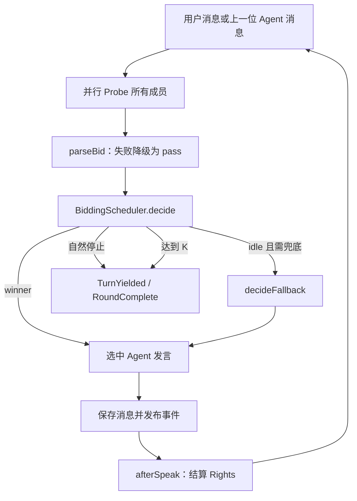

# Autonomous-Bidding 群聊调度器技术文档

> 状态：与当前代码校准
> 更新日期：2026-07-13
> 代码位置：`packages/control-plane/src/group-session/scheduler/`
> 产品需求：[bidding-prd.md](bidding-prd.md)

## 1. 组件边界

Autonomous-Bidding 在一个 Group Session 内选择下一位 Agent 发言者。它由低成本 LLM Probe 生成结构化 Bid，再由确定性评分器仲裁。

它不负责：

- 判断项目是否立项；
- 生成主会话高信号摘要；
- 委派 Work Item；
- 审批、Gate 或权限；
- 决定 Agent 的组织地位。

这些职责分别属于 Channel/Thread、Delegation、Governance 和 Org 子系统。

## 2. 当前文件结构

```text
packages/control-plane/src/group-session/
  group-session.ts                 # 调度循环与 Group Session 集成
  scheduler/
    bidding.types.ts               # Bid、Rights、State、Event 类型
    scheduler.config.ts            # 默认评分参数
    scoring.ts                     # 纯函数评分与 Rights 结算
    BiddingScheduler.ts            # 确定性状态机
    probe.ts                       # Prompt、解析、小模型调用与降级
    index.ts                       # 模块导出

packages/control-plane/test/group-session/scheduler/
  BiddingScheduler.test.ts
  scoring.test.ts
```

旧文档中的 `packages/agent-runtime/`、`src/store/chat/` 和 `apps/server/` 路径不属于本仓库当前实现，不再使用。

## 3. 核心循环

`group-session.ts` 的 `runBiddingLoop` 执行：



Probe 使用 `Effect.forEach(..., { concurrency: "unbounded" })` 并行执行。产品硬化阶段需要以公司资源预算对实际并发做上限约束。

## 4. 类型

### 4.1 Bid

```ts
type BidLevel = "must" | "want" | "could" | "pass"
type BidType = "objection" | "answer" | "question" | "claim" | "info" | "support"
type AddressedAs = "direct" | "mention" | "none"

interface Bid {
  level: BidLevel
  type: BidType
  addressedAs: AddressedAs
  reason: string
}
```

`reason` 最长保留 200 字符。解析缺少 JSON、JSON 无效或 level 非法时返回 `pass`，不会抛错阻断群聊。

### 4.2 RightsState

```ts
interface RightsState {
  cooldown: number
  idleRounds: number
}
```

- `cooldown` 抑制刚发言者连续垄断；
- `idleRounds` 给长期未发言者提供有限的 staleness bonus。

### 4.3 SchedulerState

状态包含 `channelId`、`consecutiveAgentTurns`、`currentSpeaker`、`phase`、`rights`、`round` 和一个尚未接入主产品任务模型的 `taskBoard`。

`phase` 为 `idle | bidding | speaking`。

## 5. 评分

对非 `pass` Bid：

```text
intent = base(level) + addressBonus(addressedAs) + typePriority(type)
rights = -cooldown + min(idleRounds × stalenessPerRound, stalenessCap)
score  = intent + rights
```

资格门禁当前在 Rights 修正前应用：`base(level) >= tau`。默认值：

| 参数 | 默认值 |
|---|---:|
| base.must / want / could | 100 / 60 / 30 |
| address direct / mention / none | 40 / 15 / 0 |
| type objection / answer / question / claim / info / support | 15 / 10 / 6 / 4 / 2 / 0 |
| cooldownInitial | 50 |
| cooldownRecoverPerRound | 15 |
| stalenessPerRound / cap | 5 / 30 |
| tau | 30 |
| maxConsecutiveAgentTurns | 6 |

仲裁排序：

1. eligible 优先；
2. 最终 score 降序；
3. 平分时 `idleRounds` 更高者优先。

对象插入顺序仍可能成为完全平分时的最终隐式顺序。若未来需要跨运行严格可重放，应加入显式稳定 tie-break key 并记录版本。

## 6. Rights 结算

发言者：

```text
cooldown = cooldownInitial
idleRounds = 0
```

未发言者：

```text
cooldown = max(0, cooldown - cooldownRecoverPerRound)
idleRounds += 1
```

`afterSpeak` 同时增加 `consecutiveAgentTurns`。达到 `maxConsecutiveAgentTurns` 后，下一次 `decide` 返回 `yielded`。

## 7. Probe

`probeOne` 接收 Agent persona、成员、最后事件、最近 transcript 和 Group Session ID。

模型选择：

1. 读取 Provider 默认模型；
2. 优先同 Provider 的 small model；
3. 没有 small model 时回退默认模型；
4. 没有模型或调用失败时返回 `pass`。

Probe 关闭工具，只接受文本流，再由 `parseBid` 提取第一个 `{` 到最后一个 `}` 之间的 JSON。

当前实现使用手工 JSON 解析和 `any` 适配 LLM 消息。后续可在不改变调度语义的前提下改为 schema-constrained output，并补充原始输出脱敏与 Token 统计。

## 8. Fallback 与停止

### 8.1 Human Fallback

`decideFallback` 选择 `idleRounds - cooldown` 最大的成员。在用户输入后的首轮或发言人数不足时，即使全员 `pass`，`group-session.ts` 仍可能用该机制保证最低参与人数。

### 8.2 自然停止

已有足够成员发言后，如果：

- 所有人 `pass`；或
- 没有 Bid 达到阈值；

循环发布 `TurnYielded` 与 `RoundComplete`，把控制权还给用户。

### 8.3 K 预算

连续 Agent 发言数达到默认 6 后强制停止。K 是防止无人值守长对话的安全上限，不是目标轮数。

## 9. 事件

当前 Group Session 发布：

- `BiddingStarted`；
- `BiddingCompleted`，包含 winner 和完整 Scored Bid；
- `AgentStarted` / `AgentCompleted`；
- `TurnYielded`；
- `RoundComplete`。

产品接入规则：

- 普通主会话不显示 Probe reason、score 和每轮事件；
- Thread 只显示必要的发言状态；
- 完整评分进入诊断视图；
- 诊断日志不能包含其他 Agent private 或 Direct 内容；
- 高信号结论由单独的 Thread summarization/decision 协议生成，Bidding 不直接生成。

## 10. 已知限制

1. Scheduler 实例在每次 `runBiddingLoop` 新建，Rights 只在该循环内持久；跨用户轮次的长期公平语义尚未产品化。
2. Probe 并发当前为 unbounded，需要接入 Token/并发治理。
3. `taskBoard` 存在于类型中，但尚未与 `company-project` Work Item 形成权威映射，不应在 UI 宣称可用。
4. 事件包含完整 Bid reason，接入日志和遥测前要定义数据保留与脱敏。
5. 当前测试覆盖状态机和评分纯函数；Probe、Group Session 集成、故障与 E2E 覆盖仍需增强。
6. 角色权重若未来加入，只能基于任务职责；不能让 CEO 身份天然压制 CTO 或专业 Agent 的异议。

## 11. 测试

从 `packages/control-plane` 运行：

```bash
bun test test/group-session/scheduler/BiddingScheduler.test.ts test/group-session/scheduler/scoring.test.ts
```

现有测试覆盖：

- 初始状态；
- winner / idle / threshold；
- cooldown 与 staleness；
- direct mention 和贡献类型评分；
- Human Fallback；
- K 预算 yield；
- reset 行为；
- 多轮状态转换。

Pre-Public 前应补：

- Probe 的模型缺失、超时、无效 JSON 和 schema 输出；
- Group Session 从用户输入到自然停止的集成测试；
- 并发上限和取消传播；
- 事件重放与版本兼容；
- 高信号主会话不泄漏评分日志；
- transcript 构建不包含未授权 private/Direct 内容。
