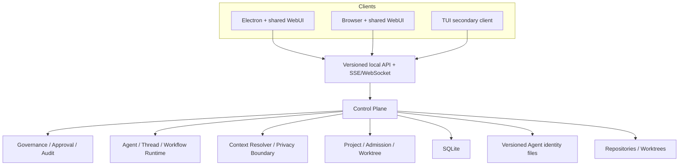
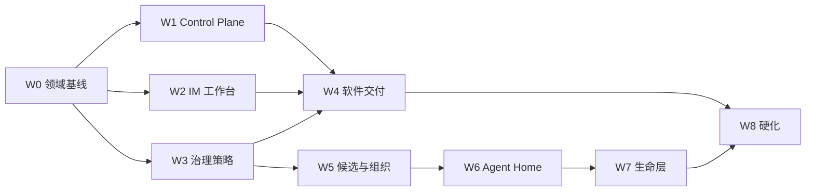

# Implementation Plan：Pre-Public 收敛

> 状态：当前
> 代码盘点日期：2026-07-13
> 上位文档：[产品宪法](PRODUCT-CONSTITUTION.md)
> 产品验收：[产品 PRD](../Agent%20Company%20产品%20PRD.md)

## 1. 计划目的

本计划不是从零设计 Agent Company，也不再沿用旧的 P0–P5/TUI/像素办公室路线。目标是在现有代码基础上，把已经存在但分散的 Agent、治理和交付能力收敛成一条可公开发布的本地产品旅程。

必须始终区分：

- **模块存在**：代码中有类型、服务、路由或测试；
- **产品闭环**：用户可从共享 WebUI 使用，状态可恢复，权限和异常路径通过验收。

只有后者可以在产品文案中标记为完成。

## 2. 已验证的代码基础

以下路径在当前仓库中存在，可优先复用；表格不代表已经达到 PRD 验收。

| 能力 | 当前路径 | 可复用基础 | 主要产品缺口 |
|---|---|---|---|
| 共享 WebUI | `packages/app` | SolidJS、Vite、Session/Project UI、通知与桌面桥接 | 仍以 Coding Session 为中心，缺公司频道、主会话高信号与 Agent Home |
| Electron 桌面 | `packages/desktop` | 启动内嵌本地 Server、随机密码、系统通知、共享 renderer | 仍有 OpenCode 命名；无托盘/状态栏、关闭窗口生命周期和完整恢复入口 |
| Local Server | `packages/opencode/src/server` | Hono API、SSE、Basic Auth、嵌入 WebUI | 需要稳定 Control Plane 契约、浏览器配对、迁移与恢复语义 |
| 项目执行 | `packages/opencode/src/company-project` | Project、Plan、Work Item、Artifact、Approval Gate、执行服务 | 需与 Charter、IM、审批策略和严格 Worktree 状态机整合 |
| Agent 身份 | `packages/opencode/src/company-agent` | Agent CRUD、模板、文件包、SOUL/INSTRUCT/记忆等 | 当前文件包边界较平；缺 candidate/employee、ROLE/PROFILE 和三空间迁移 |
| Thread | `packages/opencode/src/thread` | Primary/Reactive/Ambient、状态、速率限制、活动汇总 | 缺产品级 IM Thread 和私有 Dream Thread |
| Actor / Session | `packages/opencode/src/actor`, `src/session` | 子 Agent、会话、恢复与运行循环 | 需绑定正式 Agent、项目权限、长期 Thread 和高信号事件 |
| 群聊 | `packages/opencode/src/group-session` | 多 Agent Group Session 与 Bidding Scheduler | 需频道模型、Thread 展示、Direct 隔离和结论提升协议 |
| 委派与消息 | `packages/opencode/src/delegation`, `src/agent-message` | message/delegate/reply/propose、分解、升级、决定 | 固定层级假设需改为适应性组织；需接入 Charter/项目 UI |
| Admission | `packages/opencode/src/admission` | 任务等级、coding/non-coding submission、findings | 需软件验收映射、独立 Reviewer 与 Delivery Card |
| 组织 | `packages/opencode/src/org`, `src/team` | 组织与团队基础类型/服务 | 需最小董事会、动态团队、候选池和职业生命周期 |
| 声誉与信任 | `packages/opencode/src/reputation`, `src/trust-dial` | 声誉历史、信任等级评估 | 需批准预设/继承、UI、选人策略；不能影响私域权限 |
| 审计与 Token | `packages/opencode/src/audit-event`, `src/token-governance` | 审计事件、Root Need/项目消耗报告 | 事件类型和私域元数据规则需扩充，接入 UI 与恢复 |
| Context | `packages/opencode/src/workspace` | Context Resolver、scope/classification、relationship | 现有关系可提升 clearance 的逻辑不得作用于 private/Direct；需硬边界测试 |
| Worktree | `packages/opencode/src/worktree`, `src/control-plane` | 创建、移除、重置、Workspace adaptor | 缺项目级审批→合并→主分支验证→销毁状态机和孤儿处置产品流 |
| Workflow | `packages/opencode/src/workflow` | 沙箱、并发、持久化、嵌套、模型路由 | 保留为执行引擎，不把工作流编辑器变成主 UX |
| TUI | `packages/opencode/src/cli/cmd/tui` | 成熟终端交互和大量运行能力 | 调整为次级入口，共用 Control Plane 契约，不再主导产品 IA |
| 现有 Dream | `packages/opencode/src/session/auto-dream.ts`, `src/agent/prompt/dream.txt` | 项目记忆 consolidation | 产品语义上归入 Reflection/Distillation；人格 Dreaming 另建协议 |

## 3. 目标架构

架构约束：

- 不重写为 Multica 的 Next.js/Go 或其他竞争产品技术栈；
- renderer 不直接写 SQLite、身份文件或 Git 状态；
- 所有客户端使用同一服务契约和事件语义；
- Control Plane 是单一权威写入者；
- 数据库状态必须能用 Git/文件事实校验和恢复；
- 隐私边界在存储、API、搜索、日志和 Context Resolver 同时生效。

## 4. 实施工作流

### W0 — 文档与领域语言收敛

状态：本次文档清理已建立基线；后续随实现持续校验。

工作：

- 产品宪法作为最高层事实源；
- PRD、00–08 设计和本计划统一到 IM-first、Web/Desktop-first；
- 删除固定五层、所有规则皆软规则、像素办公室和通用领域首发等冲突；
- 统一术语：Company、Channel、Thread、Charter、Project、Work Item、Gate、Candidate、Employee、Agent Home、Dreaming；
- 在 API/schema 变更中保留术语映射，避免数据库名和 UI 概念漂移。

验收：新成员从 `docs/README.md` 能确定唯一事实源，所有新 Issue/PR 使用相同领域语言。

### W1 — Control Plane 与桌面生命周期

目标：让本地公司可靠常驻。

工作：

1. 将 Electron 现有内嵌 Server 明确为 Local Control Plane 进程；
2. 完成 Agent Company 命名、App ID、数据目录和协议迁移；
3. 增加 Windows/Linux Tray 与 macOS Status Item；
4. 区分关闭窗口、暂停公司和退出进程；
5. 从托盘恢复/重建已关闭的 BrowserWindow；
6. 提供真实任务、审批、阻塞和异常摘要；
7. 设计浏览器配对/本地凭据，不在 URL 或日志暴露密码；
8. 将恢复注册表覆盖 Project、Thread、Gate、Worktree 和后台运行；
9. 启动时执行 schema migration、孤儿扫描和幂等恢复；
10. 建立备份、导出、恢复和诊断包边界。

验收：PRD 14.1 的关闭窗口、托盘重开和系统重启场景通过；退出进程前可明确处理仍在运行的任务。

### W2 — IM-first 产品壳

目标：共享 WebUI 成为公司的主要入口。

工作：

1. 建立 Company/Channel/Thread/Message 的产品 API；
2. 支持公司、董事会、部门、项目和 Direct 频道；
3. Project 创建时自动创建项目群；
4. 定义 `signal_type` 与高信号提升规则；
5. 主会话只渲染高信号事件，保留 Thread 引用；
6. Thread 聚合消息、Work Items、工具、日志、Decision 和 Artifact；
7. 大日志分页/流式加载，避免会话快照无限增长；
8. 构建 Charter、Approval、Delivery 和 Agent 卡片；
9. 看板、组织图、审计和 Usage 作为辅助视图；
10. 将现有 Session/Project UI 逐步映射到新 IA，不平行维护第二套消息系统。

验收：用户只看主会话能理解项目状态，展开 Thread 可追溯结论和验证证据。

### W3 — 董事会、Charter 与批准策略

目标：让自治从可验收目标开始，并只在重大事项打扰用户。

工作：

1. 新公司创建 CEO、CTO、Product Lead；
2. 为 Charter 建 schema、版本、Definition of Ready 和变更 diff；
3. 将原始 Goal、Charter、Project 和 Root Need 串联；
4. 用确定性规则识别重大范围、验收、权限、仓库和风险变化；
5. 建立自主/平衡/严格预设；
6. 建立 Company → Project → One-off 的策略解析器；
7. Agent 只能调用 `escalate` 提高门槛，不能更改下限；
8. Approval 记录动作类别、资源范围、到期和撤销；
9. 用户越级指令写成独立 Intervention 事件；
10. 将 Trust Dial 从抽象等级接入具体策略，但不触碰 private/Direct 权限。

验收：同一项目在三种预设下产生可预测、可测试的不同审批点；未就绪 Charter 无法进入开发。

### W4 — 自治软件交付与 Worktree 治理

目标：把现有 Project、Delegation、Admission 和 Worktree 串成真实交付。

工作：

1. 强制一个 Project 绑定一个主仓库；
2. Worktree 项目默认值开启，可在创建项目时覆盖；
3. 新增项目级 Worktree lifecycle 记录，不能只依赖目录是否存在；
4. 将 Work Item 写入所有权绑定到 Worktree；
5. 复用 Delegation 做适应性分解，移除“必须逐层委派”的固定层级门禁；
6. 复用 Admission 生成与 Charter acceptance 一一映射的 findings；
7. Reviewer 与执行者在需要独立审查的任务上分离；
8. Approval 后若 diff 变化，自动使批准或 Review 失效；
9. 合并成功后在主分支重新运行必要验证；
10. 只有主分支验证通过才允许销毁；
11. 冲突回到 Review，失败/取消进入 preserved 状态；
12. 启动孤儿扫描同时检查数据库、`git worktree list`、分支和文件路径；
13. Direct mode 使用单写者锁并在 UI 明示风险。

验收：真实仓库完成创建→实现→测试→Review→批准→合并→主分支验证→销毁；每个状态均可从异常中恢复。

### W5 — 候选池与动态组织

目标：让临时 Agent 可复用，并通过真实工作形成正式岗位。

工作：

1. 将 Agent lifecycle 扩展为 candidate/assigned/employee/archived；
2. 存储每次推荐、选择、拒绝和原因；
3. 汇总任务难度、Admission、速度、成本、声誉和合作信息；
4. 建立能力需求与候选推荐接口；
5. Charter 通过后由项目 DRI 建最小团队；
6. 项目结束自动回池，保留身份和记录；
7. 晋升规则同时要求持续需求、频率和质量；
8. 晋升和归档通过公司治理，不由 Dreaming 或单一分数触发；
9. 正式员工建立 Agent Home，项目代码仍使用项目 Worktree。

验收：同一候选 Agent 可跨两个项目复用；选择理由可追溯；满足条件时出现合理的晋升提案而非自动批量招聘。

### W6 — Agent Home 与隐私迁移

目标：把现有平面 Agent 文件包迁移为可证明隔离的三空间。

工作：

1. 定义版本化 identity manifest；
2. 将 SOUL、个人记忆和私人关系迁移到 `private/`；
3. 新建 `professional/ROLE.md`、INSTRUCT、career、skills、work-memory；
4. 新建 `public/PROFILE.md` 和系统签名事实投影；
5. 迁移时保留原文件、校验和、作者和来源；
6. API 将 private read 和 write 分离：Agent 本人读写、用户只读；
7. 管理者、董事会、其他 Agent 和服务账号默认硬拒绝；
8. 私域从组织全文搜索、embedding、推荐、招聘、声誉和跨 Agent 摘要中排除；
9. 日志、通知、错误和审计只保留必要元数据；
10. 用户磁盘改动检测为 external authored 版本；
11. 备份加密复制但不解析 private 正文；
12. UI 移除编辑、转发和引用动作。

验收：PRD 10.2 的全部攻击面测试通过，而不只是 API 单元测试。

### W7 — Direct、Reflection、Ambient 与人格型 Dreaming

目标：建立生命层，同时保持治理边界。

工作：

1. Direct 建立双人 membership 与用户只读旁观语义；
2. 禁止管理者/董事会访问，用户查看不触发 read receipt 或 context；
3. 检测工作承诺、决定和范围变化，提示生成项目摘要；
4. Reflection 写入职业工作记忆，不写 SOUL；
5. Ambient 调度低频、可中断、默认只读；
6. 把现有 `/dream` 逐步重命名/归类为 memory distillation；
7. 新建真正的 Agent-private Dream Thread；
8. 定义 experience ledger 和身份意义阈值，而不只按天触发；
9. Dream 只获取本人 private、获准职业摘要和真实经历引用；
10. 生成 Dream Record、Identity Reflection 和 SOUL Patch；
11. Patch 存 diff、理由、来源、版本和中断状态；
12. Dream tool policy 禁止项目写入、网络副作用、消息、权限和 ROLE 修改；
13. Dream 预算独立，不参与绩效评分。

验收：用户只读看到一个有真实经历依据的 SOUL diff；另一个 Agent、管理者和董事会从所有入口都无法读取。

### W8 — Pre-Public 硬化与发布

目标：将纵向闭环交给外部用户长期使用。

工作：

1. Windows/macOS 安装、签名、更新和卸载；
2. 数据迁移、备份恢复和降级失败保护；
3. 资源、Token、磁盘与后台活动上限；
4. 键盘、屏幕阅读、减少动效和错误状态；
5. 纵向 E2E 场景与真实示例仓库；
6. privacy/worktree/approval/recovery 测试纳入 CI；
7. 诊断导出默认脱敏；
8. 产品文案只陈述通过验收的能力；
9. 外部 Pre-Public 反馈只接收影响核心路径的变更，其他进入公开版后路线。

验收：PRD 第 14、15 节在干净 Windows/macOS 设备通过。

## 5. 依赖与并行关系

建议先形成一个窄纵向切片：一个董事会频道、一个项目群、一个仓库、两个 Agent、一个 Worktree 和一个审批。每增加一个子系统，都必须接回该切片，而不是先建孤立管理页面。

## 6. 数据与迁移策略

### 6.1 事务状态

SQLite 保存 Company、Channel、Thread、Project、Charter、Work Item、Gate、Approval、Decision、Agent lifecycle、Worktree lifecycle 和 Audit Event。

### 6.2 身份内容

Agent Home 文件保存人类可读、版本化的身份内容。数据库只保存 manifest、版本、校验和、权限与索引元数据。

### 6.3 Git 事实

Worktree、分支、提交和合并状态必须定期与 Git 校验。数据库不可以单方面声称一个未合并分支已经交付。

### 6.4 迁移原则

- 使用向前可恢复的增量迁移；
- 迁移 private 前先做只读备份和校验；
- 不把旧平面文件直接重新解释为 Agent 自己选择的公开 PROFILE；
- 旧 `/dream` 记录保留原类型，不追溯伪造成身份梦境；
- 恢复失败时保留源数据并停止危险写入。

## 7. 测试策略

### 7.1 单元/属性测试

- 策略继承与重大变化判定；
- Charter Definition of Ready；
- Worktree 状态机和非法转换；
- Candidate 推荐与晋升门槛；
- private/Direct 权限矩阵；
- Dream tool policy 和 SOUL Patch 校验；
- 高信号提升与来源引用。

### 7.2 集成测试

- API → SQLite/identity/Git 的事务一致性；
- Electron sidecar 与浏览器连接；
- Delegation → Admission → Approval → Merge；
- Context Resolver 不跨身份泄漏；
- 进程终止后的恢复和孤儿处置；
- 外部磁盘修改检测。

### 7.3 E2E

- PRD 14.1 的完整纵向场景；
- 自主/平衡/严格三种策略变体；
- Worktree 开启/关闭两种模式；
- Windows/macOS 关闭窗口、托盘、通知和重启；
- private/Direct 的负向攻击路径。

测试从对应 package 目录运行；遵守仓库规则，不在根目录执行测试。

## 8. 每个工作流的完成定义

一个工作流只有同时满足以下条件才可标记完成：

- 用户可从共享 WebUI 完成主路径；
- TUI 若暴露同一能力，使用相同服务语义；
- 状态持久化且异常可恢复；
- 权限与审计覆盖成功和失败路径；
- 有自动化测试和手工/视觉验收证据；
- README、PRD、设计与实际能力同步；
- 没有依赖人工数据库编辑、遗留 Worktree 或演示数据。

## 9. 当前下一步

优先实现 W1 与 W2 的最窄切片：

1. 清理桌面端 OpenCode 品牌和生命周期；
2. 建立托盘/状态栏与关闭窗口继续运行；
3. 定义 Company/Channel/Thread 的服务契约；
4. 在共享 WebUI 中完成董事会频道、项目群和高信号 Thread 展开；
5. 把现有 `company-project` 的一条软件交付路径接入该 UI。

这条切片成立后，再把批准继承、严格 Worktree 和 Agent Home 依次接入，避免并行建设多个互不相连的产品壳。
